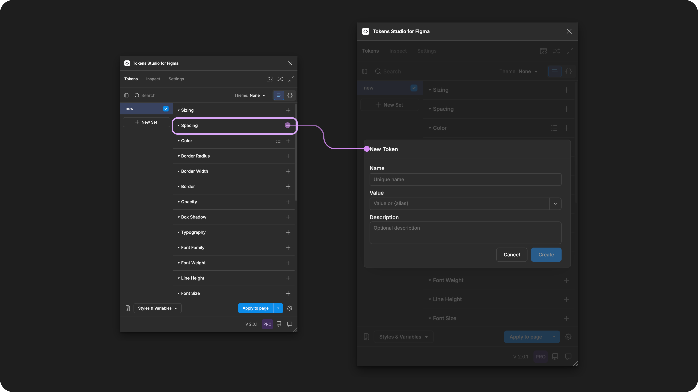
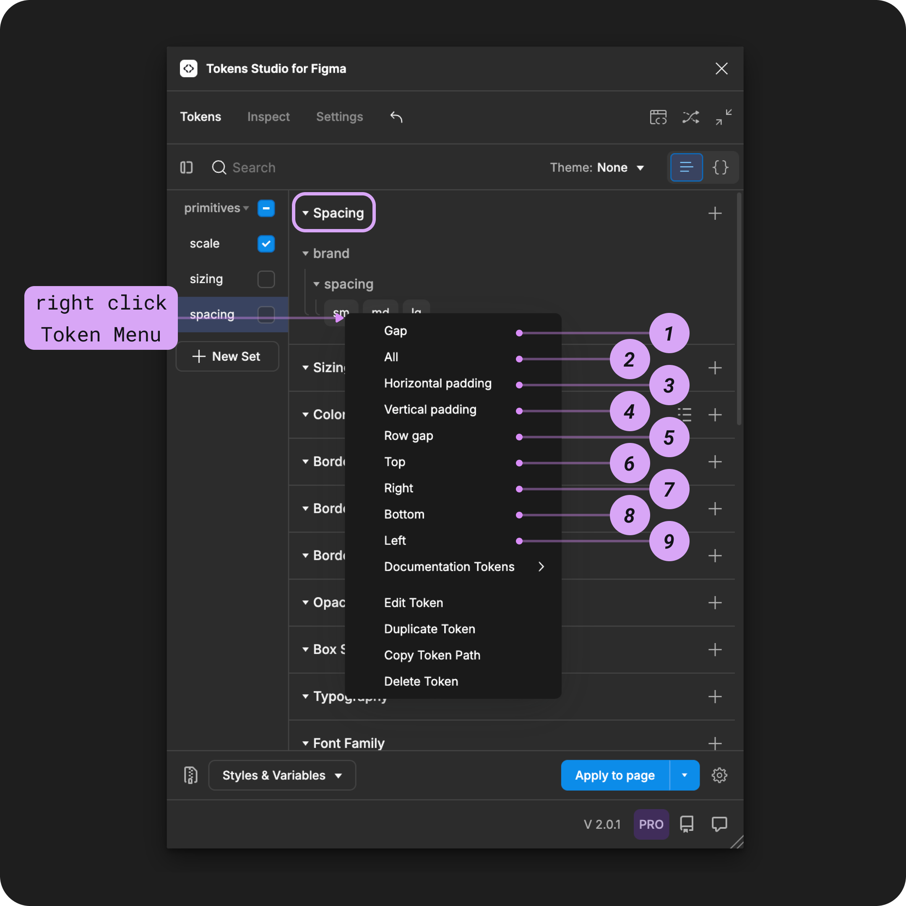

# Spacing

## Spacing - Token Type

Spacing was one of the first Token Types we supported in the plugin.

Since then, a lot has changed.

The Design Tokens Community Group (DTCG) hosts a Token specification on the W3C community group pages for web standards. Although it's in draft form, the tools and technologies working with Design Tokens are trying to align with the W3C DTCG specification.


The W3C DTCG specification does not recognize Spacing as an ['official token type'](https://tr.designtokens.org/format/#types) and instead has defined Dimension Tokens as the preferred token for space-related design decisions.&#x20;



If we want to fully align with the spec, it requires Tokens Studio to phase out the Spacing Token. However, we believe the choice should be yours!

If aligning with the W3C DTCG spec is important to your project, we suggest using Dimension Tokens instead.&#x20;


[.](./)



There is no immediate plan to discontinue support of the Spacing Token Type.

Until we have a thoughtful solution to migrate between Token Types,  we've included a custom transformation for this Token Type in the sd-transforms npm package [detailed below↓](spacing.md#transforming-tokens).&#x20;



If you love Spacing Tokens and want to make your voice heard, we've set up a forum in our feedback tool where you can leave your comments! Hopefully with enough support the DTCG may reconsider having Spacing as its own Token Type.&#x20;

→ [Conversation forum on Unofficial Token Types is here.](https://feedback.tokens.studio/p/dtcg-unofficial-token-type)


<figure><figcaption><p>Creating a new Spacing Token in the Tokens Studio Plugin for Figma.</p></figcaption></figure>

***


### Design decisions

Spacing defines the distance between design elements.&#x20;


<table data-card-size="large" data-view="cards" data-full-width="true"><thead><tr><th></th><th data-hidden data-card-cover data-type="files"></th><th data-hidden data-card-target data-type="content-ref"></th></tr></thead><tbody><tr><td><p></p><p>Spacing Tokens can be attached to Number Variables in Figma. </p></td><td><a href="../../../.gitbook/assets/card-header-figma-variables.png">card-header-figma-variables.png</a></td><td><a href="../../../figma/export/">export</a></td></tr></tbody></table>

***


### Possible values

The Spacing Token supports numeric hard-coded values with or without a unit. You can also enter negative numeric values to achieve a 'stacked' appearance. You can also enter a string value of `AUTO` to support Figma's approach to `space-between`.




#### Hard-coded values

The syntax used to write values for Spacing Tokens is important.&#x20;

* Be sure to avoid any spaces between numbers and units of measurement.&#x20;
* Units are always written in lowercase.

For example:

```
1rem
```


**Rem units (rem)**

To support responsive design, you can define your Spacing Token in `rem units`, and the plugin automatically converts the value to the pixel equivalent when applying the Token in Figma.

For example, a Spacing Token with a value of `0.5rem` will appear as a `8px` in Figma.




#### Pixel units (px)

When you have design elements that should remain static even when users change their preferences, Spacing Tokens can be defined in pixel units.&#x20;

For example `4px`.


#### AUTO as a value

The plugin supports a string value of `AUTO` to match Figma's unique way of defining the CSS property of `justify-content: space-between` in their Auto Layout feature.


It's important that you write this value in all caps `AUTO`&#x20;

Values in lowercase or titlecase will not work as expected.



### Values that reference another Token

When trying to **reference another Token as the Value** for a Spacing Token, you will see

* Tokens living in **Token Sets that are currently active**.
  * In the left menu on the plugin's **Tokens page**, a checkmark is visible next to the **Token Set name**.
* **Token Type** is compatible:
  * The same = `spacing`
  * `number`
  * `dimension`




### Multiple values

You can define the value of a **Spacing Token** to mimic the way multi-value spacing properties are written in CSS.

When you **click to apply the Token Value** (without right-clicking), the plugin will apply spacing based on the number of values in your token.

Single value - For example, `10px`

* Applies the value to the `Gap` property.

Two values - For example, `8px 64px`

* The first value is applied as padding to the top and bottom.
* The second value is applied as padding to the right and left.

Three values - For example, `16px 8px 32px`

* The first value is applied as padding to the top.
* The second value is applied as padding to the right and left.
* The third value is applied as padding to the bottom.

Four values - For example, `2px 4px 8px 16px`

* The first value is applied as padding to the top.
* The second value is applied as padding to the right.
* The third value is applied as padding to the bottom.
* The fourth value is applied as padding to the left.

You can also write multiple value **Spacing Tokens** with references. For example, `{space.sm} {space.md}`.


Figma does not support Variables with multiple values!

If you export your Tokens to Variables in Figma, multiple value Tokens will be skipped, as Figma only supports single values.

[→ Read the guide on Skipped Variables for more details.](../../../figma/export/variables-skipped.md)


***


### Apply Spacing Tokens&#x20;

A Spacing Token defines the distance between layers of an auto-layout frame in Figma when the Token is applied. &#x20;

You can apply a Spacing Token to all design properties at once, or each independently.&#x20;

Select one or more auto-layout elements in Figma, right-click on the Spacing Token Name in the Plugin to its options.&#x20;

Select your desired design property by clicking on it to apply the Tokens value instantly.&#x20;


If you click to apply this Token to an element without accessing the right-click Token menu, the value will be applied to the **gap** (space between) property if your Spacing Token has a single value. \
\
If it has multiple values, it will apply the values to the independent properties defined in the Tokens Value. [More details above. ↑](spacing.md#multiple-values)



<figure><figcaption><p>The right-click menu of a Sizing Token is open to reveal the design properties it can be applied to in Figma.</p></figcaption></figure>




For independent styling per side, you can repeat the steps above and apply different Spacing Tokens to each position of the same design element. Or, you can modify your [Spacing Tokens to have multiple values](spacing.md#multiple-values).






***


### Transforming Tokens



When transforming Spacing Tokens, there are some specific configurations to be aware of.

The preprocessor in the SD-Transforms package will automatically convert the Tokens Studio specific Token Type of `spacing` to align with the DTCG Format Token Type of `dimension`.

→ [SD-Transforms Read-Me Doc, Using the preprocessor](https://github.com/Tokens-studio/sd-transforms/?tab=readme-ov-file#using-the-preprocessor)


**Token Values** entered as a number without a unit will be converted to a number with pixels as a unit.

→ [SD-Transforms Read-Me Doc, ts/size/px](https://github.com/Tokens-studio/sd-transforms/?tab=readme-ov-file#tssizepx)

***


### Resources

Mentioned in this doc:

* SD-Transforms - [Read Me](https://github.com/tokens-studio/sd-transforms)
* Style Dictionary - [Read Me](https://amzn.github.io/style-dictionary/#/)
* Design Tokens Community Group - [W3C Draft](https://tr.designtokens.org/format/)
* Design Tokens Community Group - [8.0 Types](https://tr.designtokens.org/format/#types)


#### Community resources:

* None yet!




#### Known issues and bugs

Tokens Studio Plugin GitHub - [Open issues for Token Type Spacing](https://github.com/tokens-studio/figma-plugin/labels/token%20type%20spacing)

* AUTO Value is Created as '0' in Variables [#2916](https://github.com/tokens-studio/figma-plugin/issues/2916)
  * Exporting to variables when the Spacing Token value is `AUTO` creates a `0` value.




#### Requests, roadmap and changelog

* W3C DTCG Spec - Unofficial Token Types - [Conversation Forum](https://feedback.tokens.studio/p/dtcg-unofficial-token-type)


