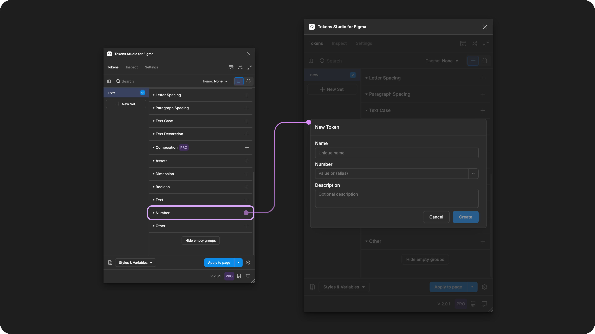
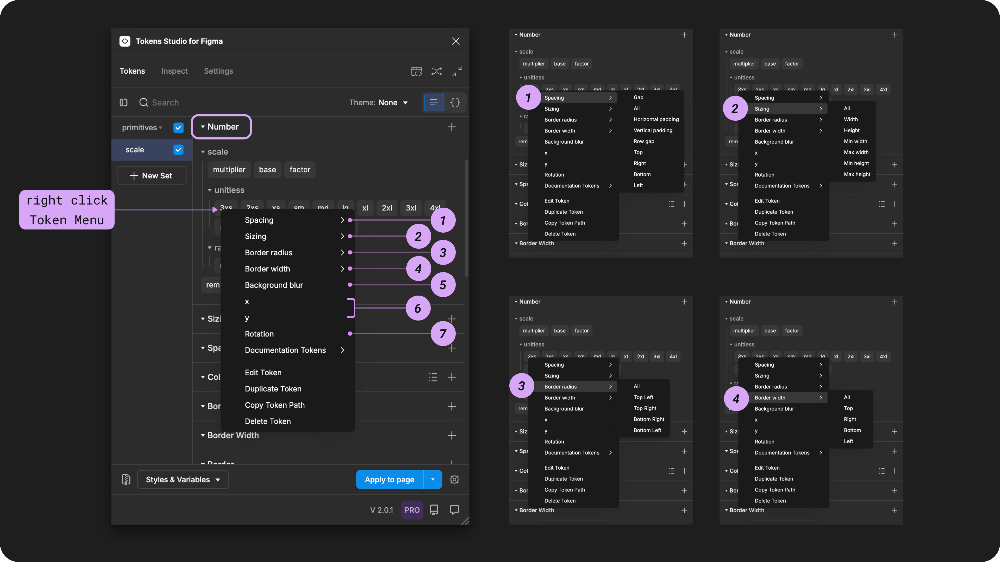

# Number

## Number - Token Type

Number Tokens define the numeric value of several design properties that don't require a unit of measurement.&#x20;

The primary difference between a Number Token and a Dimension Token is a unit of measurement.&#x20;

* **Number tokens** are intended to be unitless.
  * For example: `4`
* **Dimension Tokens** are required to have a unit of `pixels` or `rem`.
  * For example: `4px`

<figure><figcaption>
Creating a new Number Token in the Tokens Studio Plugin for Figma.
</figcaption></figure>

***

### Design decisions

The Number Token is used for design decisions with a numeric value that doesn't benefit from a unit of measurement. For example:

* Math equations to create scales
* &#x20;A `-90` degree rotation of an image filling the background of a hero section of a website.&#x20;

Number Tokens can define these design properties in Figma; however, many of these properties benefit from a unit of measurement, and a Dimension Token is preferred:

* rotation
* background blur
* absolute position location
* size (Dimension Token preferred)
* space (Dimension Token preferred)
* border-radius and width (Dimension Token preferred)



<table data-card-size="large" data-view="cards" data-full-width="true"><thead><tr><th></th><th data-hidden data-card-cover data-type="files"></th><th data-hidden data-card-target data-type="content-ref"></th></tr></thead><tbody><tr><td>

Number Tokens can be attached to Number Variables in Figma. 
</td><td><a href="../../.gitbook/assets/card-header-figma-variables.png">card-header-figma-variables.png</a></td><td><a href="../../figma/export/">export</a></td></tr></tbody></table>

***

### Possible values

According to the [W3C DTCG specification](number.md#w3c-dtcg-token-format), the value of a Number Token **must be a unitless number.**



#### Hard-coded values

The syntax used to write numeric values for Number Tokens is important.


Number Tokens require a unitless number as the value. For example:

`16`



A number with a unit should not be used. For example:  `16px`


### Values that reference another Token

When trying to reference another Token as the Value for a Number Token, you will see Tokens in the dropdown list that are:

* Living in Token Sets that are currently active.
  * In the left menu on the plugin's Tokens page, **a checkmark is visible next to the Token Set name**.
* Token Type is compatible:
  * The same = `number`



#### Compatible Token Types

After you've created Number Tokens, they can be referenced in another Number Token and several compatible Token Types.&#x20;

See all Token Types compatible with Number Tokens

[typography](typography/ "mention")

[font-size.md](typography/font-size.md "mention")

[paragraph-spacing.md](typography/paragraph-spacing.md "mention")

[border.md](border.md "mention")

Color Tokens with [#reduced-opacity-transparency](color/#reduced-opacity-transparency "mention")

\
You can also reference a **Number Token** in these additional Token Types; however, they are not recognized in the W3C DTCG specifications as _official Token Types,_ [more details below _↓_](number.md#w3c-dtcg-token-format)_._

[spacing.md](dimension/spacing.md "mention")

[sizing.md](dimension/sizing.md "mention")

[border-radius.md](dimension/border-radius.md "mention")

[border-width.md](dimension/border-width.md "mention")

***

### Apply Number Tokens&#x20;

A Number Token can define the numeric value of several design properties when applied to frames, groups or graphic elements in Figma.

With one or more elements selected in Figma, right-click on the Number Token Name in the Plugin to see the design property options.&#x20;

Select your desired design property by clicking on it to apply the Tokens value instantly.&#x20;


If you click to apply this Token to an element without accessing the right-click Token menu, the value will be applied as a **spacing-gap** property.


<figure><figcaption>
The right-click menu and sub-menus of a Number Token are opened to reveal the design properties it can be applied to in Figma.
</figcaption></figure>

#### 1. Spacing

The spacing property defines the distance between layers of an auto-layout frame in Figma when the Number Token is applied. &#x20;



For independent styling per side, you can repeat the steps above and apply different Number Tokens to each position of the same design element.


If you apply the Token to a frame _**before**_ auto-layout is applied in Figma, you may have to remove and re-apply the Token after auto-layout has been enabled for the Token Value to apply as expected.

→ [Read Figma's doc on Autolayout here](https://help.figma.com/hc/en-us/articles/360040451373-Explore-auto-layout-properties)


#### 2. Sizing

The Sizing property defines the width or height of polygonal shape, frames, groups or graphic elements in Figma when the Number Token is applied. &#x20;



For independent styling per side, you can repeat the steps above and apply different Number Tokens to each position of the same design element.


If you apply the Token as Min/Max Width or Height to a frame _**before**_ auto-layout is applied in Figma, you may have to remove and re-apply the Token after auto-layout has been enabled for the Token Value to apply as expected.

→ [Read Figma's doc on Autolayout here](https://help.figma.com/hc/en-us/articles/360040451373-Explore-auto-layout-properties)


#### 3. Border Radius

The Border Radius property defines the corner roundness of polygonal shape, frames, groups or graphic elements in Figma when the Token is applied. &#x20;



For independent corner styling, you can repeat the steps above and apply different Number Tokens to each corner position of the same design element.

#### 4. Border Width

A Border Width property defines the thickness of the stroke applied to text layers, polygonal shapes, frames, groups or graphic elements in Figma when the Number Token is applied. &#x20;



For independent border styling, you can repeat the steps above and apply different Number Tokens to each side of the same design element.&#x20;


If you apply the Border Width property to an element **before a stroke is applied in Figma,** you may have to remove and re-apply the Dimension Token after the stroke has been enabled for the value to apply as expected.

The plugin supports a [Border Composite Token](border.md) that allows you to reference a Border Width Token to avoid this issue.


#### 5. Background Blur

The Background Blur property of the Number Token defines the intensity of the Layer Blur Effect in Figma when the Token is applied in Figma.&#x20;

→ [Read Figma's doc on Layer blur here](https://help.figma.com/hc/en-us/articles/360041488473-Apply-shadow-or-blur-effects#blur)

The Background Blur property must be applied to container design elements, like frames, groups, and polygonal shapes with a **reduced opacity color fill** applied.

[_→ Jump to the guide on Color Tokens_ ](color/)_to learn about reduced opacity colors using color spaces that support alpha._


This property can't yet be Exported to Figma as a reusable **Effect Style** from the plugin in the same way that [Box Shadow Tokens](box-shadow.md) can.


#### 6. X and Y Position

The x position and y position properties of the Number Token define the absolute position of the design element when the Token is applied in Figma.&#x20;

X Position

* The element is absolutely positioned on the horizontal axis in relationship to the parent container.
* If no parent container is present, it positions the element on the Figma canvas.

Y Postion

* The element is absolutely positioned on the vertical axis in relationship to the parent container.
* If no parent container is present, it positions the element on the Figma canvas.


If you apply the **x/y** property to an element before enabling Absolute Position and Auto-layout in Figma, you may have to remove and re-apply the Dimension Token after they are enabled before the value will be applied as expected.&#x20;

[→ Read Figma's docs on Absolute Position ](https://help.figma.com/hc/en-us/articles/360039956914-Adjust-alignment-rotation-and-position#h_01HNBH55654RRGKMTFTB9MT1KX)


#### 7. Rotation

The rotation property defines the numeric degree of rotation on its access when the Number Token is applied to any design element in Figma.&#x20;

This means you **can assign negative values** to control the direction of rotation.

→ [Read Figma's docs on Rotation here](https://help.figma.com/hc/en-us/articles/360039956914-Adjust-alignment-rotation-and-position)



***

### W3C DTCG Token Format

`Number` is an official Token type in the W3C Design Token Community Group specifications.

> "Represents a number. Numbers can be positive, negative and have fractions. Example uses for number Tokens are [gradient stop positions](https://tr.designtokens.org/format/#gradient) or unitless line heights. The `$type` property _MUST_ be set to the string `number`. The value _MUST_ be a JSON number value." - [8.7 Number, DTCG Specifications on W3C](https://tr.designtokens.org/format/#number)

Tokens Studio has approached **Number Tokens** differently than how it is defined in the current W3C spec to align with Figma's number variables more closely.

However, we will be iterating on **Number Tokens** in the near future to more closely align with the W3C DTCG specifications.

* We **allow a unit** in a Number Token (this will change).
* We allow a **Number Token** to be used with many of the same properties the specification defines as requiring a **Dimension Token**.
* We don't yet require a **Number Token** in all use cases the spec defines it as a requirement, such as a "gradient stop position."

**Number Tokens** are a relatively new addition to the W3C DTCG specification, which defines this Token as being applied to many different design properties.

If we want to fully align with the spec, it requires Tokens Studio to phase out several unofficial Token we introduced long before the **Number Token** was added to the spec:


[spacing.md](dimension/spacing.md)



[sizing.md](dimension/sizing.md)



[border-radius.md](dimension/border-radius.md)



[border-width.md](dimension/border-width.md)




***

### Transforming Tokens



When transforming **Number Tokens**, there are specific configurations to be aware of.

**Token Values** entered as a number without a unit converted to a number with pixels as a unit.

→ [SD-Transforms Read-Me Doc, ts/size/px](https://github.com/Tokens-studio/sd-transforms/?tab=readme-ov-file#tssizepx)

**Token Values** entered with **math equations** need to be checked and resolved.

→ [SD-Transforms Read-Me Doc, ts/resolveMath](https://github.com/Tokens-studio/sd-transforms/?tab=readme-ov-file#tsresolvemath)

Running the SD-Transforms pre-processor as part of the generic package will prep your Number Tokens for Style Dictionary.

→ [SD-Transforms Read-Me Doc, Using the preprocessor](https://github.com/Tokens-studio/sd-transforms/?tab=readme-ov-file#using-the-preprocessor)

***

### Resources

Mentioned in this doc:

* SD-Transforms - [Read Me](https://github.com/tokens-studio/sd-transforms#readme)
* Style Dictionary - [https://styledictionary.com/](https://styledictionary.com/)
* Design Tokens Community Group - [W3C Draft](https://tr.designtokens.org/format/)
* Design Tokens Community Group - [8.7 Number](https://tr.designtokens.org/format/#number)

#### Figma resources:

* Design in Figma - [Explore autolayout properties](https://help.figma.com/hc/en-us/articles/360040451373-Explore-auto-layout-properties)
* Design in Figma - [Apply and adjust stroke properties](https://help.figma.com/hc/en-us/articles/360049283914-Apply-and-adjust-stroke-properties)
* Design in Figma - [Adjust corner radius and smoothing](https://help.figma.com/hc/en-us/articles/360050986854-Adjust-corner-radius-and-smoothing)
* Design in Figma - [Adjust alignment, rotation, and position](https://help.figma.com/hc/en-us/articles/360039956914-Adjust-alignment-rotation-and-position)
* Design in Figma - [Apply blur effect](https://help.figma.com/hc/en-us/articles/360041488473-Apply-shadow-or-blur-effects)

#### CSS resources:

* MDN Web Docs - [Number](https://developer.mozilla.org/en-US/docs/Web/CSS/number)

#### Community resources:

* None yet!



#### Known issues and bugs

Tokens Studio Plugin GitHub - [Open issues for Token Type Number](https://github.com/tokens-studio/figma-plugin/labels/token%20type%20number)

* None yet



#### Requests, roadmap and changelog

* None


