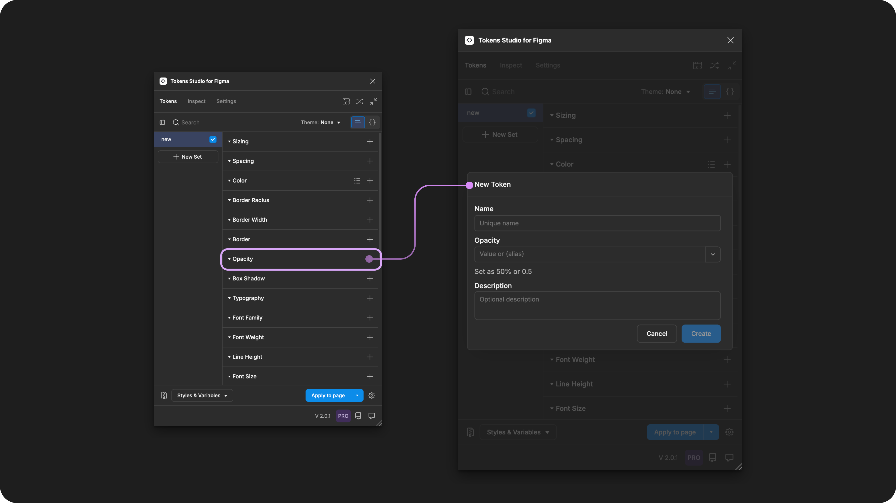

# Opacity

## Opacity - Token Type

Opacity Tokens define the transparency of a layer, or how opaque it appears.&#x20;

<figure><figcaption>
Creating a new Opacity Token in the Tokens Studio Plugin for Figma.
</figcaption></figure>

***

### Design decisions defined by Opacity Tokens

Opacity Tokens define a layer's opacity. In Figma, they can be applied to any design element that supports reduced opacity.

For example, you might have a Button that changes opacity when hovered over.

* You could create two Opacity tokens:
  * `button.opacity.default` with a value of `1` (fully opaque)
  * `button.opacity.hover` with a value of `0.8` (slightly transparent)
* Then, apply the Opacity Tokens to the background container layer of each variation of the Button design.

***

### Possible Values

An Opacity Token can define any level of transparency from fully opaque to fully transparent. The values range from:

* `1` (layer is fully opaque)
* `0` (layer is fully transparent)
* Any decimal value between `0` and `1` can be used to set varying levels of transparency.

### Values that reference another Token

When trying to reference another Token as the Value for an Opacity Token, you will see Tokens in the dropdown list that are:

* Living in Token Sets that are currently active.
  * In the left menu on the plugin's Tokens page, **a checkmark is visible next to the Token Set nam**e.
* Token Type is compatible:
  * The same = `opacity`



***

### Apply Opacity Tokens

&#x20;You can apply an Opacity Token to change the transparency value of any design element and all of its children layers.&#x20;

With one or more elements selected in Figma, click on the name of your chosen Opacity Token in the Plugin to apply its value instantly.&#x20;



***

### W3C DTCG Token Format

Opacity is not yet an official token type in the W3C DTCG specifications, but there is mention of a `Percentage/radio` type under consideration ([8.8 Additional Types](https://tr.designtokens.org/format/#additional-types))

***

### Transforming Tokens

Engineers typically transform Tokens used in code with [Style Dictionary](https://styledictionary.com/), which is tool-agnostic. Tokens coming from Tokens Studio require an additional step: [@Tokens-studio/sd-transforms](https://www.npmjs.com/package/@tokens-studio/sd-transforms), an npm package that prepares Tokens for Style Dictionary.

When transforming **Opacity Tokens**, there are specific configurations to be aware of.

For **Opacity Token** values entered in percentages, the SD-transforms package converts the value from `%` to number between `0` and `1` -> `ts/opacity`.

→ [SD-Transforms Read-Me Doc, ts/opacity](https://github.com/Tokens-studio/sd-transforms/?tab=readme-ov-file#tsopacity)

***

### Resources

Mentioned in this doc:

* SD-Transforms - [Read Me](https://github.com/tokens-studio/sd-transforms#readme)
* Style Dictionary -[ https://styledictionary.com/](https://styledictionary.com/)
* Design Tokens Community Group - [W3C Draft](https://tr.designtokens.org/format/)
* Design Tokens Community Group - [8.8 Additional Types](https://tr.designtokens.org/format/#additional-types)

#### Figma resources:

* Design in Figma - [Adjust the properties of an asset](https://help.figma.com/hc/en-us/articles/360041098433-Adjust-the-properties-of-an-image)

#### CSS resources:

* MDN Web Docs -[ Opacity](https://developer.mozilla.org/en-US/docs/Web/CSS/opacity)

#### Community resources:

* None yet!



#### Known issues and bugs

Tokens Studio Plugin GitHub - [Open issues for Token Type Opacity](https://github.com/tokens-studio/figma-plugin/labels/token%20type%20opacity)

* Opacity issue: some values are wrongly rounded in Figma [#2380](https://github.com/tokens-studio/figma-plugin/issues/2380)
  * Values entered less than 1% are resolving to 1% in Figma
  * Ex: `0.1%` will resolve to 1%
* Referencing a (base+opacity) and adding another opacity to that, doesn't give the correct result [#1822](https://github.com/tokens-studio/figma-plugin/issues/1822)
  * Including an Opacity Token in the value of a Color Token produces unexpected results.
  * We may want to avoid using Opacity Tokens in Color Token values as Figma assigns the Opacity value to layer transparency and not a color modifier.
* Using Opacity in Tokens Creates Blank Variable [#2977](https://github.com/tokens-studio/figma-plugin/issues/2977)
  * When Exporting Color Tokens with Opacity Tokens referenced in the value as Color Variables, the Variable is not created as expected.
  * Likely related to issue 1822 above.



#### Requests, roadmap and changelog

* None yet


