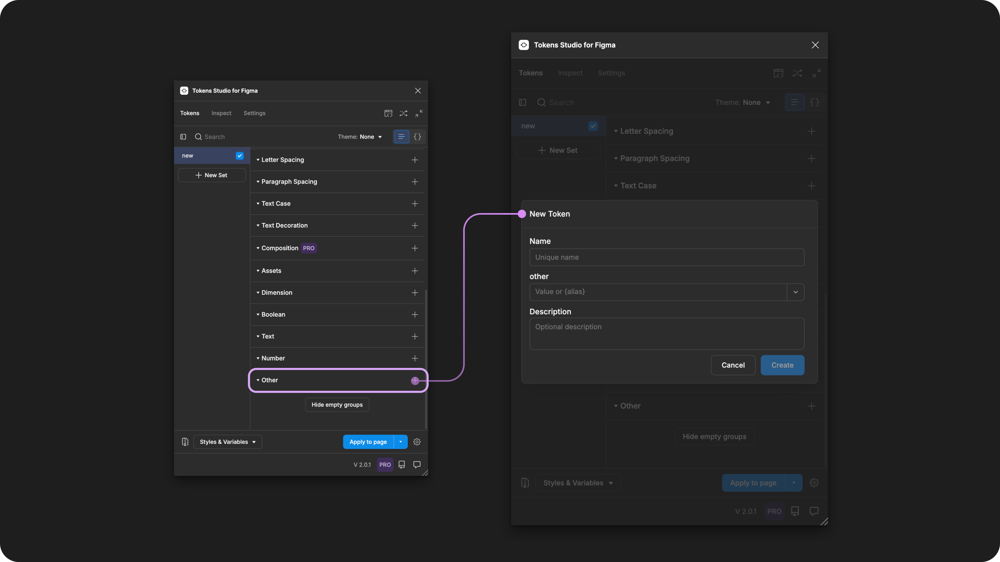

# Other

## Other - Token Type

Other Tokens allow you to capture design decisions that don't fit into another Token Type.

This provides flexibility to define and use tokens tailored to your specific needs. However, when applied to design elements, they don't interact with the Figma UI in any capacity.

<figure><figcaption>
Creating a new Other Token in the Tokens Studio Plugin for Figma.
</figcaption></figure>

***

### Design decisions defined by Other Tokens

Other Tokens can be used to define almost any design decision that works for you, your project and your team which aren't covered by an existing Token Type. For example:

* Notes within your token sets you want to be surfaced to engineers.
* Internal documentation.
* Creating Tokens you don't want to interact with Figma.

Here are some creative ways the community is using Other Tokens:

* Defining the CSS properties, like text alignment
* Technical notes on where to find external documentation, like where to download a font family being used in the system.
* Math equations referenced in Number or Dimension tokens to ensure they are preserved without cluttering the main token set.
  * For example:`golden-ratio`: `1.618`

### Possible Values

An Other Token can have any hard-coded value as needed, including:

* String
* Numeric with units
* Numeric without units
* Math equations

### Values that reference another Token

When trying to reference another Token as the Value for an Other Token, you will see Tokens in the dropdown list that are:

* Living in Token Sets that are currently active.
  * In the left menu on the plugin's Tokens page, **a checkmark is visible next to the Token Set name**.
* Token Type is compatible:
  * The same = `other`



***

### Apply Other Tokens

You can apply an Other Token to attach it to any layer of a design element in Figma, however it does not change the element in any way.&#x20;

With one or more elements selected in Figma, click on the name of your chosen Other Token in the Plugin to instantly attach the Token to the Element.&#x20;



***

### W3C DTCG Token Format

**Other** is not an official Token Type in the W3C DTCG specifications.

Tokens Studio has added Other as an unofficial Token Type to offer flexibility for custom properties not covered by the standard Token Types.

***

### Transforming Tokens



When transforming Other Tokens, there are some specific configurations to be aware of.

The preprocessor in the SD-Transforms package will automatically convert the Tokens Studio specific properties to align with the DTCG Format.

→ [SD-Transforms Read-Me Doc, Using the preprocessor](https://github.com/Tokens-studio/sd-transforms/?tab=readme-ov-file#using-the-preprocessor)

**Token Values** entered as a number without a unit will be converted to a number with pixels as a unit.

→ [SD-Transforms Read-Me Doc, ts/size/px](https://github.com/Tokens-studio/sd-transforms/?tab=readme-ov-file#tssizepx)

***

### Resources

Mentioned in this doc:

* SD-Transforms - [Read Me](https://github.com/tokens-studio/sd-transforms#readme)
* Style Dictionary - [https://styledictionary.com/](https://styledictionary.com/)
* Design Tokens Community Group - [W3C Draft](https://tr.designtokens.org/format/)
* Design Tokens Community Group - [8.0 Types](https://tr.designtokens.org/format/#types)

#### Community resources:

* None yet!



#### Known issues and bugs

Tokens Studio Plugin GitHub - [Open issues for Token Type Other](https://github.com/tokens-studio/figma-plugin/labels/token%20type%20other)



#### Requests, roadmap and changelog

* None


