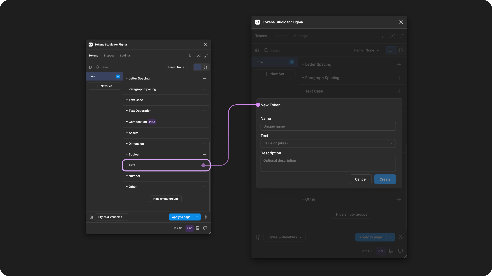

# Text (string)

## Text - Token Type

Text Tokens define entire strings of text that change the written copy of your designs when applied to a text layer.&#x20;

<figure><figcaption><p>Creating a new Text Token in the Tokens Studio Plugin for Figma.</p></figcaption></figure>

***


### Design decisions

Text Tokens define the written content in your designs and can be applied to text elements.

Useful for:

* UX writing
* Creating themes for different languages
* Capturing translations
* When your product or brand names are still being iterated on

<table data-card-size="large" data-view="cards" data-full-width="true"><thead><tr><th></th><th data-hidden data-card-cover data-type="files"></th><th data-hidden data-card-target data-type="content-ref"></th></tr></thead><tbody><tr><td><p></p><p>Text Tokens can be attached to String Variables in Figma. </p></td><td><a href="../../.gitbook/assets/card-header-figma-variables.png">card-header-figma-variables.png</a></td><td><a href="../../figma/export/">export</a></td></tr></tbody></table>

***


### Possible values

Text Token can have any combination of alpha-numeric values and may include emojis.


Known Issue&#x20;

Text Tokens with values that are numeric only are not applying as expected.



#### Hard-coded string values

Hard-coded values of Text Token would be a string of text you define directly.

For example, a Text Token named `welcome.message` with the hard-coded value of:

```
"Hello world"
```


### Values that reference another token

When trying to reference another Token as the Value for a Text Token, you will see Tokens in the dropdown list that are:

* Living in Token Sets that are currently active.
  * In the left menu on the plugin's Tokens page, a checkmark is visible next to the Token Set name.
* Token Type is compatible:
  * The same = `text`




**Nested references**

Text Tokens can also reference another Token nested somewhere within the value.

For example, a Text Token with a Name of `customer-id` with the hard-coded value of:

```
Jan Six
```


When referenced within the value of another Text Token with a Name of `app.home-page.title`:

```
👋 Welcome back, {customer-id}!
```


Which would inherit the text content from the `customer-id` token and have a resolved value of :

```
👋 Welcome back, Jan Six!
```


This is a great way to communicate to engineers the design decision to have text content; in this case, the client name comes from a database.

You could even add some notes in the Description of the Token for engineers, like `"show the preferred name as the client ID if it exists in the database."`

***


### Apply Text Tokens

You can apply a Text Token to change the written content of a text layer in Figma when the Token is applied.&#x20;

With one or more text layers selected in Figma, click on the name of your chosen Text Token in the Plugin to apply its value instantly.&#x20;



For example, if you select the bounding box that a text layer is in by mistake, the Token is applied to the parent frame and no changes will be made to the text layer as it is a child.&#x20;



***


### W3C DTCG Token Format

**Text** is not yet an official token type in the W3C DTCG specifications. Tokens Studio has added Text as an unofficial Token Type to support Figma's String Variable.

***


### Transforming Tokens



When transforming **Text Tokens**, there are specific transforms to be aware of.

The preprocessor in the SD-Transforms package will automatically convert the Tokens Studio specific Token Type of `text` to align with the Style Dictionary compatible Token Type of `content`.

→ [SD-Transforms Read-Me Doc, Using the preprocessor](https://github.com/Tokens-studio/sd-transforms/?tab=readme-ov-file#using-the-preprocessor)


***


### Resources

Mentioned in this doc:

* SD-Transforms - [Read Me](https://github.com/tokens-studio/sd-transforms#readme)
* Style Dictionary - https://styledictionary.com/
* Design Tokens Community Group - [W3C Draft](https://tr.designtokens.org/format/)
* Design Tokens Community Group - [8.0 Types](https://tr.designtokens.org/format/#types)

#### Community resources:

* None yet!




#### Known issues and bugs

Tokens Studio Plugin GitHub - [Open issues for Token Type Text](https://github.com/tokens-studio/figma-plugin/labels/token%20type%20text)

* Unable to Assign a Numeric Value in the Text Token Type [#2470](https://github.com/tokens-studio/figma-plugin/issues/2470)
  * When the value is purely numeric, results are unexpected.




#### Requests, roadmap and changelog

* None


