# Typography - Composite

## Typography - Token Type

Style text elements by composing many typography-related design decisions together into a single Typography Token.

Each of the nine design decisions (font size, letter spacing, etc.) that is part of the Composite Token is referred to as a **property** of the Typography Token in out guides.

<figure>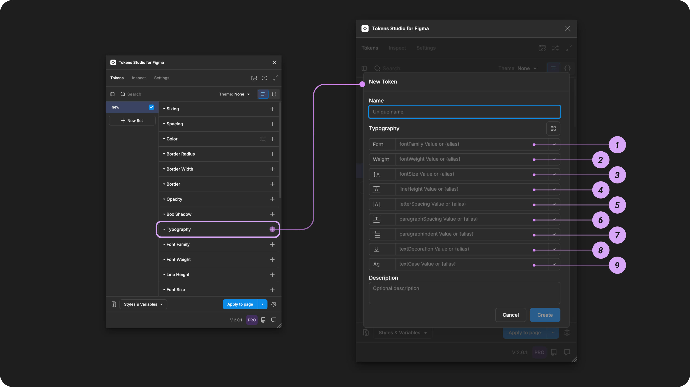<figcaption>
Creating a new Typography Token in the Tokens Studio Plugin for Figma.
</figcaption></figure>

***

### Design decisions&#x20;

Typography Tokens define a group of properties used to style text elements.

[In CSS](https://developer.mozilla.org/en-US/docs/Learn/CSS/Styling_text/Fundamentals), this is known as the `Text and Font Styling` properties, which are defined individually.

Typography Tokens can be applied to text layers to define all styling decisions in a single token.

Each property composed to style text elements can be defined as it's own Token and referenced within the Typography Composite Toke&#x6E;**:**

1. Font family
2. Font weight&#x20;
3. Font size&#x20;
4. Line height
5. Letter spacing&#x20;
6. Paragraph indent&#x20;
7. Paragraph spacing
8. Text decoration
9. Text case

<table data-card-size="large" data-view="cards" data-full-width="true"><thead><tr><th></th><th data-hidden data-card-cover data-type="files"></th><th data-hidden data-card-target data-type="content-ref"></th></tr></thead><tbody><tr><td>

Typography Tokens can be attached to Text Styles in Figma. 
</td><td><a href="../../../.gitbook/assets/card-header-figma-styles.png">card-header-figma-styles.png</a></td><td><a href="../../../figma/export/">export</a></td></tr></tbody></table>

***

### Possible values

Like all Composite Tokens, you define the value of each **property** individually. \
\
When you create the Typography Token in the plugin, you can reference each Token you've already created as a **property** or enter a hard-coded value.


The best practice is to define all parts of a Composite Token, even with a `null/none` value, rather than to leave it empty.


#### Hard coded values

The dedicated Token Type of each **property** within the Typography Composite Token has unique specifications, described in detail in their own guides.



### Font Family

Font Family defines the typeface.&#x20;

* It must be written as a string value that exactly matches how Figma has it written in their UI.&#x20;
* It acts as a _'pair'_ with Font Weight due to Figma's unique approach to text styling.&#x20;

[_→ Jump to the Font Family Guide_](font-family.md)




### Font Weight

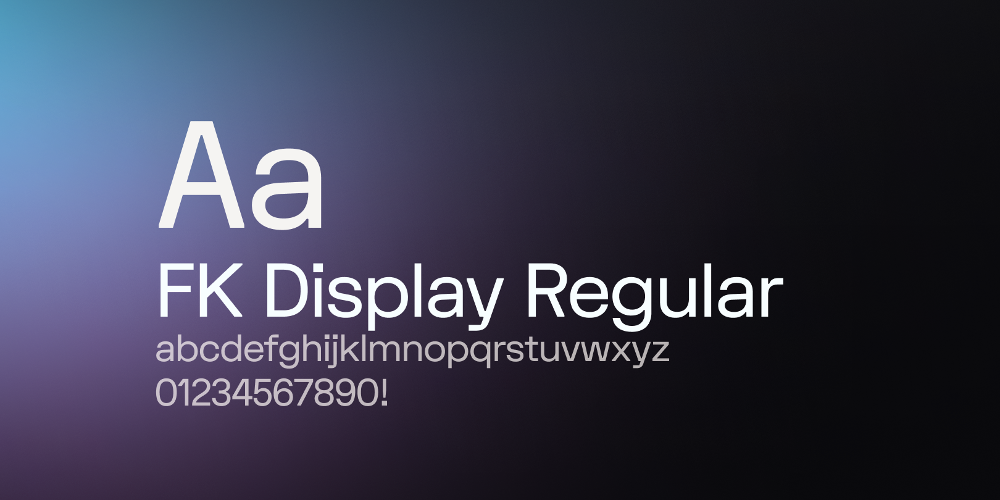

Font Weight defines the thickness and styling of the characters of a typeface.&#x20;

* It can be written as a unitless number, or a string value that exactly matches how Figma has written it their UI for the particular typeface.&#x20;
* It acts as a _'pair'_ with Font Family due to Figma's unique approach to text styling.&#x20;

[_→ Jump to the Font Weight Guide_](font-weight.md)




### Font Size

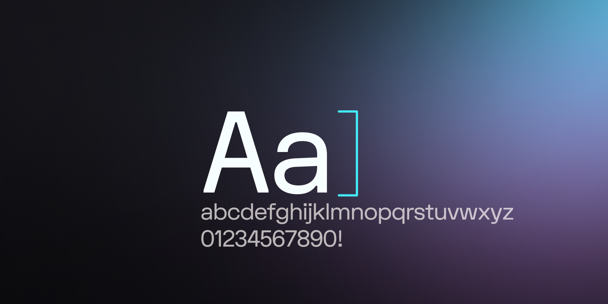

Font Size defines the height of the glyphs/characters of a typeface.

* It should be written as a numeric value with a unit of measurement in either pixels or rem.&#x20;
* Font Size impacts the Line Height and Letter Spacing values.&#x20;

[_→ Jump to the Font Size Guide_](font-size.md)




### Line Height

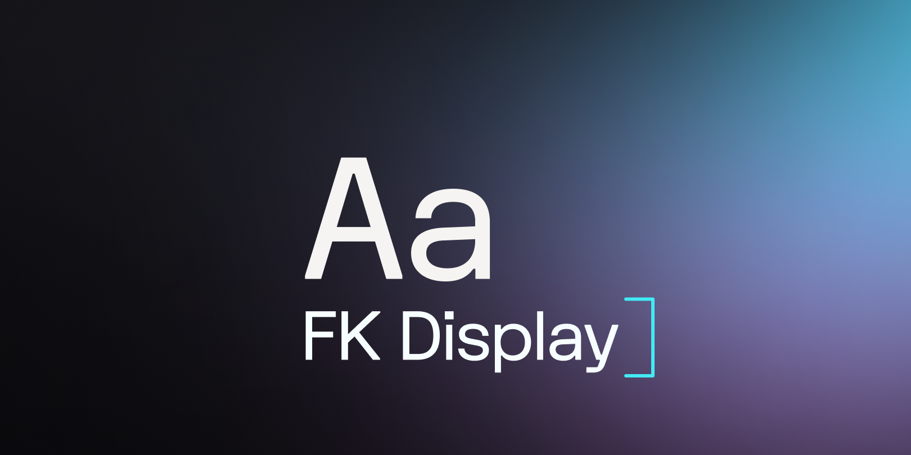

Line Height defines the vertical distance of each line of text related to its font size.&#x20;

* It should be written as a numeric value with a percentage to support responsive design in Figma.&#x20;
* Values without a percentage unit will be assumed as a fixed value in pixels.&#x20;

[_→ Jump to the Line Height Guide_](line-height.md)




### Letter Spacing

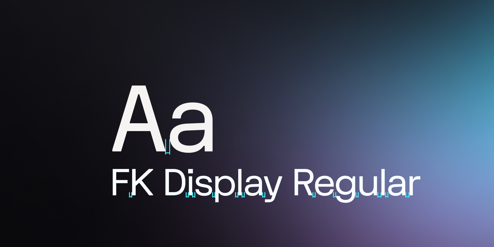

Letter Spacing defines the horizontal distance between each glyph/character related to its font size.&#x20;

* It should be written as a numeric value with a percentage to support responsive design in Figma.&#x20;
* Values without a percentage unit will be assumed as a fixed value in pixels.&#x20;

[_→ Jump to the Letter Spacing Guide_](letter-spacing.md)




### Paragraph Spacing

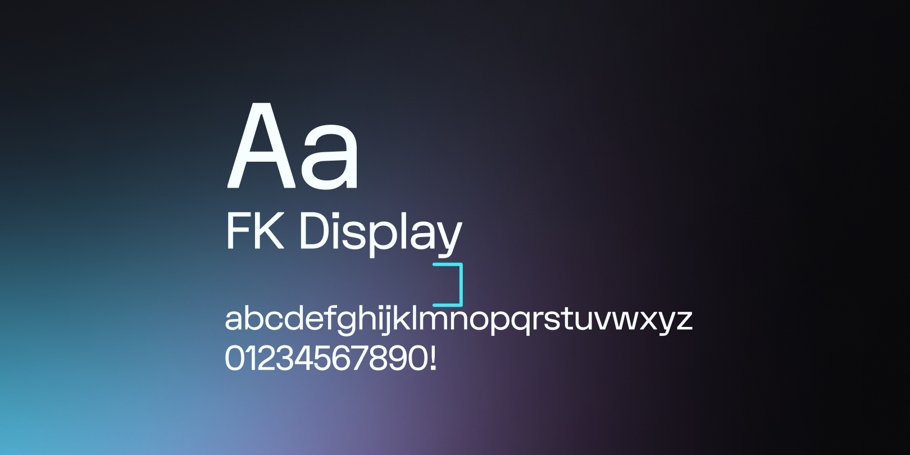

Paragraph Spacing defines the vertical distance between 2 paragraphs of text&#x20;

* It should be written as a numeric value with a unit of measurement in either pixels or rem.&#x20;
* Values without a unit will be assumed as a fixed value in pixels.&#x20;

[_→ Jump to the Paragraph Spacing Guide_](paragraph-spacing.md)




### Paragraph Indent

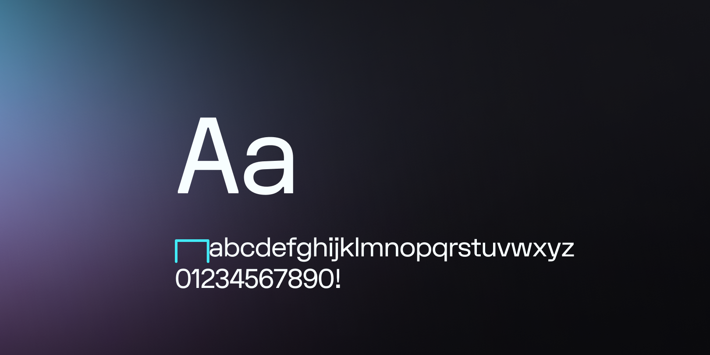

Paragraph Indent defines an offset of the first word of every paragraph.

* It should be written as a numeric value with a unit of measurement in either pixels or rem.&#x20;
* Values without a unit will be assumed as a fixed value in pixels.&#x20;

[_→ Jump to the Paragraph Indent Guide_](paragraph-indent.md)




### Text Decoration

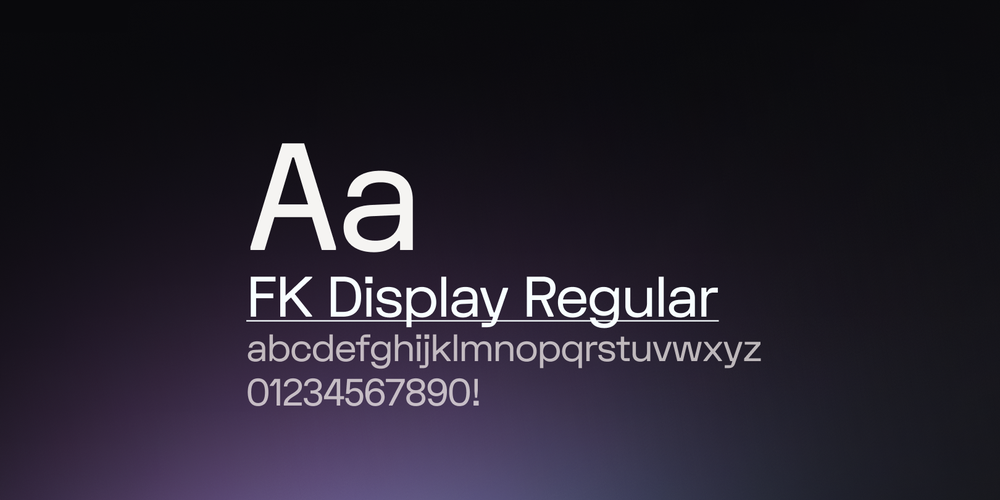

Text Decoration defines the position of an optional line in a string of text.&#x20;

* It should be written as the string value that matches the intended property.&#x20;

[_→ Jump to the Text Decoration Guide_](text-decoration.md)




### Text Case

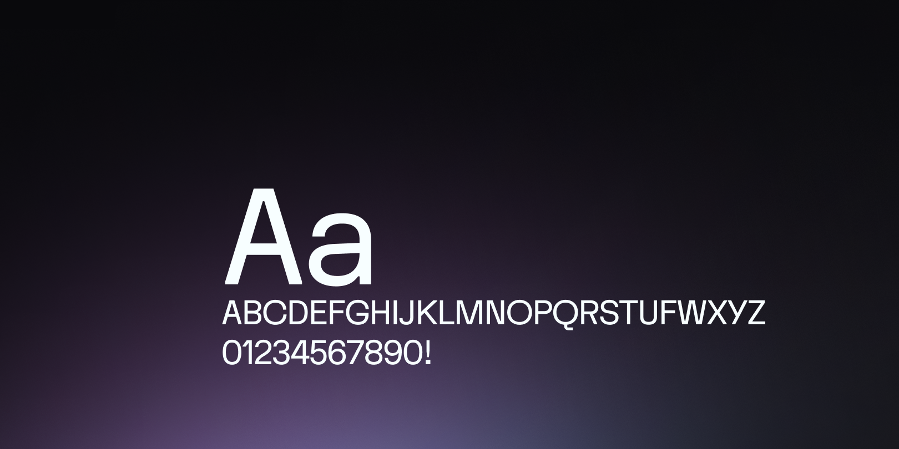

Text Case defines a transformation to the capitalization of letters in a string of text.&#x20;

* It should be written as the string value that matches the intended property.&#x20;

[_→ Jump to the Text Case Guide_](text-case.md)




Any property defined within the Typography Token that accepts numeric values can use math to calculate their value in Tokens Studio.&#x20;

_There's an example in the image below for Line Height and Letter Spacing to convert a unitless number into a percentage to accommodate Figma's limitations on those properties._&#x20;

[→ Jump to the guide on Tokens with Math Values for more details.](../../token-values/math.md)


### Values that reference another Token

Like all Composite Tokens, you may reference an existing Token as the value for each individual property [as described above ↑](./#hard-coded-values).

If you'd prefer to reference an existing Typography Composite Token as the value instead of defining each Property, select the Token's Reference mode button (2x2 circle icon).

<figure>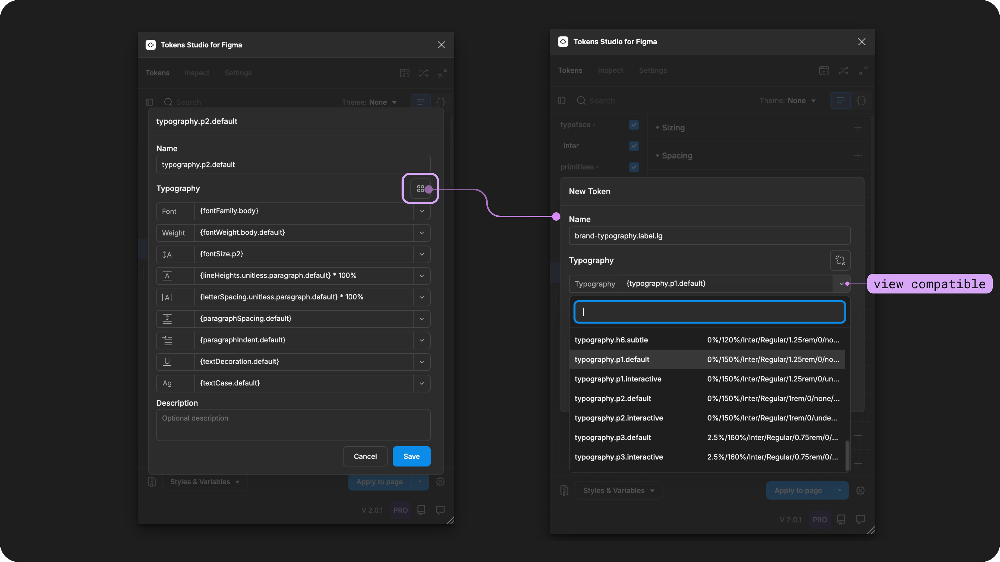<figcaption>
Once the Typography Token form is open, you can select the icon button to reference a Typography composite Token as the value. 
</figcaption></figure>

When trying to reference another Token as the Value for a Typography Token, you will see Tokens in the dropdown list that are:

* Living in Token Sets that are currently **active**.
  * In the left menu on the plugin's Tokens page, **a checkmark is visible next to the Token Set name**.
* Token Type is compatible:
  * `typography`



***

### Apply Typography Tokens

**Typography Tokens** define all 9 styling properties of text when the Token is applied.&#x20;

With one or more text layers selected in Figma, click on the name of a Typography Token in the Plugin to instantly apply its value.&#x20;

Keep in mind, Tokens can only be applied to the entire layer. In the case of Typography, you might want to apply a Token to a particular word within the text layer, but that is not possible today due to limitations of the Figma plugin API.

💌 Create a free account to upvote on the [feature request for this here](https://feedback.tokens.studio/p/multiple-token-per-layer) and we will notify you when we start working on it.&#x20;



***

### Text Styles in Figma

Typography Tokens can be [Exported to Figma as Text Styles](../../../figma/export/)**.** Tokens Studio also supports [Styles with Variable References](../../../figma/export/styles-variable-references.md).

Here are some tips for creating Text Styles with Variable References using the Plugin.&#x20;


Before you export your Typography Tokens to Figma as styles, ensure each property within the **Typography Tokens has a value referencing another Token**.


When you **Export to Figma**, select these **Options** from the menu:

* `Typography Styles` is selected.
* `Number` and `String Variables` are selected.
* `Create styles with variable references` is selected.

<figure>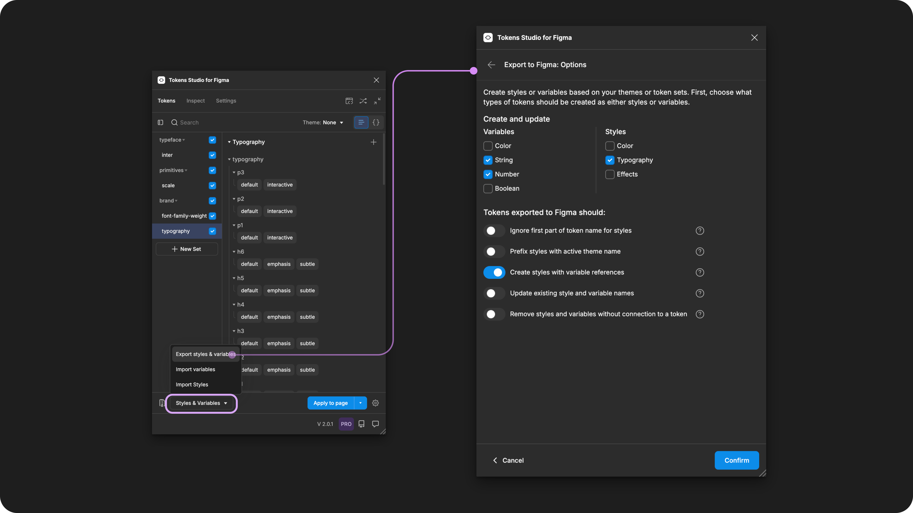<figcaption>
Select the Export Styles and Variables from the Tokens page to configure the Options. 
</figcaption></figure>

Ensure your Export to Figma as Themes or Sets configuration includes all necessary Tokens.

* Themes and token sets where the referenced Tokens are located are `active`.
* Themes and token sets where the variables are attached may need to be configured as `reference only`.

You'll notice these Variables are created on Export based on their Token Type:

* `fontFamily` (will create as string variable)
* `fontWeight` (will create either as string or number variable, depending on if they are a string or a number)
* `letterSpacing` (number variable)
* `lineHeight` (number variable)
* `paragraphSpacing` (number variable)
* `paragraphIndent` (number variable)

You'll notice the Text Style will be created on Export, with all possible values mapped to the appropriate Variables, based on the Token Type for each property.


For Tokens using percentage units `%`, the plugin will not map this property to the variable created to preserve the responsive design decision in the token.


<figure><figcaption>
A Text Style created with Variable References from the Plugin will leave properties with percentage values attached to the Token value and not a variable. The remaining text properties will be attached to Variables. 
</figcaption></figure>


Known issue with Font Weight as Figma doesn't allow changing a Variable Type after its been created.&#x20;


If you are converting your [Font Weight Tokens](font-weight.md#possible-values) between numeric and string values and you've already exported to Figma as a Style with Variable References, you may need to delete the Variable from the Figma collection.&#x20;

Figma doesn't allow the changing of a Variable type, so by deleting that single Variable in Figma, when you export the Typography Token as a Style with Variable References, the Plugin will create the variable with the new Token Type.&#x20;



***

### W3C DTCG Token Format

`typography` is an official token type in the W3C Design Token Community Group specifications.([9.7 Typography ](https://tr.designtokens.org/format/#typography))

However, Tokens Studio has approached Typography Tokens differently than how it is defined in the current spec draft. We support:

* Additional text properties not defined in the spec.
* Dedicated Token Types for each text property.

We've made these adjustments in the plugin to align with Figma's unique approach to Typography.

***

### Transforming Tokens



When transforming Typography Tokens, which are a Composite Token with several adaptations to accommodate Figma's unique approach to Text Styling, there are specific configurations to be aware of.

**Composite Tokens** require the SD-Transforms option to `expand composite Tokens into multiple Tokens`.



If you are working in **Android Compose**, there is an optional transform to convert `typography objects` into Android Compose shorthand (platform option).

[→ SD-Transforms Read Me Doc, ts/typography/compose/shorthand](https://github.com/Tokens-studio/sd-transforms/?tab=readme-ov-file#options)

Each property defined within the Typography Token has individual SD-Transform configurations to be aware of, which can all be found on the [Read Me page on Github.](https://github.com/tokens-studio/sd-transforms/blob/main/README.md)

***

### Resources

Mentioned in this doc:

* SD-Transforms - [Read Me](https://github.com/tokens-studio/sd-transforms#readme)
* Style Dictionary - [https://styledictionary.com/](https://styledictionary.com/)
* Design Tokens Community Group - [W3C Draft](https://tr.designtokens.org/format/)
* Design Tokens Community Group - [9.7 Typography](ttps://tr.designTokens.org/format/#typography)

#### Figma resources:

* Design in Figma - [Explore Text Properties](https://help.figma.com/hc/en-us/articles/360039956634-Explore-text-properties)

#### CSS resources:

* MDN Web Docs - [Text Styling Fundamentals](https://developer.mozilla.org/en-US/docs/Learn/CSS/Styling_text/Fundamentals)

#### Community resources:

* Nate Baldwin's Typography + Dimension scale tool - [Proportio.app](https://proportio.app/)
* Import Typography Styles from Figma into Tokens Studio - [Video Tutorial by Sam I am Designs](https://www.youtube.com/watch?v=Z8o3YDkB6c8)
* Marco Krenn's [Fluid Typescale Generator + Design Token Integration](https://fluid-tokenization.vercel.app/)
  * [Office hours demo of the tool and process (2023)](https://www.youtube.com/watch?v=EbykWCBeqBg)



#### Known issues and bugs

Tokens Studio Plugin GitHub - [Open issues for Token Type Typography Composite](https://github.com/tokens-studio/figma-plugin/labels/token%20type%20typography)



#### Requests, roadmap and changelog

* Enhanced Typography Support - [Feature Request](https://feedback.tokens.studio/p/enhanced-typography-support)
* Expand Token Types - [Feature Request](https://feedback.tokens.studio/p/expand-token-types)
* Support Multiple Token Types per Layer - [Feature Request](https://feedback.tokens.studio/p/multiple-token-per-layer)


