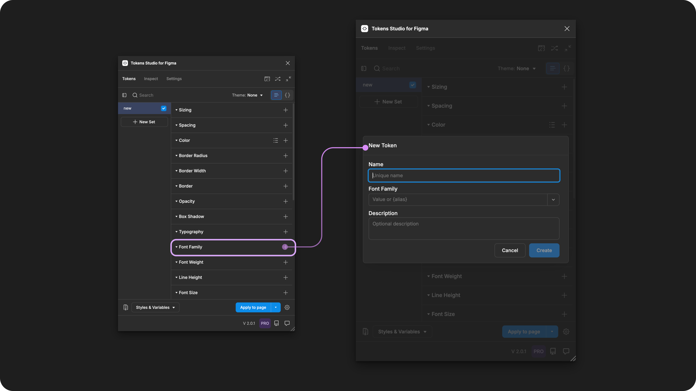
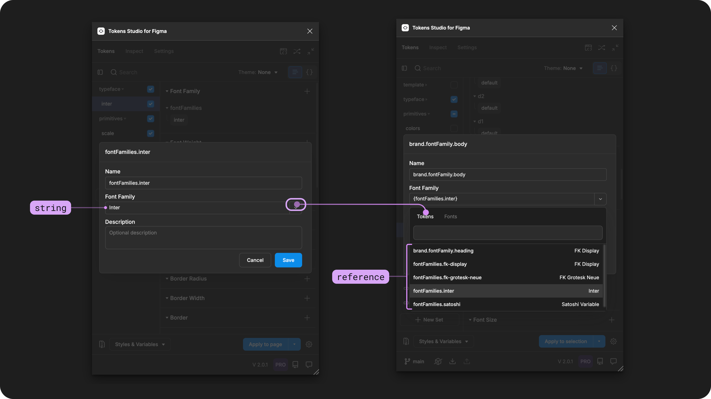
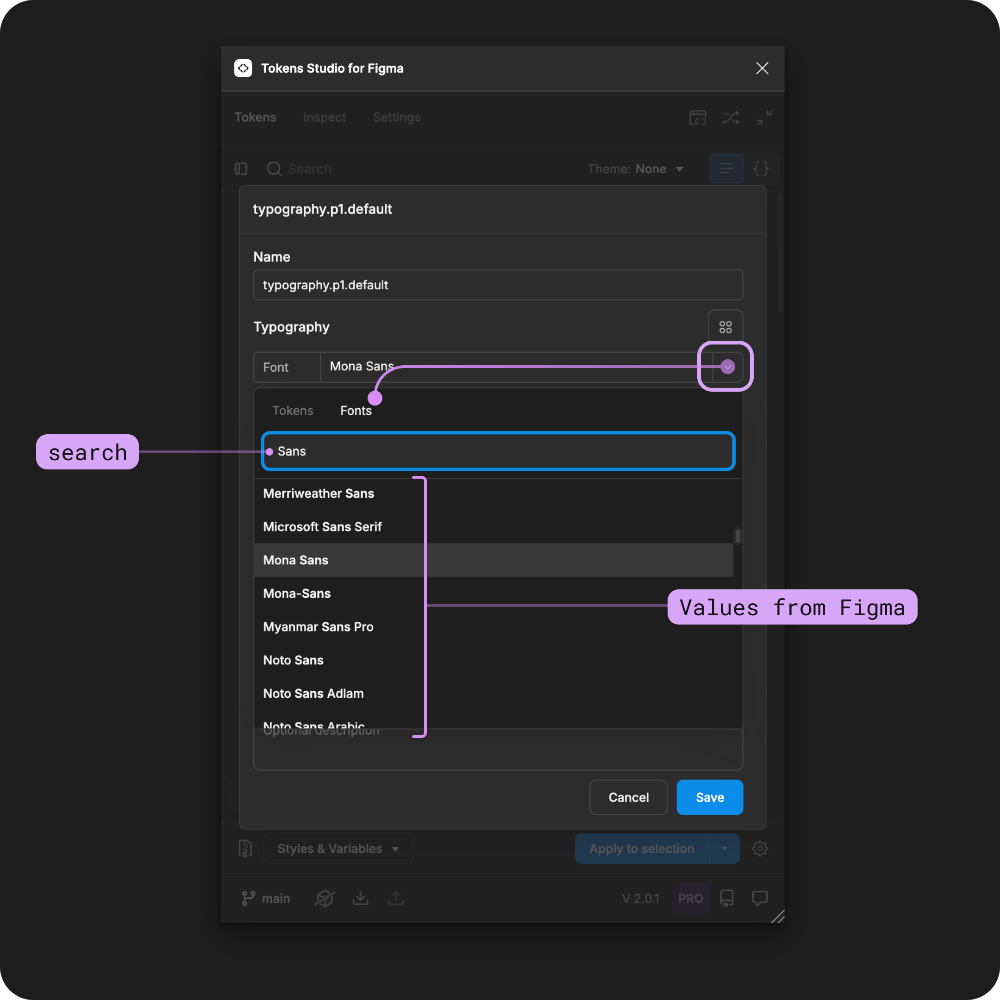
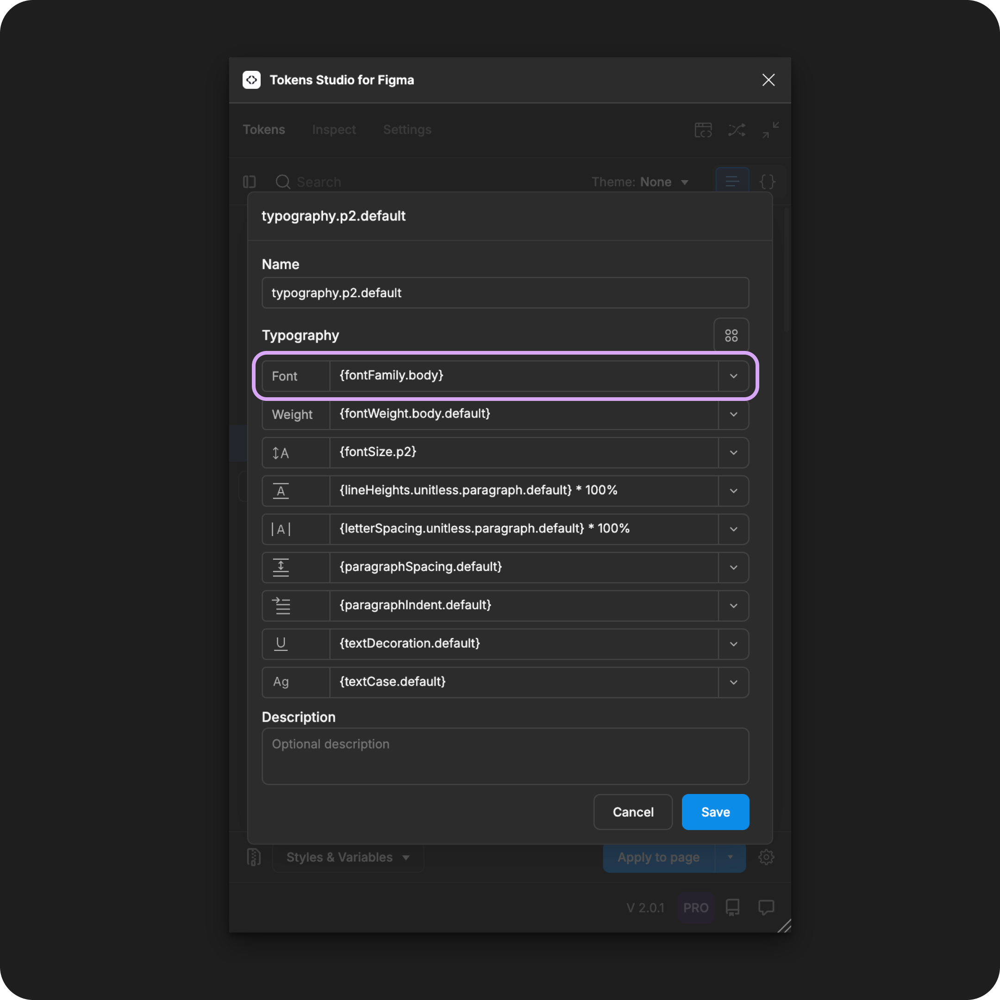

# Font Family

## Font Family - Token Type

Font Family Tokens define typeface as an individual property to be composed within a [Typography Token](./). It is **not** intended to be applied to text elements directly.&#x20;



<figure><figcaption><p>Creating a new Font Family Token in the Tokens Studio Plugin for Figma.</p></figcaption></figure>

***


### Design decisions

Font Family defines a group of related fonts that vary in weight, style or width but maintain a consistent visual appearance and share the same design characteristics.

In [CSS](https://developer.mozilla.org/en-US/docs/Web/CSS/font-family) this property is called `font-family`.

Font Family design decisions ensure that text elements are easy to read in a particular context while representing the visual style of the brand/product/service.

A design system will typically define which Font Family is to be used when text within a visual design calls for:

* serif font
* sans-serif font
* mono-spaced font
* decorative font

<table data-card-size="large" data-view="cards" data-full-width="true"><thead><tr><th></th><th data-hidden data-card-cover data-type="files"></th><th data-hidden data-card-target data-type="content-ref"></th></tr></thead><tbody><tr><td><p></p><p>Font Family Tokens can be attached to String Variables in Figma. </p></td><td><a href="../../../.gitbook/assets/card-header-figma-variables.png">card-header-figma-variables.png</a></td><td><a href="../../../figma/export/">export</a></td></tr></tbody></table>

***


### Possible values

The Value of a Font Family Token must be identical to the text string value for the Font Family in the Figma design panel due to limitations from Figma (plugin API).

When writing the string value of a Font Family Token, pay close attention to:

* Spelling
* Spacing
* Punctuation
* Use of capital letters

<figure><figcaption><p>Once the Font Family Token form is open, select the value dropdown to open the menu. The Token tab shows compatible Font Family Tokens available to reference as the value. </p></figcaption></figure>

#### Hard-coded values

To ensure your Font Family Token values are an exact match to what Figma has, you can:

* Carefully type it out, paying attention to the syntax in Figma.
* Save your Font Family and Font Weight pairs as text styles in Figma, then import them into the plugin to see how they appear.
* Select the value from the Tokens Studio menu, pictured below.

<figure><figcaption><p>Once the Font Family Token form is open, select the value dropdown to open the menu. The Fonts tab shows available Font Families from Figma to set as the hard-coded value. </p></figcaption></figure>


### Values that reference another Token

When trying to reference another Token as the Value for a Font Family Token, you will see Tokens in the dropdown list that are:

* Living in Token Sets that are currently active.
  * In the left menu on the plugin's Tokens page, **a checkmark is visible next to the Token Set name**.
* Token Type is compatible:
  * The same = `fontFamilies`

<figure><figcaption><p>The Typography Composite Token form is open, with each property referencing another Token. The Font Family property is highlighted. </p></figcaption></figure>




***


### W3C DTCG Token Format

**Font Family is an official Token Type** in the in the W3C Design Token Community Group specifications.( [8.3 Font Family](https://tr.designtokens.org/format/#font-family))

It is mentioned as a required part of a [typography token](https://tr.designtokens.org/format/#typography)

> "The typography's font. The value of this property _MUST_ be a valid font family value or a reference to a font family token." - 9.7. Typography

#### Token Type syntax

In Tokens Studio, the Font Family Token has a unique syntax in code which identifies if the token is:

* An independent property Token
* Part of a Typography Composite Token

Looking at the JSON format, the `"type"` is written in plural `"fontFamilies`" when the Font Size Token is defined as an independent property Token.

This example shows a Font Family property Token named `font-family-sans` with a value of Satoshi Variable (see line 4).


```json
{
  "font-family-sans": {
      "value": "Satoshi Variable",
      "type": "fontFamilies"
    }
  }
```



This is in contrast to the Typography Composite Token, which has the property Token `"type"` written in the singular `"fontFamily"`.

This example shows a Typography composite token with the Font Family Token named `font-family-sans` referenced as the value (see line 4).&#x20;


```json
{
  "paragraph-3": {
    "value": {
      "fontFamily": "{font-family-sans}",
      "fontWeight": "{font-weight-default}",
      "lineHeight": "{line-height-classic}",
      "fontSize": "{font-size-small}",
      "letterSpacing": "{letter-spacing-tight}",
      "paragraphSpacing": "{paragraphSpacing.none}"
      "paragraphIndent": "{paragraphIndent.none}"
      "textCase": "{textCase.none}",
      "textDecoration": "{textDecoration.none}"
    },
    "type": "typography"
  }
}
```


***


### Transforming Tokens



When transforming Font Family Tokens, there are specific configurations to be aware of.

The preprocessor in the SD-Transforms package will automatically convert the Tokens Studio specific Token Type of `fontFamilies` to align with the DTCG Format Token Type of `fontFamily`.

→ [SD-Transforms Read-Me Doc, Using the preprocessor](https://github.com/Tokens-studio/sd-transforms/?tab=readme-ov-file#using-the-preprocessor)


Font Family, as a part of Typography Composite Tokens, require the SD-Transforms option to `expand composite Tokens into multiple Tokens`.



***


### Resources

Mentioned in this doc:

* SD-Transforms - [Read Me](https://github.com/tokens-studio/sd-transforms#readme)
* Style Dictionary -[ https://styledictionary.com/](https://styledictionary.com/)
* Design Tokens Community Group - [W3C Draft](https://tr.designtokens.org/format/)
* Design Tokens Community Group - [8.3 Font Family](https://tr.designtokens.org/format/#font-family)
* Design Tokens Community Group - [9.7 Typography](ttps://tr.designTokens.org/format/#typography)

#### Figma resources:

* Design in Figma - [Explore Text Properties, Font Family](https://help.figma.com/hc/en-us/articles/360039956634-Explore-text-properties#font-family)
* Figma Learn - \[Add a font in Figma]\(# Add a font to Figma design)

#### CSS resources:

* MDN Web Docs - [font-family](https://developer.mozilla.org/en-US/docs/Web/CSS/font-family)


#### Community resources:

* Font Weight + Font Family Pairs explained by [Sam I am Designs](https://bento.me/samiam)
  * [It took me 2 years to figure out that Typography in Figma is not how text properties work in code.](https://samiamdesigns.substack.com/p/it-took-me-2-years-to-figure-out)
  * Import Typography Styles from Figma into Tokens Studio - [Video Tutorial by Sam I am Designs](https://www.youtube.com/watch?v=Z8o3YDkB6c8)




#### Known issues and bugs

Tokens Studio Plugin GitHub - [Open issues for Token Type Font Family](https://github.com/tokens-studio/figma-plugin/labels/token%20type%20font%20family)




#### Requests, roadmap and changelog

* None


