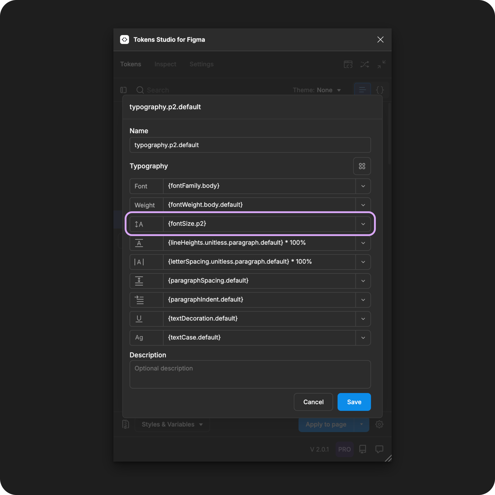

# Font Size

## Font Size - Token Type

Font Size Tokens define the height of the glyphs/characters as an individual property to be composed within a [Typography Token](./). It is **not** intended to be applied to text elements directly.&#x20;

In Typography, the Letter Spacing and Line Height properties are related to the Font Size.&#x20;

<figure><figcaption><p>Creating a new Font Size Token in the Tokens Studio Plugin for Figma.</p></figcaption></figure>

### Base font size

When you assign a Token Value in **Rem Units**, it creates a relationship with the system's Base Font Size.

A Rem Unit acts as a multiplier of the **Base Font Size.** This allows the font size to be controlled by user preferences in a responsive way.&#x20;

The value of 1rem in the Plugin can be configured in its settings.&#x20;


[base-font-size.md](../../../manage-settings/base-font-size.md)


***


### Design decisions&#x20;

Font Size, also known as point size or type size, defines the vertical size of each character/glyph in a typography design element.

In [CSS](https://developer.mozilla.org/en-US/docs/Web/CSS/font-size) this property is also called `font-size`.

A design system typically defines font sizes as a proportional scale to help with visual hierarchy and readability of text elements.


When we apply a Typography Composite Token to a text layer in Figma, these Font Size values will change the text layer:

* Responsive - `value in rem units`
  * Example: heading at `2rem` paragraph at `1rem`
    * a person who has increased the font-size of a mobile phone will see the heading text twice as large as the paragraph text
* Fixed - `value in pixels`
  * Example `32px`
    * the text will remain the same size when a user zooms into a webpage


<table data-card-size="large" data-view="cards" data-full-width="true"><thead><tr><th></th><th data-hidden data-card-cover data-type="files"></th><th data-hidden data-card-target data-type="content-ref"></th></tr></thead><tbody><tr><td>Font Size Tokens can be attached to Number Variables in Figma.</td><td><a href="../../../.gitbook/assets/card-header-figma-variables.png">card-header-figma-variables.png</a></td><td><a href="../../../figma/export/">export</a></td></tr></tbody></table>


***


### Possible values

Like all Tokens defining a dimension design decision, the value for the Font Size property must include a numeric value and, ideally, a unit of measure.


Tokens without a unit specified are applied as the pixel equivalent in Figma.





For Font Size Tokens, math might be used to create dynamic scales of font sizes that follow a particular multiplier, like the golden ratio.


#### Hard-coded values

The syntax used to write numeric values for the Font Size property is important.

* Be sure to avoid any spaces between numbers and units of measurement.&#x20;
* Units are always written in lowercase.
* Value should always be greater than 0.&#x20;


**Rem units (rem)**&#x20;

To support responsive design, you can define your Font Size Token in r**em units**, and the plugin automatically converts the value to the pixel equivalent when the Typography Composite Token is applied to the text element in Figma.&#x20;

For example, a Font Size Token with a value of `2rem`, when applied as a Typography Composite Token, will have letters appear as `32px`tall in Figma.




Tokens Studio supports Font Size Tokens in **em units** and will treat them the same as rem units when applying them to text layers in Figma.&#x20;



**Pixel units (px)**

Should you require the character size to remain static even when users change their preferences, the Font Size value can be defined in pixel units. For example:

```
20px
```


**Units not supported by Figma**

There are additional units [commonly used in CSS for Font Size ](https://www.w3schools.com/css/css_font_size.asp)properties that are not supported in Figma.

* percentage (%)
* em and percentage combined
* viewport width (vw)

You can still create Font Size Tokens with these units using the Tokens Studio plugin.

When you apply them to design elements in Figma, the Token will be present and visible to engineers inspecting the design element in Figma, but the Token won't interact with the Font Size property in Figma's UI.

It will be up to the engineers working to transform the design Tokens in Style Dictionary if they want to transform the values as you've entered them or change them in some way.


### Values that reference another Token

When trying to reference another Token as the Value for a Font Size Token, you will see Tokens in the dropdown list that are:

* Living in Token Sets that are currently active.
  * In the left menu on the plugin's Tokens page, **a checkmark is visible next to the Token Set name.**
* Token Type is compatible:
  * The same = `fontSizes`
  * `number`
  * `dimension`

<figure><figcaption><p>The Typography Composite Token form is open, with each property referencing another Token. The Font Size property is highlighted. </p></figcaption></figure>




***


### W3C DTCG Token Format

Font Size is not yet an official Token type in the W3C Design Token Community Group specifications.

However, it is mentioned as a required part of a [typography Token](https://tr.designtokens.org/format/#typography)

> "The size of the typography. The value of this property _MUST_ be a valid dimension value or a reference to a dimension Token." - 9.7. Typography

Tokens Studio has added Font Size as an unofficial Token type in anticipation it will be added to the W3C specs in the near future.


#### Token Type syntax

In Tokens Studio, the Font Size Token has a unique syntax in code which identifies if the Token is:

* An independent property Token
* Part of a Typography Composite Token

Looking at the JSON format, the `"type"` is written in plural `"fontSizes`" when the Font Size Token is defined as an independent property Token.

This example shows a Font Size property Token named `font-size-small` with the value in pixels (see line 4).


```json
{
   "font-size-small": {
      "value": "20px",
      "type": "fontSizes"
   }
}
```


This is in contrast to the Typography Composite Token, which has the property Token `"type"` written in the singular `"fontSize"`.

This example shows a Typography Composite Token with the Font Weight property Token named `font-size-small` referenced as the value (see line 5).&#x20;


```json
{
   "paragraph-3": {
      "value": {
         "fontFamily": "{font-family-sans}",
         "fontWeight": "{font-weight-default}",
         "lineHeight": "{line-height-classic}",
         "fontSize": "{font-size-small}",
         "letterSpacing": "{letter-spacing-tight}",
         "paragraphSpacing": "{paragraphSpacing.none}"
         "paragraphIndent": "{paragraphIndent.none}"
         "textCase": "{textCase.none}",
         "textDecoration": "{textDecoration.none}"
      },
      "type": "typography"
   }
}
```


***


### Transforming Tokens



When transforming Font Size Tokens, there are specific configurations to be aware of.

Font Size Token values entered as a number without a unit converted to a number with pixels as a unit.

→ [SD-Transforms Read-Me Doc, ts/size/px](https://github.com/Tokens-studio/sd-transforms/?tab=readme-ov-file#tssizepx)


Token Values entered with math equations need to be checked and resolved.

→ [SD-Transforms Read-Me Doc, ts/resolveMath](https://github.com/Tokens-studio/sd-transforms/?tab=readme-ov-file#tssizepx)


The preprocessor in the SD-Transforms package will automatically convert the Tokens Studio specific Token Type of `fontSizes` to align with the DTCG Format Token Type of `fontSize`.

→ [SD-Transforms Read-Me Doc, Using the preprocessor](https://github.com/Tokens-studio/sd-transforms/?tab=readme-ov-file#using-the-preprocessor)


Font Size Tokens, as part of Typography Composite Tokens, require the SD-Transforms option to `expand composite Tokens into multiple Tokens`.



***


### Resources

Mentioned in this doc:

* SD-Transforms - [Read Me](https://github.com/tokens-studio/sd-transforms#readme)
* Style Dictionary - [https://styledictionary.com/](https://styledictionary.com/)
* Design Tokens Community Group - [W3C Draft](https://tr.designtokens.org/format/)
* Design Tokens Community Group - [9.7 Typography](ttps://tr.designTokens.org/format/#typography)


Figma resources:

* Design in Figma - [Explore Text Properties, Font Size](https://help.figma.com/hc/en-us/articles/360039956634-Explore-text-properties#font-size)


CSS resources:

* MDN Web Docs - [Font Size](https://developer.mozilla.org/en-US/docs/Web/CSS/font-size)
* W3 Schools - [Font Size](https://www.w3schools.com/css/css_font_size.asp)


Community resources:

* WHAT - LINK
* Font size scalar tool




#### Known issues and bugs

Tokens Studio Plugin GitHub - [Open issues for Token Type Font Size](https://github.com/tokens-studio/figma-plugin/labels/token%20type%20font%20size)

* None yet




#### Requests, roadmap and changelog

* None


