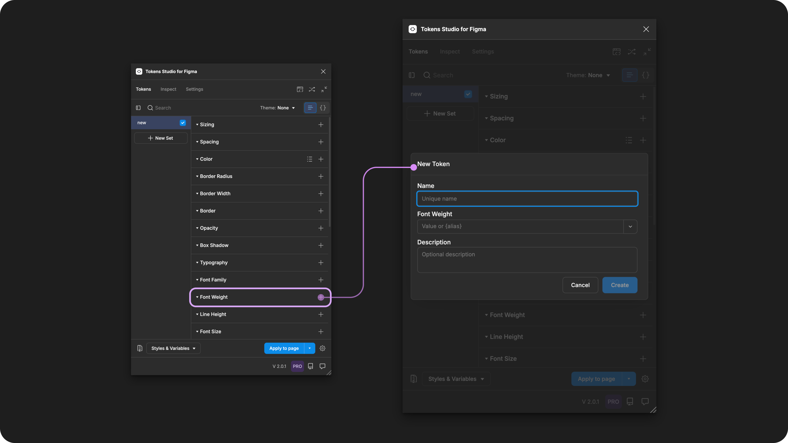
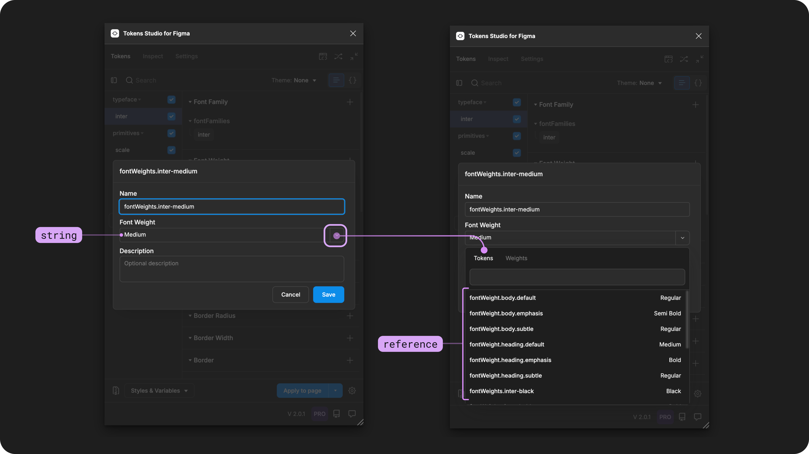
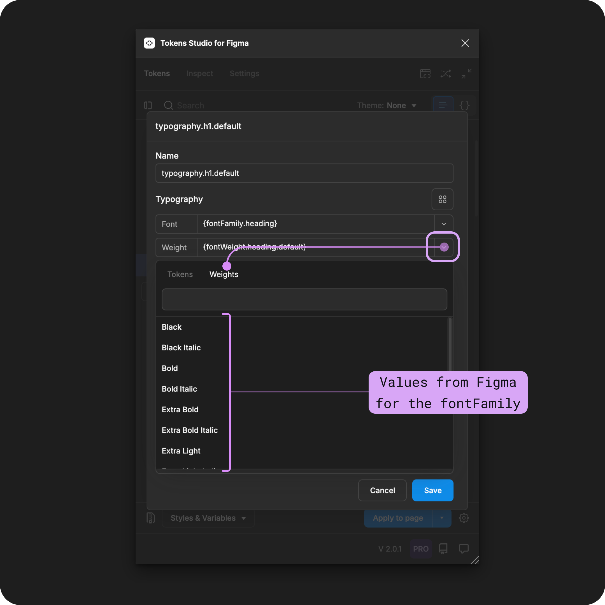
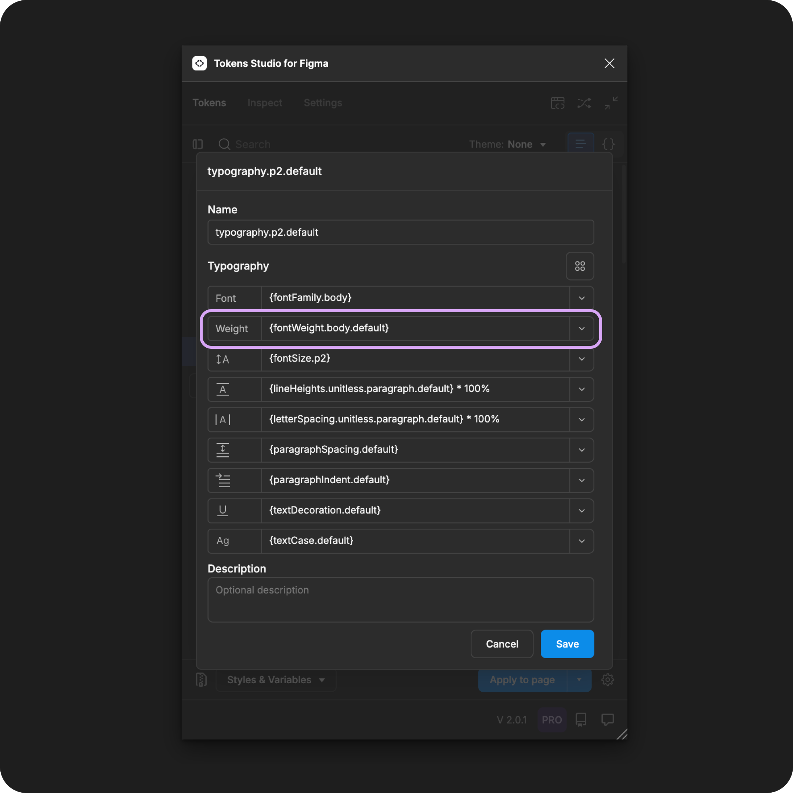

# Font Weight

## Font Weight - Token Type

Font Weight Tokens define the thickness and styling of the characters related to the Font Family as an individual property to be composed within a [Typography Token](./). It is **not** intended to be applied to text elements directly.&#x20;



<figure><figcaption><p>Creating a new Font Weight Token in the Tokens Studio Plugin for Figma.</p></figcaption></figure>

***


### Design decisions

Font Weight defines the thickness of each character/glyph in the Font Family. Font Weight design decisions are typically used to communicate visual hierarchy or emphasize text elements.

In [CSS](https://developer.mozilla.org/en-US/docs/Web/CSS/font-weight) this property is called `font-weight`.

Font Weight in [Figma](https://help.figma.com/hc/en-us/articles/360039956634-Explore-text-properties#font-weight) is written differently for each Font Family. It also combines the font-style property. So, for one Font Family, you might see several Font Weights:

* bold
* bold-italic
* bold-wide
* bold-wide-italic

In [CSS](https://developer.mozilla.org/en-US/docs/Web/CSS/font-style), `font-style` and `font-weight` are defined as independent properties.

<table data-card-size="large" data-view="cards" data-full-width="true"><thead><tr><th></th><th data-hidden data-card-cover data-type="files"></th><th data-hidden data-card-target data-type="content-ref"></th></tr></thead><tbody><tr><td><p></p><p>Font Weight Tokens can be attached to String or Number Variables in Figma. </p></td><td><a href="../../../.gitbook/assets/card-header-figma-variables.png">card-header-figma-variables.png</a></td><td><a href="../../../figma/export/">export</a></td></tr></tbody></table>


***


### Possible values

The value of a Font Weight Token must be identical to the text string value for Font weight (plus styling) in the Figma design panel due to limitations from Figma (plugin API).

When writing your Font Weight Token values, pay close attention to:

* Spelling
* Spacing
* Punctuation
* Use of capital letters

<figure><figcaption><p>Once the Font Weight Token form is open, select the value dropdown to open the menu. The Token tab shows compatible Font Weight Tokens available to reference as the value. </p></figcaption></figure>

#### Hard-coded values

To ensure your Font Weight Token values are an exact match to what Figma has, you can:

* Carefully type it out, paying attention to the syntax in Figma.
* Save your Font Family and Font Weight pairs as text styles in Figma, then import them into the plugin to see how they appear.
* Select the value from the Tokens Studio menu (works for Typography composite Tokens only), pictured below.

<figure><figcaption><p>Once the Typography Token form is open, select the Font Weight value dropdown to open the menu. The Weights tab shows compatible Font Weights for the selected Font Familily from Figma to set as the hard-coded value. </p></figcaption></figure>


#### Numeric weights


Text Styles in Figma don't accept a numeric value for Font Weight, only a string value.

Text Variables in Figma has limited support for numeric values for Font Weights.


To work around this limitation, we've [written a conversion](https://github.com/tokens-studio/figma-plugin/blob/main/src/plugin/figmaTransforms/fontWeight.ts) into the plug-in, which allows the value of a Font Weight Token to be written in its numerical value, like `400` or `700`, and the plugin translates it into a text string that Figma recognizes.

You can enter any of these numeric raw values in the table below into the **Font Weight Token**, and the plugin will convert them to the corresponding resolved value for the Font Family Token they are paired with.

* Keep in mind that your chosen Font Families may not support all Font Weights.
* If you enter an incompatible value with your Font Family, the plugin will send an error message when you try to apply the Token or Export as Styles in Figma.


<table><thead><tr><th width="208">Raw Numeric Value</th><th>Resolved Value</th></tr></thead><tbody><tr><td>100</td><td>Thin<br>Hairline</td></tr><tr><td>200</td><td>Extra Light<br>ExtraLight<br>Ultra Light<br>UltraLight<br>extraleicht</td></tr><tr><td>300</td><td>Light<br>leicht</td></tr><tr><td>400</td><td>Regular<br>Normal<br>buch</td></tr><tr><td>500</td><td>Medium<br>kraeftig<br>kräftig</td></tr><tr><td>600</td><td>Semibold<br>SemiBold<br>Semi Bold<br>DemiBold<br>Demi Bold<br>halbfett</td></tr><tr><td>700</td><td>Bold<br>dreiviertelfett</td></tr><tr><td>800</td><td>ExtraBold<br>Extra Bold<br>UltraBold<br>Ultra Bold<br>fett</td></tr><tr><td>900</td><td>Black<br>Heavy<br>extrafett</td></tr><tr><td>950</td><td>Extra Black<br>Ultra Black</td></tr></tbody></table>



If your system uses italics or other styling properties that Figma has combined into its Font Family and Font Weight pairing, we suggest using the text string value instead of the numeric value.


Recall that Figma combines the thickness of letters with other text styling properties, like the slant or posture of the glyphs/characters, to create their unique Font Weight property.

This is written differently depending on the Font Family.

For example, 600 from the chart above and italic style would appear in Figma's Font Weight property as

* Inter = `Semi Bold Italic`
* Source Sans Pro = `SemiBold Italic`
* SF Pro = `Semibold Italic`

This doesn't match the way font weights, font families, and their styles typically work in code. It also means that if you use the numeric value, the plug-in cannot communicate any additional styling properties (like italics) that Figma combines.


#### Converting from numeric to string values

If you are converting your Tokens between numeric and string values and you've already exported to Figma as a Style with Variable References, you may need to delete the Variable from the Figma collection.&#x20;

Figma doesn't allow the changing of a Variable type, so by deleting that single Variable in Figma, when you export the Typography Token as a Style with Variable References, the Plugin will create the variable with the new Token Type.&#x20;

[→ Jump to the Typography Token guide for more details. ](./#text-styles-in-figma)


### Values that reference another Token

When trying to reference another Token as the Value for a Font Weight Token, you will see Tokens in the dropdown list that are:

* Living in Token Sets that are currently active.
  * In the left menu on the plugin's Tokens page, a **checkmark is visible next to the Token Set name.**
* Token Type is compatible:
  * The same = `fontWeights`
  * `number`
  * `dimension`

<figure><figcaption><p>The Typography Composite Token form is open, with each property referencing another Token. The Font Weight property is highlighted. </p></figcaption></figure>




***


### W3C DTCG Token Format

**Font Weight is an official Token Type** in the in the W3C Design Token Community Group specifications.([8.4 Font weight](https://tr.designtokens.org/format/#font-weight))

It is mentioned as a required part of a [typography token](https://tr.designtokens.org/format/#typography)

> "The weight of the typography. The value of this property _MUST_ be a valid font weight or a reference to a font weight token." - 9.7. Typography

Tokens Studio has approached Font Weight Token differently than how they are defined in the current spec to support the unique way that Figma combines the Font Weight and additional styling properties.

When you use Style Dictionary as a part of your design-to-code pipeline, these text string values will be transformed into numeric values which align with the W3C specification and how these properties work in CSS.


#### Token Type syntax

In Tokens Studio, the Font Weight Token has a unique syntax in code which identifies if the token is:

* An independent property Token
* Part of a Typography Composite Token

Looking at the JSON format, the `"type"` is written in plural `"fontWeights`" when the Font Weight Token is defined as an independent property Token.

This example shows a Font Weight property Token named `font-weight-default` with its value as a text string `"bold"` (see line 2).


```json
  "font-weight-default": {
   "value": "Bold",
   "type": "fontWeights"
 }
```


This is in contrast to the Typography Composite Token, which has the property `"type"` written in the singular `"fontWeight"`.

This example shows a Typography Composite Token with the Font Weight property Token named `font-weight-default` referenced as the value (see line 5).


```json
{
  "paragraph-3": {
 "value": {
   "fontFamily": "{font-family-sans}",
   "fontWeight": "{font-weight-default}",
   "lineHeight": "{line-height-classic}",
   "fontSize": "{font-size-small}",
   "letterSpacing": "{letter-spacing-tight}",
   "paragraphSpacing": "{paragraphSpacing.none}"
   "paragraphIndent": "{paragraphIndent.none}"
   "textCase": "{textCase.none}",
   "textDecoration": "{textDecoration.none}"
 },
 "type": "typography"
  }
}
```


***


### Transforming Tokens



When transforming Font Weight Tokens, there are specific configurations to be aware of.

Recall that Figma combines the `fontStyle` and `fontWeight` properties into a single text string value. If this is true within your tokens, you'll want to look into the optional transform to add a separate `fontStyle token` to be included in the CSS shorthand.

→ [SD-Transforms Read-Me Doc, alwaysAddFontStyle](https://github.com/tokens-studio/sd-transforms/?tab=readme-ov-file#tstypographyfontweight)\


The preprocessor in the SD-Transforms package will automatically convert the Tokens Studio specific Token Type of `fontWeights` to align with the DTCG Format Token Type of `fontWeight`.

→ [SD-Transforms Read-Me Doc, Using the preprocessor](https://github.com/Tokens-studio/sd-transforms/?tab=readme-ov-file#using-the-preprocessor)


**Font Weight Token** entered as a text string that needs to be converted to its numeric value so it matches CSS.

→ [SD-Transforms Read-Me Doc, Font Weight](https://github.com/tokens-studio/sd-transforms/?tab=readme-ov-file#tstypographyfontweight)


Font Weight as a part of Typography Composite Tokens require the SD-Transforms option to `expand composite Tokens into multiple Tokens`.

Make sure you look at the generic SD-Transforms package to include this option, which allows you to further customize this transformation further using Style Dictionary.

→ [SD-Transforms Read-Me Doc, Generic - expand composite Tokens](https://github.com/Tokens-studio/sd-transforms/?tab=readme-ov-file#tstypographycssshorthand)


"object, object"

When you transform your Typography Tokens, and they show `"object, object"` it means your SD-Transforms configuration needs to be adjusted to include `"expand"`.


***


### Resources

Mentioned in this doc:

* SD-Transforms - [Read Me](https://github.com/tokens-studio/sd-transforms#readme)
* Style Dictionary - https://styledictionary.com/
* Design Tokens Community Group - [W3C Draft](https://tr.designtokens.org/format/)
* Design Tokens Community Group - [9.7 Typography](ttps://tr.designTokens.org/format/#typography)
* Design Tokens Community Group - [8.4 Font Weight](https://tr.designtokens.org/format/#font-weight)

#### Figma resources:

* Design in Figma - [Explore Text Properties, Font Weight](https://help.figma.com/hc/en-us/articles/360039956634-Explore-text-properties#font-weight)

#### CSS resources:

* MDN Web Docs - [font-weight](https://developer.mozilla.org/en-US/docs/Web/CSS/font-weight)
* MDN Web Docs - [font-style](https://developer.mozilla.org/en-US/docs/Web/CSS/font-style)

#### Community resources:

* Font Weight + Font Family Pairs explained by [Sam I am Designs](https://bento.me/samiam)
  * [It took me 2 years to figure out that Typography in Figma is not how text properties work in code.](https://samiamdesigns.substack.com/p/it-took-me-2-years-to-figure-out)
  * Import Typography Styles from Figma into Tokens Studio - [Video Tutorial by Sam I am Designs](https://www.youtube.com/watch?v=Z8o3YDkB6c8)




#### Known issues and bugs

Tokens Studio Plugin GitHub - [Open issues for Token Type Font Weight](https://github.com/tokens-studio/figma-plugin/labels/token%20type%20font%20weight)

* None yet




#### Requests, roadmap and changelog

* None



