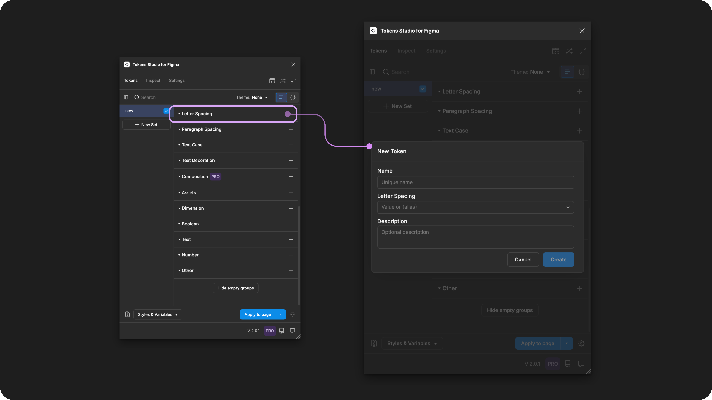
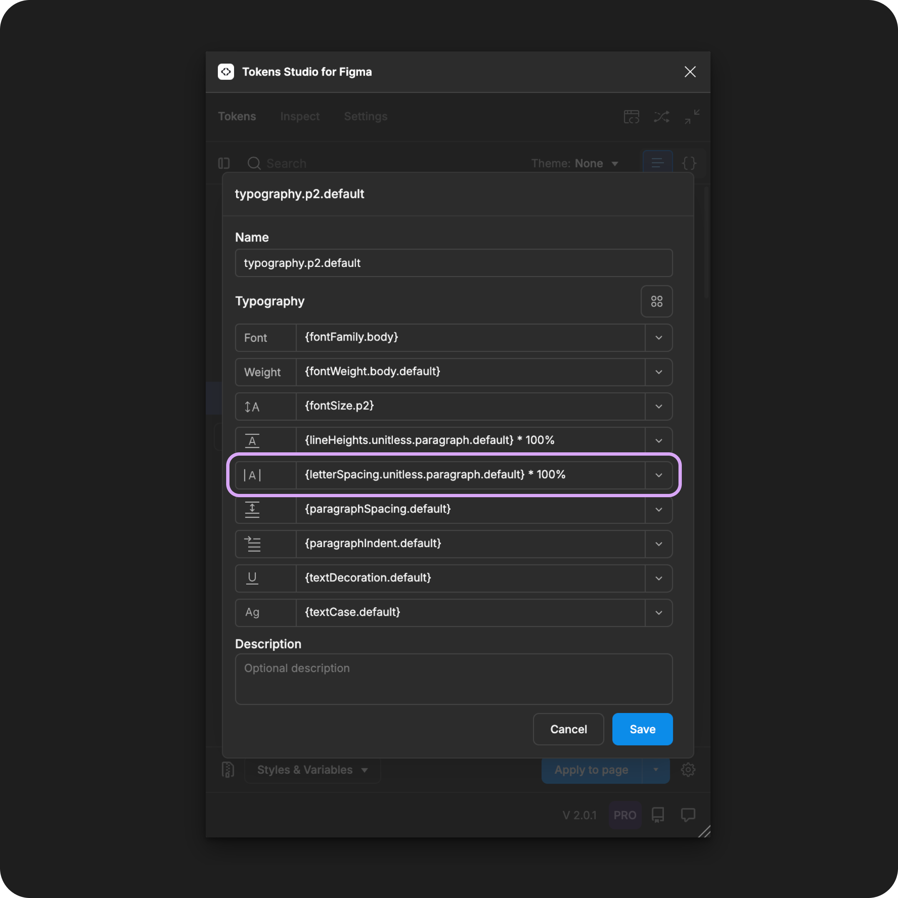

# Letter Spacing

## Letter Spacing - Token Type

Letter Spacing Tokens define the horizontal distance between each glyph/character (related to its font size) as an individual property to be composed within a [Typography Token](./). It is **not** intended to be applied to text elements directly.&#x20;

<figure><figcaption><p>Creating a new Letter Spacing Token in the Tokens Studio Plugin for Figma.</p></figcaption></figure>

***


### Design decisions&#x20;

Letter Spacing, also known as kerning or tracking, defines the horizontal distance between individual characters/glyphs of a word or other strings of text.

In [CSS](https://developer.mozilla.org/en-US/docs/Web/CSS/letter-spacing) this property is called `letter-spacing`.

Letter Spacing decisions are typically used to style text elements to improve readability and creatively express a product or brand's visual language.


When we apply a Typography Composite Token to a text layer in Figma, these Letter Spacing values will change the text layer:

* Default - `value is 0`
  * By default, the system uses the value determined by the Font Family
* Characters/glyphs are closer together - `values less than 0`
  * Example `-2%`
  * Text styles with heavier Font Weight and larger Font Size to "tighten" headlines and display text on a marketing website.
* Characters/glyphs are farther apart - `values greater than 0`
  * Example `1px`
  * Text styles with lighter Font Weight and smaller Font Size "relax" the account number and phone number in the settings page of a customer portal.


<table data-card-size="large" data-view="cards" data-full-width="true"><thead><tr><th></th><th data-hidden data-card-cover data-type="files"></th><th data-hidden data-card-target data-type="content-ref"></th></tr></thead><tbody><tr><td><p></p><p>Letter Spacing Tokens can be attached to Number Variables in Figma. </p></td><td><a href="../../../.gitbook/assets/card-header-figma-variables.png">card-header-figma-variables.png</a></td><td><a href="../../../figma/export/">export</a></td></tr></tbody></table>


***


### Possible values

Like all Tokens defining a dimension design decision, the value of a Letter Spacing Token must include a numeric value and, ideally, a unit of measure.


Tokens without a unit specified are applied as the pixel equivalent in Figma.




For Letter Spacing Tokens, math might be used to convert a unitless number into a percentage.


#### Hard-coded values

The syntax used to write numeric values for the Letter Spacing property is important.

* Be sure to avoid any spaces between numbers and units of measurement.&#x20;
* Units are always written in lowercase.
* Value should always be greater than 0.&#x20;


**percentage (%)**

To scale the Letter Spacing relative to Font Size the Token value will be defined with a percentage to match Figma's unique approach to typography. &#x20;

When the Typography Composite Token is applied, the Plugin will apply the percentage as a multiplier of the Font Size.&#x20;

This is different from the way we would define this relationship in code. In CSS, we might enter this as a number in **em units**, which Figma does not support, but Tokens Studio has written a custom Token Transformation to help.

[↓ See the Transforming Tokens section below for more details.](letter-spacing.md#transforming-tokens)


**Rem units (rem)**

To support responsive design, you can define your Letter Spacing Token in r**em units**, and the Plugin automatically converts the value to the pixel equivalent when the Typography Composite Token is applied to the text element in Figma.&#x20;

For example, a Paragraph Spacing Token with a value of `-0.25rem`, when applied as a Typography Composite Token, will have letters appear as `-4px`closer together in Figma.




**pixels (px)**

While its not common, should you require the space between every character of text to remain static even when users change their preferences, the Letter Spacing value can be defined in pixel units. For example:

```
1px
```

Be mindful that the fixed value in pixels means the Letter Spacing property is no longer related to the Font Size in the Typography Composite Token. If you change the Font Size, you'll also need to change the Letter Spacing value.&#x20;


**Units not supported by Figma**

Tracking is another CSS property related to Letter Spacing, typically defined in px or em units

Figma does not allow em units but [suggests the use of this formula](https://help.figma.com/hc/en-us/articles/360039956634-Explore-text-properties#spacing) to convert em units to percentages:

* `1000px tracking = 100% letter spacing = 1em letter-spacing (CSS)`
  * so a value of 4% would = 0.04em

You can still create Letter Spacing Tokens with these units using the Tokens Studio plugin.

When you apply them to design elements in Figma, the Token will be present and visible to engineers inspecting the design element in Figma, but the Token won't interact with the Letter Spacing property in Figma's UI.

It will be up to the engineers working to transform the design Tokens in Style Dictionary if they want to transform the values as you've entered them or change them in some way.


### Values that reference another Token

When trying to reference another Token as the Value for a Letter Spacing Token, you will see you will see Tokens in the dropdown list that are:

* Living in Token Sets that are currently active.
  * In the left menu on the plugin's Tokens page, **a checkmark is visible next to the Token Set name.**
* Token Type is compatible:
  * The same = `letterSpacing`
  * `dimension`
  * `number`

<figure><figcaption><p>The Typography Composite Token form is open, with each property referencing another Token. The Letter Spacing property is highlighted. </p></figcaption></figure>




***


### W3C DTCG Token Format

Letter Spacing is not yet an official dedicated Token type in the W3C Design Token Community Group specifications.

However, it is mentioned as a required part of a [Typography Token](https://tr.designtokens.org/format/#typography).

> "The horizontal spacing between characters. The value of this property _MUST_ be a valid dimension value or a reference to a dimension Token." - 9.7. Typography


Figma doesn't support a rem or em value number for responsive design.


Tokens Studio has added Letter Spacing as an unofficial Token Type to support Figma's unique approach to this text property which includes allowing the use of percentage as a value.  If your Design Tokens are being used in code, we have included a transformation to correct this inconsistency, described below.

***


### Transforming Tokens



When transforming Letter Spacing Tokens, there are specific configurations to be aware of.

Letter Spacing Token Values entered as a **percentage** to accommodate Figma's unique approach to Typography need to be converted to em units in [CSS](https://developer.mozilla.org/en-US/docs/Web/CSS/letter-spacing).

→ [SD-Transforms Read-Me Doc, ts/size/css/letterspacing](https://github.com/Tokens-studio/sd-transforms/?tab=readme-ov-file#tssizecssletterspacing)


The preprocessor in the SD-Transforms package will automatically convert the Tokens Studio specific Token Type of `paragraphSpacing` to align with the DTCG Format Token Type of `dimension`.

→ [SD-Transforms Read-Me Doc, Using the preprocessor](https://github.com/Tokens-studio/sd-transforms/?tab=readme-ov-file#using-the-preprocessor)


Letter Spacing Tokens, as part of Typography Composite Tokens, requires the SD-Transforms option to `expand composite Tokens into multiple Tokens`.



***


### Resources

Mentioned in this doc:

* SD-Transforms - [Read Me](https://github.com/tokens-studio/sd-transforms#readme)
* Style Dictionary - https://styledictionary.com/
* Design Tokens Community Group - [W3C Draft](https://tr.designtokens.org/format/)
* Design Tokens Community Group - [9.7 Typography](ttps://tr.designTokens.org/format/#typography)

#### Figma resources:

* Design in Figma - [Explore Text Properties, Letter Spacing](https://help.figma.com/hc/en-us/articles/360039956634-Explore-text-properties#letter-spacing)

#### CSS resources:

* MDN Web Docs - [letter-spacing](https://developer.mozilla.org/en-US/docs/Web/CSS/letter-spacing)
* W3 Schools - [letter spacing](https://www.w3schools.com/css/css_text_spacing.asp)


#### Community resources:

* None yet!




#### Known issues and bugs

Tokens Studio Plugin GitHub - [Open issues for Token Type Letter Spacing](https://github.com/tokens-studio/figma-plugin/labels/token%20type%20letter%20spacing)

* None yet




#### Requests, roadmap and changelog

* None


