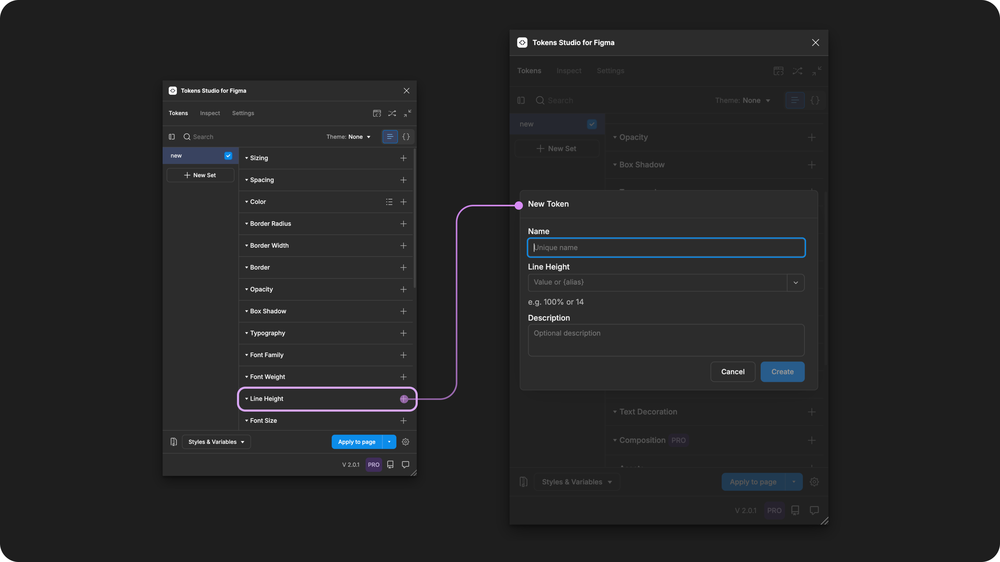
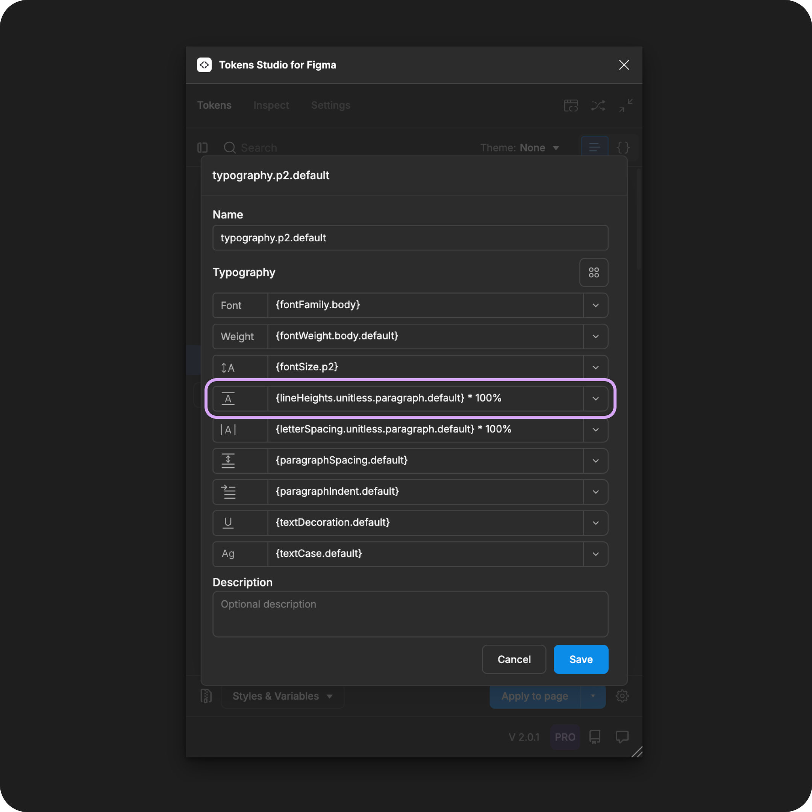

# Line Height

## Line Height - Token Type

Line Height Tokens define the vertical distance of each line of text (related to its font size) as an individual property to be composed within a [Typography Token](./). It is **not** intended to be applied to text elements directly.&#x20;

<figure><figcaption><p>Creating a new Line Height Token in the Tokens Studio Plugin for Figma.</p></figcaption></figure>

***


### Design decisions

Line Height, also known as leading, defines the vertical distance of each line of text.

In [CSS](https://developer.mozilla.org/en-US/docs/Web/CSS/line-height) this property is called `line-height`.


Line Height decisions are typically used to enhance the readability of text.&#x20;

For example, it's common to use a larger Line Height value for long-form text than a short headline to make paragraphs easier to read.


When we apply a Typography Composite Token to a text layer in Figma, these **Line Height** **values** will change the text layer:

* No changes to the Line Height - `normal`
  * By default, the system uses the value determined by the typeface it is pared with
* Relative to [Font Size](font-size.md) - `value in %`
  * Example `200%`
    * Line Height will be twice as large as the font size no matter what the `Font size` is
* Responsive - `value in rem`
  * Example `2rem`
    * A person with a webpage zoomed in will see this **Line Height** remain twice as large as a font size set at `1rem`
* Fixed - `value in px`
  * Example `32px`
    * **Line Height** will remain the same even when the `Font size` changes or the user tries to modify the text using system accessibility features.


<table data-card-size="large" data-view="cards" data-full-width="true"><thead><tr><th></th><th data-hidden data-card-cover data-type="files"></th><th data-hidden data-card-target data-type="content-ref"></th></tr></thead><tbody><tr><td><p></p><p>Line Height Tokens can be attached to Number Variables in Figma. <br></p><p>However, Figma does not support responsive values for Line Height as Number Variables, they only fixed values as Number Variables.</p></td><td><a href="../../../.gitbook/assets/card-header-figma-variables.png">card-header-figma-variables.png</a></td><td><a href="../../../figma/export/">export</a></td></tr></tbody></table>


***


### Possible values

Like all Tokens defining a dimension design decision, the value of a Line Height Token must include a numeric value and, ideally, a unit of measure.


Tokens without a unit specified are applied as the pixel equivalent in Figma.


Unless you are choosing to use the "default" value defined by the Font Family, which is commonly referred to as the `normal` value.




For Line Height Tokens, math might be used to ensure that the bounding box for your text elements always sits on a 4/8 pixel grid.


**normal (AUTO)**

Figma supports the equivalent of the `normal` Value in CSS (Figma has this as AUTO).&#x20;

To write your **Line Height Token** with this value, it needs to match the following text string, which is case sensitive:

```
normal
```

However, if you are Exporting your Typography Tokens to Figma as Styles with Variable references, Figma does not support this string value.&#x20;


#### Hard-coded numeric values

The syntax used to write numeric values for the Letter Spacing property is important.

* Be sure to avoid any spaces between numbers and units of measurement.&#x20;
* Units are always written in lowercase.
* Value should always be greater than 0.&#x20;


Figma allows values less than 0&#x20;

Line Height Values less than 0 are not widely supported in CSS and other programming languages. So, while you can enter negative values in the plugin that will communicate with Figma, we don't suggest this without consulting with your engineering team.



**Percentage units (%)**

To scale the Line Height relative to Font Size the Token value will be defined with a percentage to match Figma's unique approach to typography. &#x20;

When the Typography Composite Token is applied, the Plugin will apply the percentage as a multiplier of the Font Size.&#x20;

This is different from the way we would define this relationship in code. In CSS, we might enter this as a unitless number, which Figma does not support as unitless numbers in Figma as assumed to be pixels.

[↓ See the Transforming Tokens section below for more details.](line-height.md#transforming-tokens)


**Rem units (rem)**

While its not common, you can define your Line Height Token in **rem units**, and the Plugin automatically converts the value to the pixel equivalent when the Typography Composite Token is applied to the text element in Figma.&#x20;

For example, a Line Height Token with a value of `1rem`, when applied as a Typography Composite Token, will appear as `16px` in Figma.




**pixels (px)**

While its not common, should you require the line height to remain static even when users change their preferences, the Line Height value can be defined in pixel units. For example:

```
20px
```

Be mindful that the fixed value in pixels means the Line Height property is no longer related to the Font Size in the Typography Composite Token. If you change the Font Size, you'll also need to change the Line Height value.&#x20;


**Units not supported by Figma**

There are additional units [commonly used in CSS for Line Height](https://www.w3schools.com/cssref/pr_dim_line-height.php) properties that are not supported in Figma:

* length in cm, pt, etc
* additional text-strings
  * initial - sets the property to default value
  * inherit - parent element determines the value

You can still create Line Height Tokens with these units using the Tokens Studio plugin.

When you apply them to design elements in Figma, the Token will be present and visible to engineers inspecting the design element in Figma, but the Token won't interact with the Line Height property in Figma's UI.

It will be up to the engineers working to transform the design Tokens in Style Dictionary if they want to transform the values as you've entered them or change them in some way.


### Values that reference another Token

When trying to reference another Token as the Value for a Line Height Token, you will seeyou will see Tokens in the dropdown list that are:

* Living in Token Sets that are currently active.
  * In the left menu on the plugin's Tokens page, **a checkmark is visible next to the Token Set name.**
* **T**oken Type is compatible:
  * The same = `lineHeights`
  * `dimension`
  * `number`

<figure><figcaption><p>The Typography Composite Token form is open, with each property referencing another Token. The Line Height property is highlighted. </p></figcaption></figure>




***


### W3C DTCG Token Format

Line Height is not yet an official dedicated Token type in the W3C Design Token Community Group specifications.

However,  is mentioned as a required part of a [typography Token](https://tr.designtokens.org/format/#typography)

> "The vertical spacing between lines of typography. The value of this property _MUST_ be a valid number value or a reference to a number Token. The number _SHOULD_ be interpreted as a multiplier of the `fontSize`." - 9.7. Typography


However, Figma doesn't support a unitless number that behaves as a multiplier; it interprets a unitless number as an exact value in pixels.


Tokens Studio has added Line Height as an unofficial Token Type to support Figma's unique approach to this text property which includes the use of percentage units in its value.  If your Design Tokens are being used in code, we have included a transformation to correct this inconsistency, [described below ↓](line-height.md#transforming-tokens).


#### Token Type syntax

In Tokens Studio, the Line Height Token has a unique syntax in code which identifies if the Token is:

* An independent property Token
* Part of a Typography Composite Token

Looking at the JSON format, the `"type"` is written in plural `"lineHeights`" when the Font Size Token is defined as an independent property Token.

This example shows a Line Height property Token named `line-height-classic` with the value in percentage (see line 4).


```json
{
  "line-height-classic": {
    "value": "100%",
    "type": "lineHeights"
  }
}
```



This is in contrast to the Typography Composite Token, which has the property Token `"type"` written in the singular `"lineHeight"`.

This example shows a Typography Composite Token with the Font Weight property Token named `line-height-classic` referenced as the value (see line 6).&#x20;


```json
{
  "paragraph-3": {
    "value": {
      "fontFamily": "{font-family-sans}",
      "fontWeight": "{font-weight-default}",
      "lineHeight": "{line-height-classic}",
      "fontSize": "{font-size-small}",
      "letterSpacing": "{letter-spacing-tight}",
      "paragraphSpacing": "{paragraphSpacing.none}"
      "paragraphIndent": "{paragraphIndent.none}"
      "textCase": "{textCase.none}",
      "textDecoration": "{textDecoration.none}"
    },
    "type": "typography"
  }
}
```


***


### Transforming Tokens



When transforming Line Height Tokens, there are specific configurations to be aware of.

Line Height Token values entered as a **percentage** to accommodate Figma's unique approach to Typography need to be converted into a unitless number to match the [CSS preferred value for line height.](https://developer.mozilla.org/en-US/docs/Web/CSS/line-height)

→ [SD-Transforms Read-Me Doc, ts/size/lineheight](https://github.com/Tokens-studio/sd-transforms/?tab=readme-ov-file#tssizelineheight)


Token Values entered with math equations need to be checked and resolved.

→ [SD-Transforms Read-Me Doc, ts/resolveMath](https://github.com/Tokens-studio/sd-transforms/?tab=readme-ov-file#tssizepx)


The preprocessor in the SD-Transforms package will automatically convert the Tokens Studio specific Token Type of `lineHeights` to align with the DTCG Format Token Type of `lineHeight`.

→ [SD-Transforms Read-Me Doc, Using the preprocessor](https://github.com/Tokens-studio/sd-transforms/?tab=readme-ov-file#using-the-preprocessor)


Line Height Tokens, as part of Typography Composite Tokens, requires the SD-Transforms option to `expand composite Tokens into multiple Tokens`.



***


### Resources

Mentioned in this doc:

* SD-Transforms - [Read Me](https://github.com/tokens-studio/sd-transforms#readme)
* Style Dictionary - https://styledictionary.com/
* Design Tokens Community Group - [W3C Draft](https://tr.designtokens.org/format/)
* Design Tokens Community Group - [9.7 Typography](ttps://tr.designTokens.org/format/#typography)

#### Figma resources:

* Design in Figma - [Explore Text Properties, Line Height](https://help.figma.com/hc/en-us/articles/360039956634-Explore-text-properties#line-height)

#### CSS resources:

* MDN Web Docs - [line-height](https://developer.mozilla.org/en-US/docs/Web/CSS/line-height)
* W3 Schools - [line-height](https://www.w3schools.com/css/css_text_spacing.asp)


#### Community resources:

* WHAT - LINK
* None yet!




#### Known issues and bugs

Tokens Studio Plugin GitHub -[ Open issues for Token Type Line Height](https://github.com/tokens-studio/figma-plugin/labels/token%20type%20line%20height)




#### Requests, roadmap and changelog

* None


