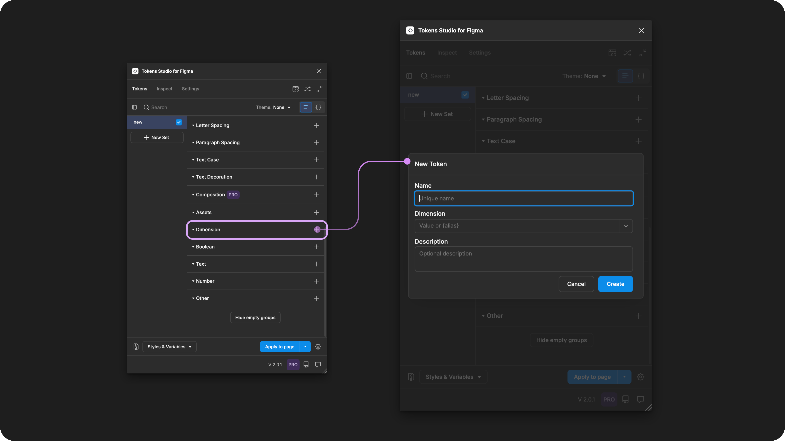
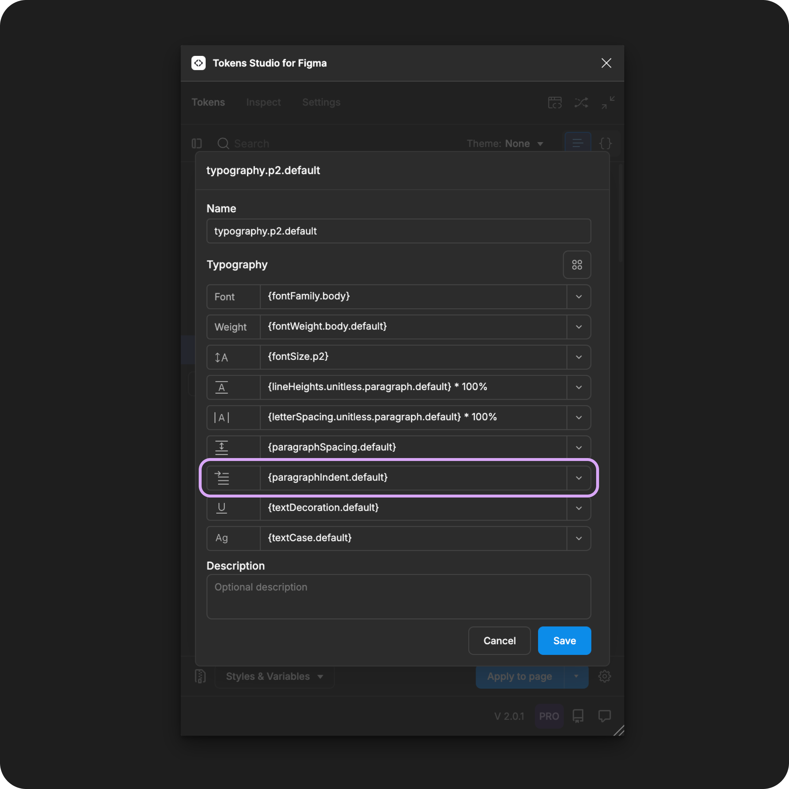

# Paragraph Indent

## Paragraph Indent - Token Type

Paragraph Indent Tokens define offset of the first word of every paragraph as an individual property to be composed within a [Typography Token](./). It is **not** intended to be applied to text elements directly.&#x20;

Paragraph Indent is **not** a dedicated Token type in Tokens Studio. We use a [Dimension Token ](../dimension/)for this property.

<figure><figcaption><p>Creating a new Dimension Token for Paragraph Indent in the Tokens Studio Plugin for Figma.</p></figcaption></figure>

***


### Design decisions

Paragraph Indent defines the offset of the first word of every paragraph.

In [CSS](https://developer.mozilla.org/en-US/docs/Web/HTML/Element/p#css), this property is called `text-indent`.

Paragraph Indent decisions enhance the legibility of compact text elements, like a magazine article appearing as a column on the side of a page design.&#x20;


When we apply a Typography Composite Token to a text layer in Figma, these Paragraph Indent values will change the text layer:

* Default value - `0`
  * No additional space is added.
  * All words would be aligned tight to the left side of the text container.
* Relative to **Font Size** - `value in rem units`
  * Example: Paragraph Indent at `0.5rem` with **Font Size** at `1rem`
  * A person who has increased the font size of a mobile phone will see the space before the first word of each paragraph half the size of the text.
* Fixed - `value in pixels`
  * Example `8px`
  * The space before the first word in the paragraph will remain the same as a user zooms into a webpage.

***


### Possible values

Like all Tokens defining a dimension design decision, the value of a Dimension Token for Paragraph Indent must include a numeric value and, ideally, a unit of measure.

Tokens without a unit specified are applied as the pixel equivalent in Figma.

#### Hard-coded values

The syntax used to write numeric values for the Paragraph Indent property is important.

* Be sure to avoid any spaces between numbers and units of measurement.&#x20;
* Units are always written in lowercase.
* Value should always be greater than 0.&#x20;


**rem units (rem)**

To support responsive design, you can define your Paragraph Indent Token in **rem units**, and the Plugin automatically converts the value to the pixel equivalent when the Typography Composite Token is applied to the text element in Figma.&#x20;

For example, a Paragraph Indent Token with a value of `1rem`, when applied as a Typography Composite Token, will appear as `16px` in Figma.




**Pixel units (px)**

While its not common, should you require the space before the first word of every paragraph to remain static even when users change their preferences, the Paragraph Indent value can be defined in pixel units. For example:

```
32px
```


**Units not supported by Figma**

Em units are commonly used in CSS for Paragraph Indent properties but they are not supported in Figma.

You can still create Paragraph Indent Tokens with these units using the Tokens Studio plugin.

When you apply them to design elements in Figma, the Token will be present and visible to engineers inspecting the design element in Figma, but the Token won't interact with the Text Indent property in Figma's UI.


### Values that reference another Token

When trying to reference another Token as the Value for a Dimension Token for Paragraph Indent, you will see you will see Tokens in the dropdown list that are:

* Tokens living in Token Sets that are currently active.
  * In the left menu on the plugin's Tokens page **a checkmark is visible next to the Token Set name.**
* Token Type is compatible:
  * The same = `dimension`
  * `number`

<figure><figcaption><p>The Typography Composite Token form is open, with each property referencing another Token. The Paragraph Indent property is highlighted. </p></figcaption></figure>




***


### W3C DTCG Token Format

Paragraph Indent is not yet an official Token type in the W3C Design Token Community Group specifications.

Tokens Studio has added Paragraph Indent as a Token type to support Figma's unique approach to this text property.

#### Token Type syntax

In Tokens Studio, the Paragraph Indent Token has a unique syntax in code which identifies if the Token is:

* An independent property Token
* Part of a Typography Composite Token

Looking at the JSON format, the `"type"` is `"dimensions"` when the Font Size Token is defined as an independent property Token.

This example shows a Dimension Token named `paragraphIndent-none` with the value in pixels (see line 4).


```json
{
 "paragraphIndent-none": {
  "value": "0px",
  "type": "dimension"
 }
}
```



This is in contrast to the Typography Composite Token, which has the property Token `"type"` written as`"paragraphIndent"`.

This example shows a Typography Composite Token with the Paragraph Indent property Token named `paragraphIndednt-none` referenced as the value (see line 10).


```json
{
 "paragraph-3": {
  "value": {
   "fontFamily": "{font-family-sans}",
   "fontWeight": "{font-weight-default}",
   "lineHeight": "{line-height-classic}",
   "fontSize": "{font-size-small}",
   "letterSpacing": "{letter-spacing-tight}",
   "paragraphSpacing": "{paragraphSpacing-none}"
   "paragraphIndent": "{paragraphIndent.none}"
   "textCase": "{textCase.none}",
   "textDecoration": "{textDecoration.none}"
  },
  "type": "typography"
 }
}
```


This difference in syntax for the Paragraph Indent Token is less than ideal as it doesn't match the DTCG definition for this property, which is intended to be `dimension`. If your Design Tokens are being used in code, we have included a transformation to correct this inconsistency, described below.

***


### Transforming Tokens



When transforming Paragraph Indent Tokens there are specific transforms to be aware of.

The preprocessor in the SD-Transforms package will automatically convert the Tokens Studio specific Token Type of `paragraphIndent` to align with the DTCG Format Token Type of `dimension`.

→ [SD-Transforms Read-Me Doc, Using the preprocessor](https://github.com/Tokens-studio/sd-transforms/?tab=readme-ov-file#using-the-preprocessor)


Paragraph Indent, as part of Typography Composite Tokens, requires the SD-Transforms option to `expand composite Tokens into multiple Tokens`.



***


### Resources

Mentioned in this doc:

* SD-Transforms - [Read Me](https://github.com/tokens-studio/sd-transforms#readme)
* Style Dictionary - [https://styledictionary.com/](https://styledictionary.com/)
* Design Tokens Community Group - [W3C Draft](https://tr.designtokens.org/format/)
* Design Tokens Community Group - [9.7 Typography](https://tr.designtokens.org/format/#typography)

#### Figma resources:

* Design in Figma - Explore Text Properties,[ Paragraph Indentation](https://help.figma.com/hc/en-us/articles/360039956634-Explore-text-properties#paragraph-indentation)

#### CSS resources:

* MDN Web Docs - [The paragraph element](https://developer.mozilla.org/en-US/docs/Web/HTML/Element/p#css)
* W3 Schools - [text indent](https://www.w3schools.com/cssref/pr_text_text-indent.php)


#### Community resources:

* None yet!




#### Known issues and bugs

Tokens Studio Plugin GitHub - [Open issues for Paragraph Indent](https://github.com/tokens-studio/figma-plugin/labels/token%20type%20paragraph%20indent%20dimension)

* None yet




#### Requests, roadmap and changelog

* None


