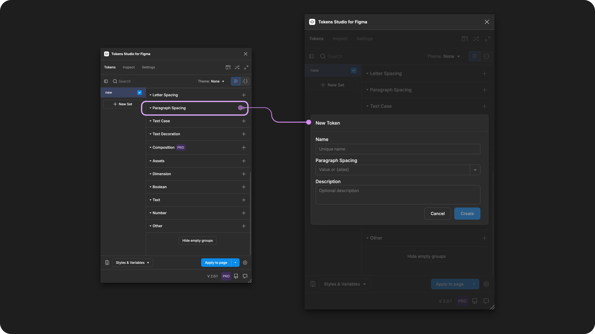
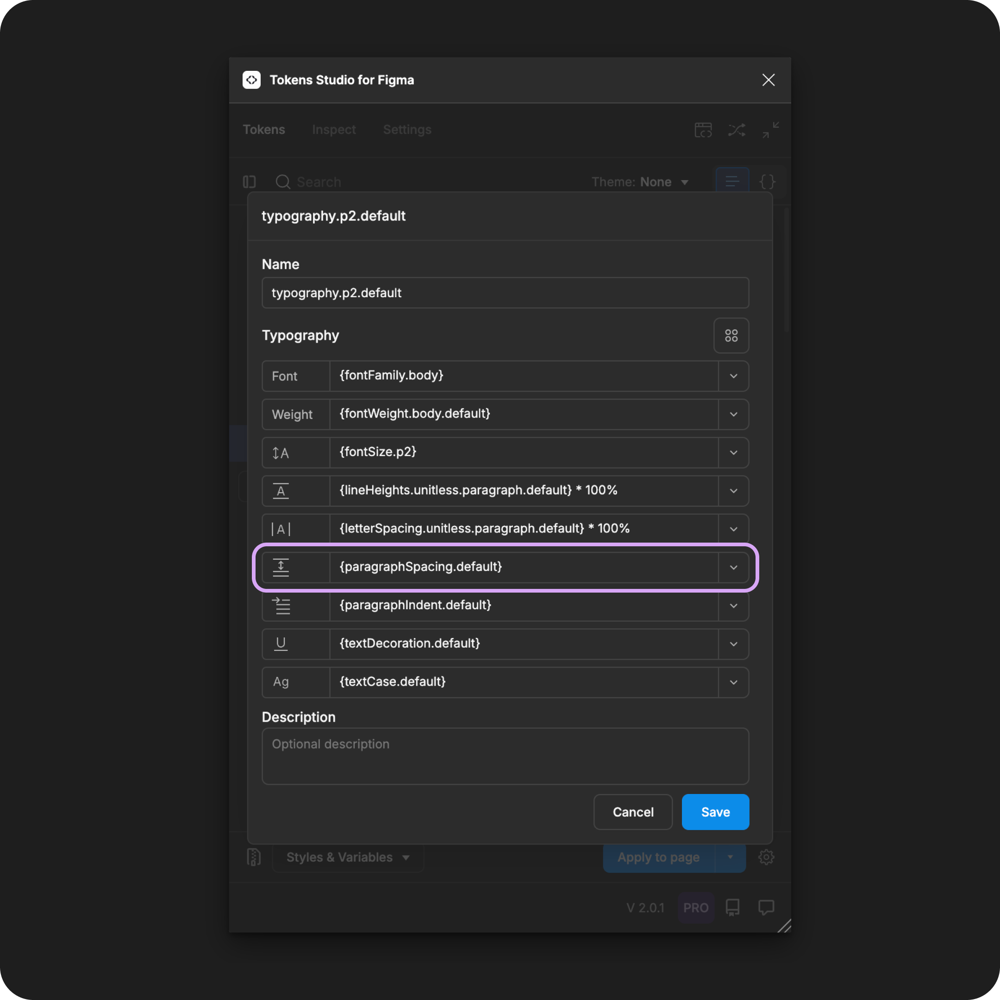

# Paragraph Spacing

## Paragraph Spacing - Token Type

Paragraph Spacing Tokens define the vertical distance between 2 paragraphs of text as an individual property to be composed within a [Typography Token](./). It is **not** intended to be applied to text elements directly.&#x20;

<figure><figcaption><p>Creating a new Paragraph Spacing Token in the Tokens Studio Plugin for Figma.</p></figcaption></figure>

***


### Design decisions

Tokens Studio added support for Paragraph Spacing to accommodate Figma's unique way of handling text styles. They use this property to define the vertical distance between 2 paragraphs of text.

This isn't a typical CSS property; you could define it by adding a [margin to your paragraphs](https://developer.mozilla.org/en-US/docs/Web/HTML/Element/p#accessibility_concerns).&#x20;


This property does not appear in Figma's Dev Mode&#x20;

While you can apply the Token using the plugin to change Figma's Paragraph Spacing property, this value does not have a CSS equivalent property so it does not show up in Dev Mode when inspecting CSS.

The Token applied will show up when inspecting Tokens Studio in Dev Mode.

→ Read the Dev Mode guide here.



When we apply a **Typography Composite Token** to a text layer in Figma, these **Paragraph Spacing** values will change the text layer:

* Preferred value - `0`
  * No additional space between paragraphs.
  * A line break would be added to create the space needed instead.
  * This most closely matches how spacing between paragraphs would be done in code.
* Relative to **Font Size** - `value in rem units`
  * Example: **Paragraph Spacing** at `0.5rem` with **Font Size** at `1rem`
  * A person who has increased the font size of a mobile phone will see the space between paragraphs half the size of the text.
* Fixed - `value in pixels`
  * Example `8px`
  * The space between paragraphs will remain the same as a user zooms into a webpage.


Paragraph Spacing Tokens can be attached to Number Variables in Figma.



***


### Possible values

Like all Tokens defining a dimension design decision, the value of a **Paragraph Spacing Token** must include a numeric value and, ideally, a unit of measure.

Tokens without a unit specified are applied as the pixel equivalent in Figma.


### Hard-coded values

When writing the hard-coded values for a **Paragraph Spacing Token**, you'll want to:

* Avoid spaces
* Include a number and unit of measure.
  * Values without a unit will be translated to pixels in Figma.
  * The value should always be greater than 0.
* Or use the specified string (below) for the `normal` value.


**rem units (rem)**

To support responsive design, you can define your Paragraph Spacing Token in **rem units**, and the plugin automatically converts the value to the pixel equivalent when the Typography Composite Token is applied to the text element in Figma.&#x20;

For example, a Paragraph Spacing Token with a value of `1rem`, when applied as a Typography Composite Token, will appear as `16px` in Figma.




**Pixel units (px)**

While its not common, should you require the space between every paragraph to remain static even when users change their preferences, the Paragraph Spacing value can be defined in pixel units. For example:

```
16px
```


### Values that reference another Token

When trying to reference another Token as the Value for a Paragraph Spacing Token,  you will see Tokens in the dropdown list that are:

* Living in Token Sets that are currently active.
  * In the left menu on the plugin's Tokens page, **a checkmark is visible next to the Token Set name.**
* Token Type is compatible:
  * The same = `paragraphSpacing`
  * `dimension`
  * `number`

<figure><figcaption><p>The Typography Composite Token form is open, with each property referencing another Token. The Paragraph Spacing property is highlighted. </p></figcaption></figure>




***


### W3C DTCG Token Format

Paragraph Spacing is not an official token type in the W3C Design Token Community Group specifications.

Tokens Studio has added Paragraph Spacing as an unofficial Token Type to support Figma's unique approach to this text property.

***


### Transforming Tokens



When transforming Paragraph Spacing Tokens, there are specific configurations to be aware of.

The preprocessor in the SD-Transforms package will automatically convert the Tokens Studio specific Token Type of `paragraphSpacing` to align with the DTCG Format Token Type of `dimension`.

→ [SD-Transforms Read-Me Doc, Using the preprocessor](https://github.com/Tokens-studio/sd-transforms/?tab=readme-ov-file#using-the-preprocessor)


Paragraph Spacing, as part of Typography Composite Tokens, requires the SD-Transforms option to `expand composite Tokens into multiple Tokens`.



***


### Resources

Mentioned in this doc:

* SD-Transforms - [Read Me](https://github.com/tokens-studio/sd-transforms#readme)
* Style Dictionary - [https://styledictionary.com/](https://styledictionary.com/)
* Design Tokens Community Group - [W3C Draft](https://tr.designtokens.org/format/)
* Design Tokens Community Group - [9.7 Typography](ttps://tr.designTokens.org/format/#typography)

#### Figma resources:

* Design in Figma - Explore Text Properties, [Paragraph Spacing](https://help.figma.com/hc/en-us/articles/360039956634-Explore-text-properties#paragraph-spacing)

#### CSS resources:

* MDN Web Docs - [The paragraph element](https://developer.mozilla.org/en-US/docs/Web/HTML/Element/p#accessibility_concerns)


#### Community resources:

* None yet!




#### Known issues and bugs

Tokens Studio Plugin GitHub - [Open issues for Token Type Paragraph Spacing](https://github.com/tokens-studio/figma-plugin/labels/token%20type%20paragraph%20spacing)

* None yet




#### Requests, roadmap and changelog

* None


