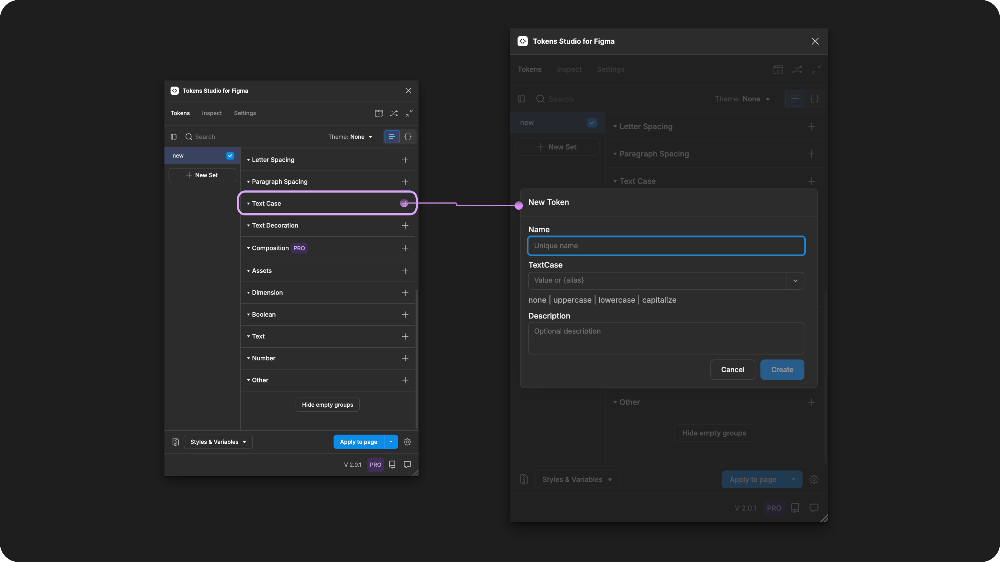
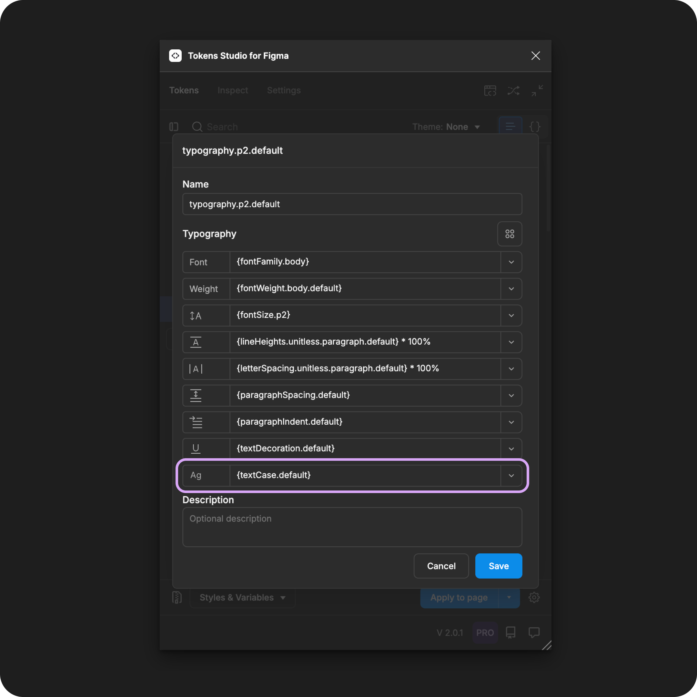

# Text Case

## Text Case - Token Type

Text Case Tokens define a transformation to the capitalization of letters as an individual property to be composed within a [Typography Token](./). It is **not** intended to be applied to text elements directly.&#x20;

<figure><figcaption><p>Creating a new Text Case Token in the Tokens Studio Plugin for Figma.</p></figcaption></figure>

***


### Design decisions

Text Case defines that the system should transform the capitalization of letters in a text element regardless of how they are typed.

In [CSS](https://developer.mozilla.org/en-US/docs/Web/CSS/text-transform), this property is called `text-transform`.

Text Case design decisions are typically used to:

* communicate the visual emphasis of text or
* standardize data inputs and data display to ensure consistency

Occasionally, they are used for creative styling decisions, for example, a personal blog where the author wants:

* HEADINGS to have all letters capitalized.
* contact details to appear in lowercase.


When we apply a **Typography Composite Token** to a text layer in Figma, these **Text Case** values will change the letter casing:

* All letters appear as typed - `null`
  * By default, the system will not transform the capitalization of letters
* All letters capitalized - `uppercase`
  * Examples:
    * button labels
    * list of countries presented as abbreviations
* No letters are capitalized - `lowercase`
  * Examples:
    * email address listed in a contact section
    * username entered in a sign-up form
* The first letter of each word is capitalized - `capitalize`
  * Examples:
    * full name entered in a sign-up form
    * list of city names

***


### Possible Values

The syntax used to write string values for Design Tokens is important, so be sure to write your Text Case Token value with **all lowercase letters and ensure there are no spaces**.&#x20;

#### Hard-coded Values

The Text Case Token has a few specific string Values depending on your needs.


**null**

Most of the time, text will appear as typed; the Text Case Token Value will be:

```
null
```


**uppercase**

When all letters should be capitalized, set the Text Case Token Value to:

```
uppercase
```


**lowercase**

When none of the letters should be capitalized, set the Text Case Token Value to:

```
lowercase
```


**capitalize**

When the first letter of each word should be capitalized, set the Text Case Token Value to:

```
capitalize
```

Many people confuse Figma's "capitalize" with "title case," but they are different.

* Title case has some words capitalized while others remain lowercase.&#x20;
  * For example `Hyma for Tokens Studio`
* Capitalize transforms all words.&#x20;
  * For example `Hyma For Tokens Studio`


**Not supported by Figma**

Additional text-transform properties commonly used in CSS are not supported in Figma, such as `Full Width`.

You can still create Text Case Tokens with these Values using the Tokens Studio plugin.

When you apply them to design elements in Figma, the Token will be present and visible to engineers inspecting the design element in Figma, but the Token won't interact with the Letter Case property in Figma's UI.


### Values that reference another Token

When trying to reference another Token as the Value for a Text Case Token, you will see Tokens in the dropdown list that are:

* Living in Token Sets that are currently active.
  * In the left menu on the plugin's Tokens page, **a checkmark is visible next to the Token Set name.**
* Token Type is compatible:
  * The same = `textCase`

<figure><figcaption><p>The Typography Composite Token form is open, with each property referencing another Token. The Text Case property is highlighted. </p></figcaption></figure>




***


### W3C DTCG Token Format

Text Case is not yet an official Token type in the W3C Design Token Community Group specifications.

Tokens Studio has added Text Case as an unofficial Token Type in anticipation of its inclusion in the W3C specs in the near future.

***


### Transforming Tokens



When transforming Test Case tokens, there are no specific transforms to be aware of.

Running the SD-Transforms pre-processor as part of the generic package will prep your Text Case Tokens for Style Dictionary.

→ [SD-Transforms Read-Me Doc, Using the preprocessor](https://github.com/Tokens-studio/sd-transforms/?tab=readme-ov-file#using-the-preprocessor)


However, Text Case, as part of Typography Composite Tokens, requires the SD-Transforms option to `expand composite Tokens into multiple Tokens`.



***


### Resources

Mentioned in this doc:

* SD-Transforms - [Read Me](https://github.com/tokens-studio/sd-transforms#readme)
* Style Dictionary - [https://styledictionary.com/](https://styledictionary.com/)
* Design Tokens Community Group - [W3C Draft](https://tr.designtokens.org/format/)
* Design Tokens Community Group - [9.7 Typography](ttps://tr.designTokens.org/format/#typography)

#### Figma resources:

* Design in Figma - [Explore Text Properties, Letter Case](https://help.figma.com/hc/en-us/articles/360039956634-Explore-text-properties#letter-case)

#### CSS resources:

* MDN Web Docs - [Letter Case](https://developer.mozilla.org/en-US/docs/Web/CSS/text-transform)


#### Community resources:

* None yet!




#### Known issues and bugs

Tokens Studio Plugin GitHub - [Open issues for Token Type Text Case](https://github.com/tokens-studio/figma-plugin/labels/token%20type%20text%20case)

* None yet




#### Requests, roadmap and changelog

* None


