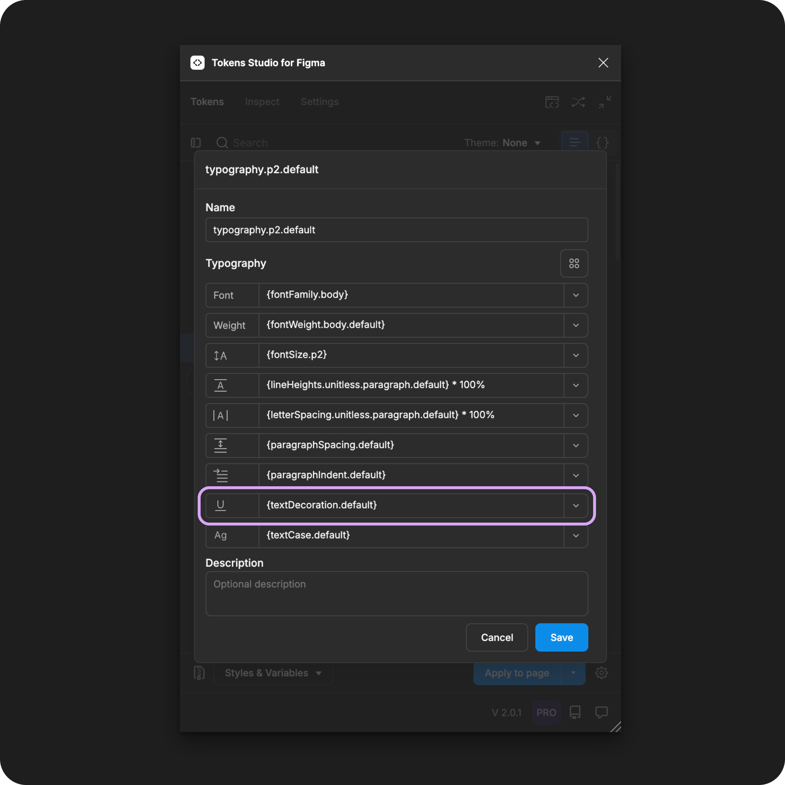

# Text Decoration

## Text Decoration - Token Type

Text Decoration Tokens define the position of an optional line as an individual property to be composed within a [Typography Token](./). It is **not** intended to be applied to text elements directly.&#x20;

<figure><figcaption><p>Creating a new Text Decoration Token in the Tokens Studio Plugin for Figma.</p></figcaption></figure>

***


### Design decisions&#x20;

**Text Decoration** defines an optional line as a part of font styling properties, typically used to communicate the visual emphasis of text.

In [CSS](https://developer.mozilla.org/en-US/docs/Web/CSS/text-decoration), this property is also called `text-decoration`.


When we apply a **Typography Composite Token** to a text layer in Figma, these **Text Decoration values** will change the text:

* By default - no lines are added to the text - `null`
  * The text appears as typed with no decoration added.
* A line below the text - `underline`
  * It commonly indicates interactive text elements, like links.
* A line in the middle of the text - `strike-through`
  * It commonly indicates information that is no longer accurate, like a to-do item that has been completed.

***


### Possible values

The syntax used to write string values for Design Tokens is important, so be sure to write your Text Decoration Token value with **all lowercase letters and ensure there are no spaces**.&#x20;

#### Hard-coded values

The **Text Decoration Token** has a few specific values depending on your needs.


**null**

Most of the time, text will appear as typed; the Text Decoration Value will be:

```
null
```


**underline**

To create a line at the bottom of the text, enter the Text Decoration Value as:

```
underline
```


**strike-through**

To create a line through the centre of the text, enter the Text Decoration Value as:

```
strike-through
```


**Not supported by Figma**

There are additional `text-decoration` properties commonly used in CSS that are not supported in Figma.

* Overline
* Line-above

Using the Tokens Studio plugin, you can still create a Text Decoration Token with these values.

When you apply them to design elements in Figma, the Token will be present and visible to engineers inspecting the design element in Figma, but the Token won't interact with the Text decoration property in Figma's UI.


### Values that reference another Token

When trying to reference another Token as the Value for a Text Decoration Token, you will see Tokens in the dropdown list that are:

* Living in Token Sets that are currently active.
  * In the left menu on the plugin's Tokens page, **a checkmark is visible next to the Token Set name.**
* Token Type is compatible:
  * The same = `textDecoration`

<figure><figcaption><p>The Typography Composite Token form is open, with each property referencing another Token. The Text Decoration property is highlighted. </p></figcaption></figure>




***


### W3C DTCG Token Format

Text Decoration is not yet an official Token type in the W3C Design Token Community Group specifications.

Tokens Studio has added Text Decoration as an uofficial Token type in anticipation it will be added to the W3C specs in the near future.

***


### Transforming Tokens



This property in Figma matches CSS, so there is no specific transform for Text Decoration.

Running the SD-Transforms pre-processor as part of the generic package will prep your Text Decoration Tokens for Style Dictionary.

→ [SD-Transforms Read-Me Doc, Using the preprocessor](https://github.com/Tokens-studio/sd-transforms/?tab=readme-ov-file#using-the-preprocessor)


However, Text Decoration, as part of Typography Composite Tokens, requires the SD-Transforms option to `expand composite Tokens into multiple Tokens`.



***


### Resources

Mentioned in this doc:

* SD-Transforms - [Read Me](https://github.com/tokens-studio/sd-transforms#readme)
* Style Dictionary - https://styledictionary.com/
* Design Tokens Community Group - [W3C Draft](https://tr.designtokens.org/format/)
* Design Tokens Community Group - [9.7 Typography](ttps://tr.designTokens.org/format/#typography)

#### Figma resources:

* Design in Figma - [Explore Text Properties, Decoration](https://help.figma.com/hc/en-us/articles/360039956634-Explore-text-properties#decoration)

#### CSS resources:

* MDN Web Docs - [Text Decoration](https://developer.mozilla.org/en-US/docs/Web/CSS/text-decoration)


#### Community resources:

* None yet!




#### Known issues and bugs

Tokens Studio Plugin GitHub - [Open issues for Token Type Text Decoration](https://github.com/tokens-studio/figma-plugin/labels/token%20type%20text%20decoration)

* None yet




#### Requests, roadmap and changelog

* None



