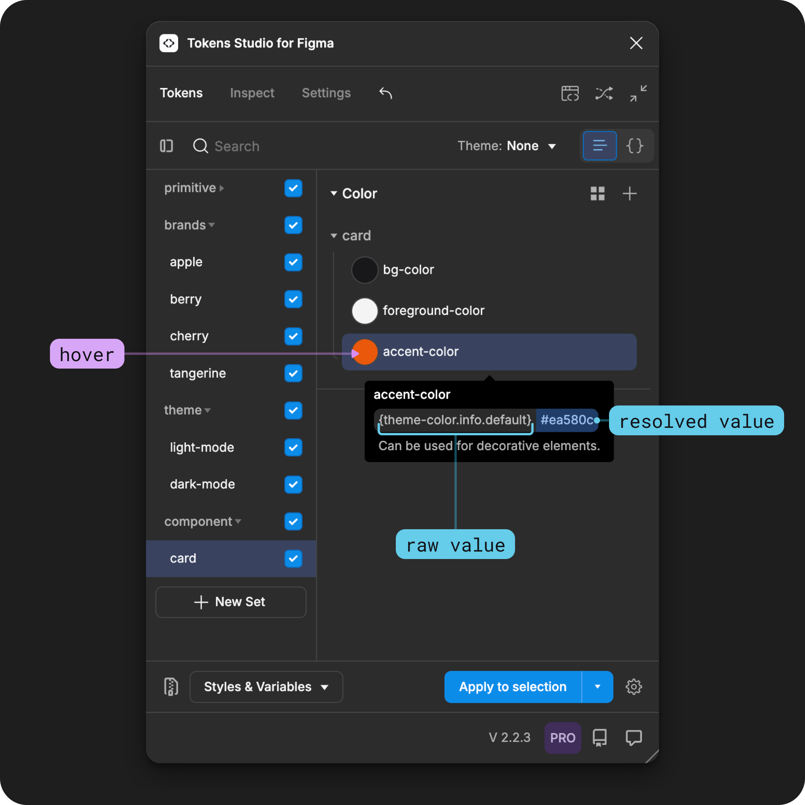

# Token Values

## Token Values in Tokens Studio&#x20;

The `value` of a Design Token defines _**what**_ the design decision is and, in some cases, _**where**_ the decision came from.&#x20;

You might recall from our [Intro to Design Tokens Guide](../../fundamentals/design-tokens/) that the Token Type determines what `values` are acceptable.&#x20;

For example, a hard-coded Value of `#22c55e` is possible when the **Token Type** is `color`, but not when it is `fontFamily`.

<figure><figcaption><p>In this infographic, the Token examples on the right side highlight the Value. The top code block shows a hard-coded value. The bottom code block has a value that references another Token. </p></figcaption></figure>


Each of the 24 unique Token Types supported Tokens Studio has its own specifications on what values are allowed.&#x20;



Before you jump into Token Types, here's an overview of the terms and capabilities of Token Values you'll see across our guides.&#x20;

Once you understand whats possible you'll be able to craft Token Values that will help you work smarter, scale faster, and manage less components.&#x20;

***


### Common terms

These terms are not the only way to describe Token Values; they are the labels the Tokens Studio team uses for simplicity across our documentation.&#x20;

If your team uses different descriptive terms, that's totally okay!


#### Hard-coded value

When you write a Token with an exact `value` that doesn't require any work from a tool to interpret it, we call that a hard-coded `value`.&#x20;

For example, `#22c55e` is a hard-coded hex-code `value` for a [Color Token](../token-types/color/#possible-values).&#x20;


Each Token Type has different specifications about what kind of hard-coded `value` is allowed based on its properties which are defined in the [W3C specifications for Design Tokens](https://tr.designtokens.org/format/#types), managed by the Design Tokens Community Group (DTCG).&#x20;

For example, the hard-coded string value accepted for a [Color Token](../token-types/color/#possible-values) is different from a [Font Family Token](../token-types/typography/font-family.md#possible-values).&#x20;

<figure><figcaption><p>An infographic example of documenting a Token applied to the text layer of a button label requiring different values depending on the defined Token Type. </p></figcaption></figure>


Here are some additional terms related to hard-coded values that might be helpful:

<details>

<summary>Numeric Value</summary>

A numeric `value` includes numbers.&#x20;

For example, the [Opacity Token](../token-types/opacity.md) accepts`0.33` as a numeric `value`.&#x20;

</details>

<details>

<summary>Alphanumeric Value</summary>

An alphanumeric `value` includes numbers and letters that are not defined.

For example, the [Text Token](../token-types/text.md) accepts `Welcome back {name}`as an alphanumeric `value`.&#x20;

</details>

<details>

<summary>String Value</summary>

A string `value` includes letters and/or numbers that are defined in a particular way.&#x20;

For example, the [Text Decoration Token](../token-types/typography/text-decoration.md) accepts  `underline` as a string `value`.&#x20;

</details>

<details>

<summary>Syntax</summary>

Syntax is the way you write the value of the Token. The requirements for syntax change depending on the type of `value` and Token Type.&#x20;

For example, spaces are to be avoided when writing the `value` of a Dimension Token which requires a unit `16px`, but required between operators of a math equation `8 * 4`&#x20;

</details>

<details>

<summary>Unit</summary>


Unit is short for unit of measurement. Some numeric values require a unit, but not all.&#x20;

For example `4px`

Most popular units when working with Tokens are:

* pixels `px`
* rem `rem`
* percentage `%`

</details>


#### References or Alias Tokens

When you write a Token with a `value` including the name of another Token wrapped in curly brackets, we call that a reference, some folks call it an alias.&#x20;

For example, `{colors.green.dark.1200}`&#x20;

Working with References is one of the main advantages of working with Design Tokens!&#x20;

[_→ Jump to the Token Values with References Guide for more details._ ](references.md)

<figure><figcaption><p>An infographic example of documenting a Color Token applied to the text layer of a button label. The Value of the Token directly applied is referencing another Token. Following the pathway of referenced Tokens as Values shows where the Color comes from in the system. </p></figcaption></figure>


#### Math

You can write the `value` of your Token to include a math equation.&#x20;

For example, to calculate a border radius of a focus ring the `value` of your Token could be&#x20;

```
{button.border-radis} + {focus.offset}
```

Working with Math to calculate Token Values is a powerful feature supported by Tokens Studio.&#x20;

[_→ Jump to the Using Math in Token Values guide for more details._ ](math.md)


#### Raw Value&#x20;

The exact `value` as it is written, which could show referenced tokens, math equations, etc. is called the Raw Value.&#x20;

For example

* &#x20;`{green-500}` is the raw `value` of a Token with a reference to another Token.
* `#22c55e` is the raw `value` of a Token with a hard-coded value.&#x20;


#### Resolved Value

The final value of the Token which may be a result of inheriting its value from another Token, or calculating its value from a math equation is called the Resolved Value.&#x20;

For example

* A Token with a math equation as its raw value of `16 + 4` would have a resolved value of `20`
* A Token named `green-500` with a raw value that is hard-coded as `#22c55e` would have the same resolved value `#22c55e`&#x20;
* A Token named `success-default` with a raw value referencing the `{green-500}` would have a resolved value of `#22c55e`&#x20;


### Test your Token Value knowledge

Take a look at the image below showing the color Tokens applied to a button label and see if you can identify:

1. Which Tokens have a hard-coded `value`?
2. Which Tokens are referencing another in its `value`?
3. What is the raw `value` of each token?&#x20;
4. What is the resolved `value` of each token?

<details>

<summary>Hints if you need them</summary>

In the image below, the text color of the button changes when the `value` of the middle Token is changed to reference a `grey`color instead of `green` .&#x20;

* The name of the Token is on the top line.
* The raw `value` is below the name.
* The resolved `value` is inside the color swatch.&#x20;

</details>


<figure><figcaption><p>An infographic example of documenting a Color Token applied to the text layer of a button label. The difference between the two buttons is the color of the label text which is controlled by the value of the middle Token. On the left side, it is referencing a Token from a <code>green</code>scale. On the right right, it is referencing a Token from a <code>grey</code>scale. </p></figcaption></figure>


***


### Working with Token Values&#x20;

From the Tokens Page of the Tokens Studio Plugin for Figma, there are three places to see the `value` of a Token.&#x20;

1. Token data on hover
2. Token form
3. JSON file

#### 1. Token Data on Hover

Hover on an existing Token to view its data. The `value` appears as the second piece of data in the list under the Token Name.&#x20;



If the `value` of the Token is [hard-coded](./#hard-coded-value), it will appear as entered.&#x20;

<figure><figcaption><p>From the Tokens Page of the Plugin, hovering on a Color Token displays its data. In this example, the hard-coded <code>value</code> of a hex code is shown under the Token Name. </p></figcaption></figure>


If the [Value references another Token](./#references-or-alias-tokens), the [raw `value`](./#raw-value) appears on the left, the [resolved `value`](./#resolved-value) on the right.&#x20;

<figure><figcaption><p>From the Tokens Page of the Plugin, hovering on a Color Token displays its data. In this example, the raw <code>value</code> of a reference to a Token is shown under the Token Name. The resolved <code>value</code> it inherits from the Token being referenced appears on the right side. </p></figcaption></figure>


#### 2. Token Form

Right click on a Token Name and select Edit to view its properties as a form. The second input displays the [raw `value`](./#raw-value).


The Token Form for each Token Type is unique, but `value` always appears as the second input.&#x20;


<figure><figcaption><p>Right-click on a Color Token to open its Form. The example on the right shows the raw value of the Color Token as a hard-coded hex code. </p></figcaption></figure>


If the Token has a `value` with a math equation or references another Token, the resolved value appears below the input.&#x20;

<figure><figcaption><p>A Color Token form on the left shows a raw value with references to another Token. A Dimension Token form on the right shows a raw value with a math equation.  Both forms show the resolved values below the Value input. </p></figcaption></figure>


If you have edit permissions, you can make changes to the Value using the input. Be sure to save your changes using the bottom button when you are finished.&#x20;


#### 3. JSON File

Use the Token View Toggle see your Tokens written in JSON code files. &#x20;

The [raw value](./#raw-value) will appear in the code file. The [resolved values](./#resolved-value) are not shown in the JSON view.&#x20;

<figure><figcaption><p>Select the JSON view toggle from the Tokens Page to see the current Token Set as an editable code file. The raw value of the Token is shown in the JSON files.</p></figcaption></figure>


If you are comfortable working in code (and have edit permissions), you can edit Token Values in the JSON view.&#x20;


The JSON view functions similar to Visual Studio Code thanks to an amazing open-source contribution from a Tokens Studio community member. 🫶


_Jump to the guide on JSON view for more details by selecting the card below._&#x20;


[json-view.md](../token-sets/json-view.md)


***


### Resolved value inheritance

Recall that Token Names within each Token Set must be unique. Token Names in different Token Sets can be identical, which provides the basis of Theming.&#x20;

If you have more than one enabled Token Set with the same Token Names, how does the plugin know which resolved Value it should inherit?&#x20;

1. The status of Token Sets
2. The position of Token Sets

The plugin considers all Token Sets when inheriting the value from a Token being referenced.&#x20;

* Token Sets with an `enabled` status are preferred, then `source`then `disabled`is last.&#x20;
* If there is more than one Token Set with the same status, the Token Set in the lowest position will \`win\`.&#x20;

In the example below, the Color Tokens are inheriting their value from the `theme-color`Tokens being referenced as their [raw value](./#raw-value). The [resolved values](./#resolved-value) change based on the position of the `theme`Token Sets. Whichever Token Set is lowest in the list on the left passes it's value.&#x20;

<figure><figcaption><p>Component-specific Tokens with values that reference Tokens from the Theme Token Sets are shown. The resolved values change based on the position of the Theme Token Sets. </p></figcaption></figure>


_Jump to the guide on Token Values with References for more details by selecting the card below._&#x20;


[references.md](references.md)


***


### In Figma&#x20;

When you apply a Token to a design element in Figma, the resolved `value` is applied to your chosen design property and displayed in Figma's UI. Each Token Type has different options that map to corresponding properties in Figma.&#x20;

When you export your Tokens as Styles or Variables, the resolved `value` is reflected in the matching Style or Variable.&#x20;

If you are using values that aren't suppored by Figma, the plugin does all the work under the hood to convert them to something Figma can use. These nuances are described in detail in the guides for each Token Type.&#x20;


[token-types](../token-types/)



***


### Transforming Tokens



Each Token Type has specific Transforms to be aware of that ensure accurate resolved values that are usable in code.&#x20;


[token-types](../token-types/)



***


### Resources

Mentioned in this doc:

* SD-Transforms - [Read Me](https://github.com/tokens-studio/sd-transforms)
* Style Dictionary - [Read Me](https://amzn.github.io/style-dictionary/#/)
* Design Tokens Community Group - [W3C Draft](https://tr.designtokens.org/format/)
* Design Tokens Community Group - [3.8 Reference Alias](https://tr.designtokens.org/format/#alias-reference)


#### Community resources:

* None yet!




#### Known issues and bugs

Tokens Studio Plugin GitHub - [Open issues for Token Values](https://github.com/tokens-studio/figma-plugin/labels/token%20value)

Tokens Studio Plugin GitHub - [Open issues for String Values](https://github.com/tokens-studio/figma-plugin/labels/token%20value%20string)




#### Requests, roadmap and changelog

* None yet.&#x20;




