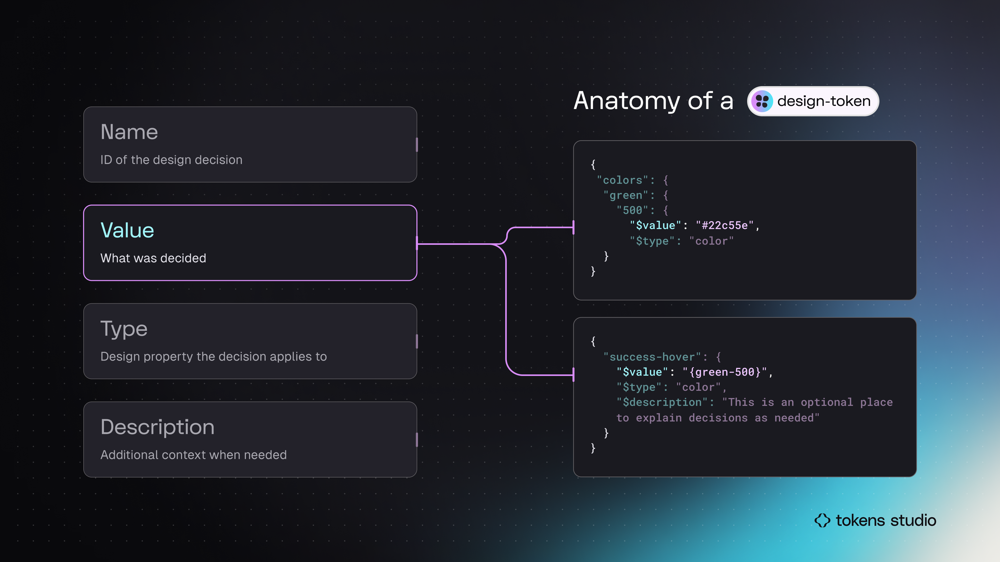
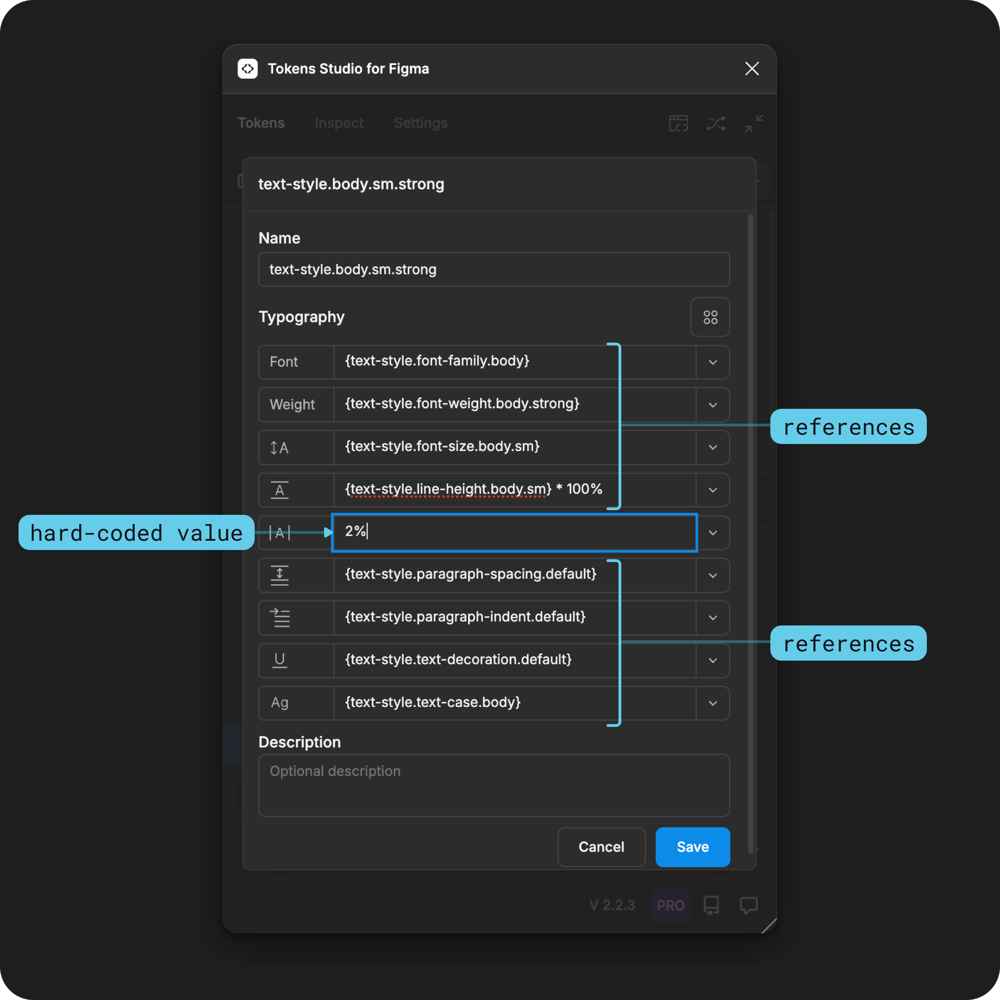
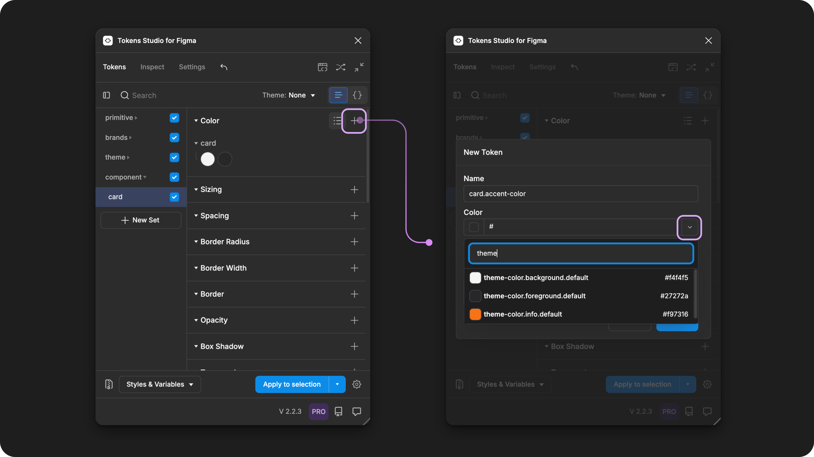
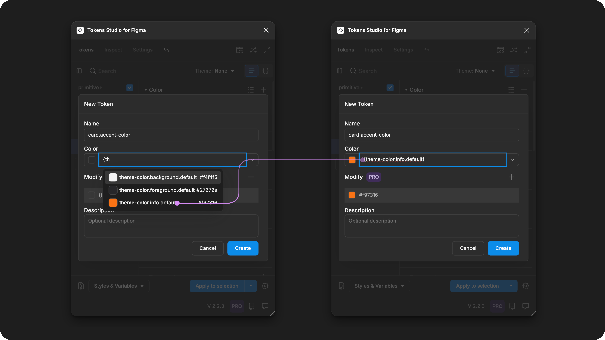

# Token Values with References

## Token Values with references

While it's helpful to give a human-readable name to a hard-coded `value`, the real power of Design Tokens comes from referencing another Token.&#x20;


When the `value` of a Token is the Name of an existing Token in the system wrapped in curly brackets`{ }`, it will **inherit its value** from the referenced Token.&#x20;



For example, looking at the value of a Color Token applied to the label of a button component, you can see it has a `value` of `{brand.colors.success.on-success}`and same value of `#b1f1cb.`

This means when you look at the `value` of a Design Token which references an existing Token in your system, you can easily tell _where_ the design decision came from.

<figure><figcaption></figcaption></figure>

### Common terms

There are lots of different words the community uses to describe this kind of Token Value:

* Reference Tokens
* Alias Tokens
* Semantic Tokens
* Decision Tokens

#### Alias Tokens

An [Alias Token](https://tr.designtokens.org/format/#alias-reference) is how the DTCG W3C specification defines a Design Token with a 
Value which references another Token.

It's called an "Alias" Token because it provides a new name, or alias, for an existing design decision in our system.

Ideally, the new name/alias provides meaningful context about how, where, or when we intend to implement our design decisions.

However, when you are just starting to work with Design Tokens, the label "Alias" can get confusing, so in the Tokens Studio docs, we will say "Values that reference another Token" for clarity.&#x20;

***


### Syntax specifications

To write a Token Value which references another Token, you wrap the Token Name in curly brackets without any spaces.&#x20;

For example: `{green-500}`

<figure><figcaption><p>In this infographic, the Token examples on the right side highlight the Value. The top code block shows a hard-coded value. The bottom code block has a value that references another Token. </p></figcaption></figure>


Composite Tokens, which have more than one value, can have one or more of its properties set to reference another Tokens.&#x20;

<figure><figcaption><p>A Typography Token form with all but one property value referencing another Token.</p></figcaption></figure>


The same Typography Composite Token example pictured above written in code is below. Line 7 has a hard-coded value, the rest are referencing another Token that exists elsewhere in the system.&#x20;


```json
{
  "text-style": {
    "body": {
      "sm": {
        "strong": {
          "value": {
            "letterSpacing": "2%",
            "lineHeight": "{text-style.line-height.body.sm} * 100%",
            "fontFamily": "{text-style.font-family.body}",
            "fontWeight": "{text-style.font-weight.body.strong}",
            "fontSize": "{text-style.font-size.body.sm}",
            "paragraphSpacing": "{text-style.paragraph-spacing.default}",
            "textDecoration": "{text-style.text-decoration.default}",
            "textCase": "{text-style.text-case.body}",
            "paragraphIndent": "{text-style.paragraph-indent.default}"
          },
          "type": "typography"
        }
      }
    }
  }
}
```


***


### Create a Token with references

In the Tokens Studio Plugin for Figma there are three ways to define the Value of a Token that references another Token .&#x20;

1. Select a Token Name using a dropdown pre-populated with compatible Token Types.
2. Search for a specific Token Name from the same pre-populated dropdown.
3. Write the Token Name you are referencing inside curly brackets.&#x20;


Each Token Type has a slightly different interface to create a new Token, but the Token Value input to add a reference works the same.


<figure><figcaption><p>A Color Token form on the left shows a raw value with references to another Token. A Dimension Token form on the right shows a raw value with a math equation.  Both forms show the resolved values below the Value input. </p></figcaption></figure>


Select the plus sign next to your desired Token Type to create a new Token. Right click on an existing Token and select Edit to open its Token form.&#x20;

* Tap the down chevron icon within the Token Value input to open the pre-populated menu of compatible Token Names.&#x20;
* You can scroll through the list, or type the name of the Token in the input to filter the Token names in the dropdown.
* Select the name of the Token you want to reference.
* The list will close, and the selected token will appear in the Token Value input wrapped in curly brackets `{theme-color.info.default}`

<figure><figcaption><p>Select the + next to any Token Type in the Plugin to open a New Token form. The second input allows you to define its Value. This example shows a Color Token with its Value dropdown open.</p></figcaption></figure>


Or,  you can type the Token Name you are referencing inside curly brackets in the Token Value input.&#x20;

For example  `{theme-color.info.default}`

Once you start typing, if there are any matches the Plugin will show them below the input. You can select the name your desired Token to close the menu.&#x20;

When you are finished creating the Token, press the button at the bottom of the Token form to close it.&#x20;

<figure><figcaption><p>If you know the name of the Token you'd like to reference, you can start typing <code>{</code>and the first few letters of the name into the Tokens Value input to see any compatible Tokens that match. </p></figcaption></figure>


The new Token appears on the Token Page. You can hover on the Token to view the data entered to create the Token.&#x20;

The name of the Token you selected to reference as the Value appears as the [raw value](references.md#raw-value) on the left, the [resolved value](references.md#resolved-value) on the right.&#x20;

<figure><figcaption><p>From the Tokens Page of the Plugin, hovering on a Color Token displays its data. In this example, the raw value of a reference to a Token is shown under the Token Name. The resolved value it inherits from the Token being referenced appears on the right side. </p></figcaption></figure>

***


### Tokens available to reference

Compatible Tokens are available to reference and are determined by the Token Type.&#x20;

For example, a Typography Token is not compatible with a Color Token as their values have different properties.&#x20;

So, when creating a new Color Token, the Plugin will **not** show Typography Token Names as an option to reference as its value.&#x20;


Each Token Type guide defines the compatible Token Types that are available to reference in its Value.&#x20;

[→ Jump to see all Token Types](../token-types/#available-token-types)



#### Tokens in Active Token Sets are available to reference

The plugin will only show Tokens with compatible Types that are living in Token Sets that are currently **active**.

Active Token Sets have a checkmark visible next to the Token Set Name in the left menu on the Token page of the Plugin.&#x20;

<figure><figcaption><p>Component-specific Tokens with values that reference Tokens from the Theme Token Sets are shown. The resolved values change based on the position of the Theme Token Sets. </p></figcaption></figure>


***


### Reference a Token not visible in the dropdown

If the Token Name you want to reference is not in the dropdown list, you can "force" a reference by manually entering the Token Name between curly brackets.&#x20;

For example, if you want to reference a **Number Token** without a unit in a Dimension Token which requires a unit, you can manually type the Number Token Name wrapped in curly brackets followed by unit:

```
{unitless.number}px
```


Even if the plugin notifies you the Token is "not found," once you save your changes, you'll notice the reference has gone through and the Token should how the correct **Resolved Value**.


Token Names are case-sensitive.



To make the forced reference process a little smoother, you can **copy the Name of any Token** by:

* Right-click on the Token
* Select **Copy Token path**

Then you can **paste the name** from your clipboard between curly brackets`{Token-name}` in the value of your desired Token using the paste keyboard shortcut.

* command + v (mac)
* control + v (windows/linux)


This strategy comes in handy when writing complex Token Values which reference another Token. For example:


[math.md](math.md)



[gradient.md](../token-types/color/gradient.md)


***


### Inherited and Resolved Values&#x20;

A Token with a Value that reference another Token will **inherit its Value** from the referenced Token.&#x20;


There are **no limits** on how many layers of referencing are possible in Design Tokens.&#x20;


This creates a flexible and dynamic system which scales very quickly.&#x20;

For example, if you decide that the text for all success elements in your system should be white instead of a light green, you only need to change the value of one Token (the `{brand.colors.success.on-success}` Token), and all components referencing it will change.&#x20;

<figure><figcaption><p>An infographic example of documenting a Color Token applied to the text layer of a button label. The difference between the two buttons is the color of the label text which is controlled by the value of the middle Token. On the left side, it is referencing a Token from a <code>green</code>scale. On the right right, it is referencing a Token from a <code>grey</code>scale. </p></figcaption></figure>


This means with thoughtful references in your Token Structure, you only have to make changes to 1 Token and the new value will cascade across the entire system.&#x20;

In technical terms, this "inheritance" is known as **Resolved Value,** because the Plugin has to pass the Value through your Token Structure and perform any calculations necessary to display the resulting Value.&#x20;

Compared to the **Raw Value**, which shows the Token Value exactly as it was written.&#x20;

_→_ [_Jump to the Token Value Guide which goes over more terms and examples._ ](./)


***


### Nested references will be deprecated

As we continue to align with the W3C specifications Design Tokens Community Group, we will be phasing out 'nested references'.

* Nested references are not included in the DTCG specifications.
* They are not supported by any other design tools.

As design Token and transformation tools become more sophisticated, nested references negatively impact the performance of Token resolution, so we can not continue to support it.


If your Token values are written with nested references:

```
{colors.{primary}.500}
```

It's time to make some changes.


***


### Transforming Tokens



Each Token Type has specific Transforms to be aware of that ensure accurate resolved values that are usable in code.&#x20;


[token-types](../token-types/)


***


### Resources

Mentioned in this doc:

* SD-Transforms - [Read Me](https://github.com/tokens-studio/sd-transforms)
* Style Dictionary - [Read Me](https://amzn.github.io/style-dictionary/#/)
* Design Tokens Community Group - [W3C Draft](https://tr.designtokens.org/format/)
* Design Tokens Community Group - [3.8 Reference Alias](https://tr.designtokens.org/format/#alias-reference)


#### Community resources:

* None yet!




#### Known issues and bugs

Tokens Studio Plugin GitHub - [Open issues for Token Value Reference Alias](https://github.com/tokens-studio/figma-plugin/labels/token%20value%20references%20alias)

* Tokens referencing the same name are showing a different value [#2852](https://github.com/tokens-studio/figma-plugin/issues/2852)
  * Occasionally when referencing a Token which exists in more than one Token Set, the incorrect values are showing in the Resolved Token Value preview when the Token is hovered on.




#### Requests, roadmap and changelog

* Expand accepted reference token types and units - [Feature Request](https://feedback.tokens.studio/p/expand-accepted-reference-token-types)



