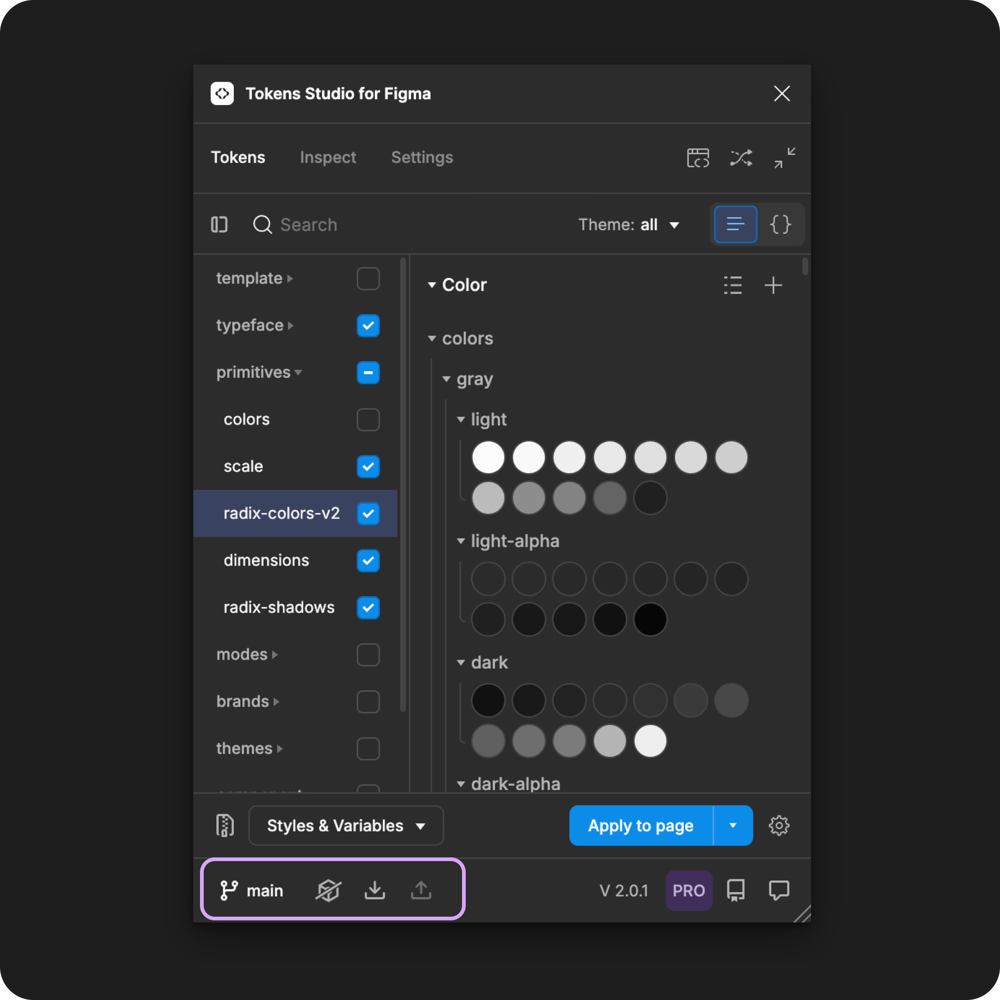
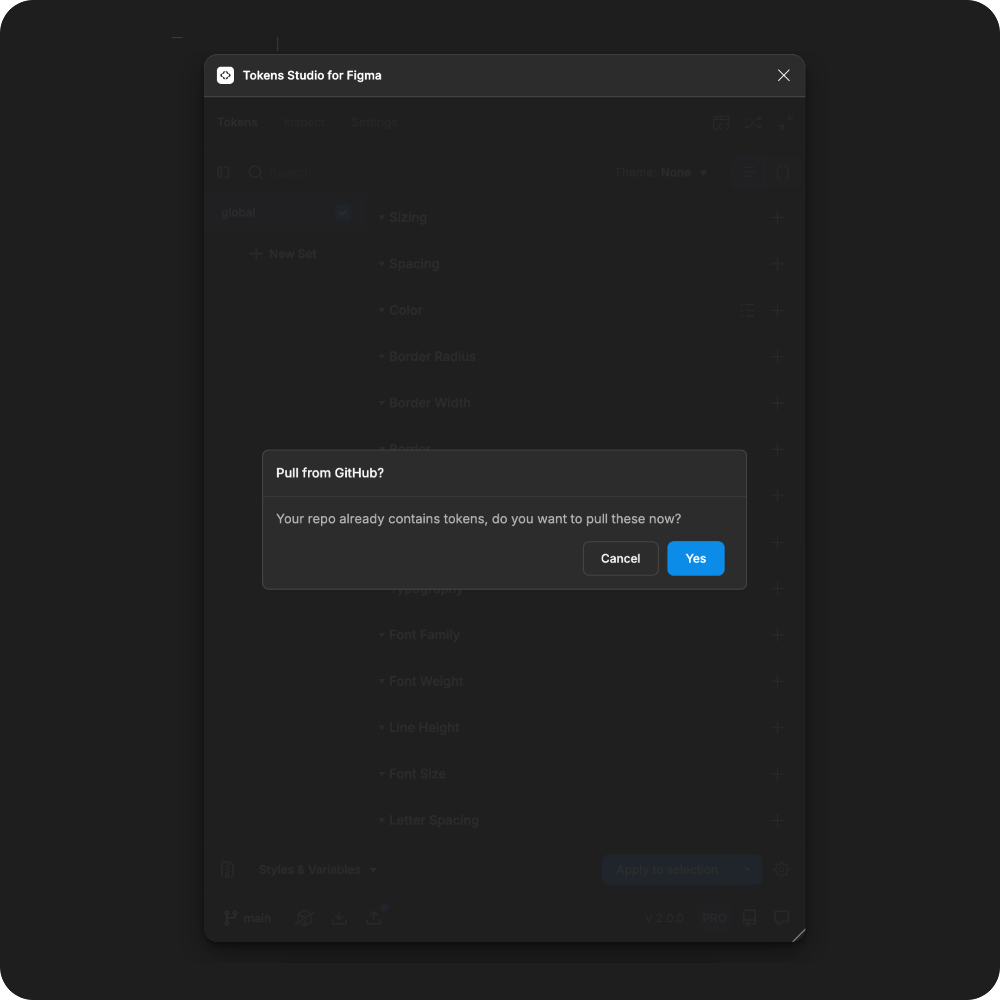

# Manage Sync Providers

## Manage sync providers

By default, Design Tokens created with Tokens Studio are stored locally in each Figma file, accessed by opening the plugin.

If you want to share your Tokens across multiple Figma files or store them externally (not in Figma), you can set up remote Token storage with one of our integration partners and add them as a **sync provider** in the plugin.

### Steps in the plugin for Figma

Open the Tokens Studio plugin and navigate to the **settings** page.

* Tap the **Add new sync provider**
* A **modal** will open with **a list of providers** to choose from.
* Tap the **Choose** button next to the provider you want to add

<figure><figcaption></figcaption></figure>

### Sync provider credentials

Once you select your sync provider, a **modal** will open with a form to **add the necessary credentials**.

\
Each provider's form will look slightly different. If you need help on how to fill out the form, make sure to check out their specific documentation for detailed instructions.&#x20;



Select **Save** to continue. Sometimes you have to scroll the form to see the **save** button.

<figure><figcaption></figcaption></figure>

### Save and do the initial sync

Once you **Save** your credentials, the plugin will compare your Tokens with whats in your repository.

You'll see a modal asking you to **push** or **pull** to 'sync' the plugin data with your storage provider, depending on the type of provider, permissions, and the Tokens you have in the plugin.

These images show the **push** and **pull** modals for a new GitHub sync, but it will look similar for most providers.

<figure><figcaption></figcaption></figure>

**Pull from provider**

If your sync provider already has Design Tokens, you'll see a dialogue asking if you want to **pull** your Tokens in.

* If you select **yes**
  * Tokens in your remote storage will be **pulled** into the plugin.
  * Any Tokens currently in the plugin will be replaced with the Tokens in your remote storage, and they can not be recovered.
  * Once the pull is complete, the modal will close and you'll be returned to the **Settings** page of the plugin.
* If you select **cancel**
  * Tokens currently in the plugin will remain, and you can choose to push them to your sync provider later.
  * The modal will close and you'll be returned to the **Settings** page of the plugin.
* If you close the modal without making a selection
  * Tokens currently in the plugin will remain, and you can choose to push them to your sync provider later.
  * Closing the modal returns you to the **Settings** page of the plugin.



**Push from local**

If your sync provider does not have code files with Design Tokens, you'll see a modal asking if you want to **push**.

This would **push** or "send" the current Tokens in the plugin to your sync provider.

* If you select **Push changes**
  * The **commit message** is required.
    * You can think of it as a short note to your engineers about what you are **pushing**, such as "initial token load."
  * Tokens in the plugin will be **pushed** to your remote storage.
  * Once the pull is complete, the modal will close and you'll be returned to the **Settings** page of the plugin.
* If you select **cancel**
  * Tokens currently in the plugin will remain, and you can choose to push them to your sync provider later.
  * The modal will close and you'll be returned to the **Settings** page of the plugin.
* If you close the modal without making a selection
  * Tokens currently in the plugin will remain, and you can choose to push them to your sync provider later.
  * Closing the modal returns you to the **Settings** page of the plugin.

### Sync provider is active

Once your sync provider is connected, it appears on the **settings page** as **Active**. The plugin will tell you which **Token Format** your JSON files are being written in.


[token-format.md](../../manage-settings/token-format.md)


<figure><figcaption></figcaption></figure>

You'll notice the **sync actions** at the bottom of the plugin are now visible. These actions indicate when the plugin is out of sync with the Tokens in remote storage.

* **Push** indicator:
  * Visible when changes you've made in the plugin need to be sent to the code files stored by your sync provider.
* **Pull** indicator:
  * Visible when the plugin needs to "receive" changes made to the code files stored by your sync provider.



<figure><figcaption></figcaption></figure>

### Pro tips for working with Sync providers

Once your sync provider is active, here are some workflow tips from the Tokens Studio team and community.

#### Save a copy of your sync provider credentials

Capture a copy of the credentials you filled in the form and store them somewhere for safekeeping.

* If you need to re-add the sync provider to the plugin, you'll have a record of what you put in each section of the form as a reference.

#### Share Tokens between Figma files

Once the sync provider is added, Tokens stored by your sync provider are easily accessed in any Figma file without needing to add the credentials again.

Once you open the Tokens Studio plugin in any Figma file:

1. Navigate to the **settings** page of the plugin
2. Navigate to the **sync provider** of your choice in the list and select **apply**
3. The **pull from provider** modal will open, asking if you want to **pull** in the Tokens being stored externally.
   * Follow the **Pull** steps above.

<figure><figcaption></figcaption></figure>

Once you've completed the **Pull** from your sync provider, your Tokens will be available in your new Figma file.

* If your sync provider has **write** permissions, changes you make in the new Figma file can be **Pushed** back to the sync provider and then **Pulled** into other Figma files.

***

### Resources

Community resources:

* None yet!



#### Known issues and bugs

Tokens Studio Plugin GitHub - Open issues for [Sync Providers Manage](https://github.com/tokens-studio/figma-plugin/labels/sync%20providers%20manage)



#### Requests, roadmap and changelog

* None yet


