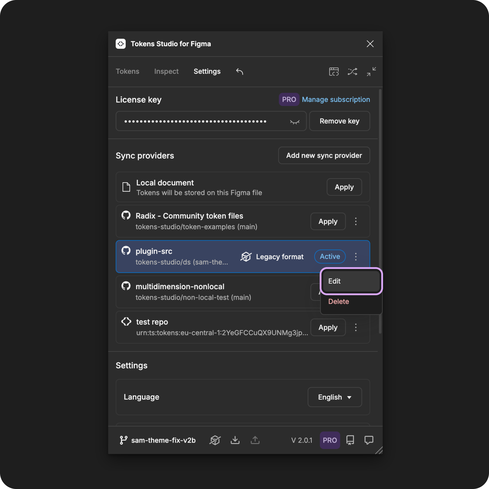
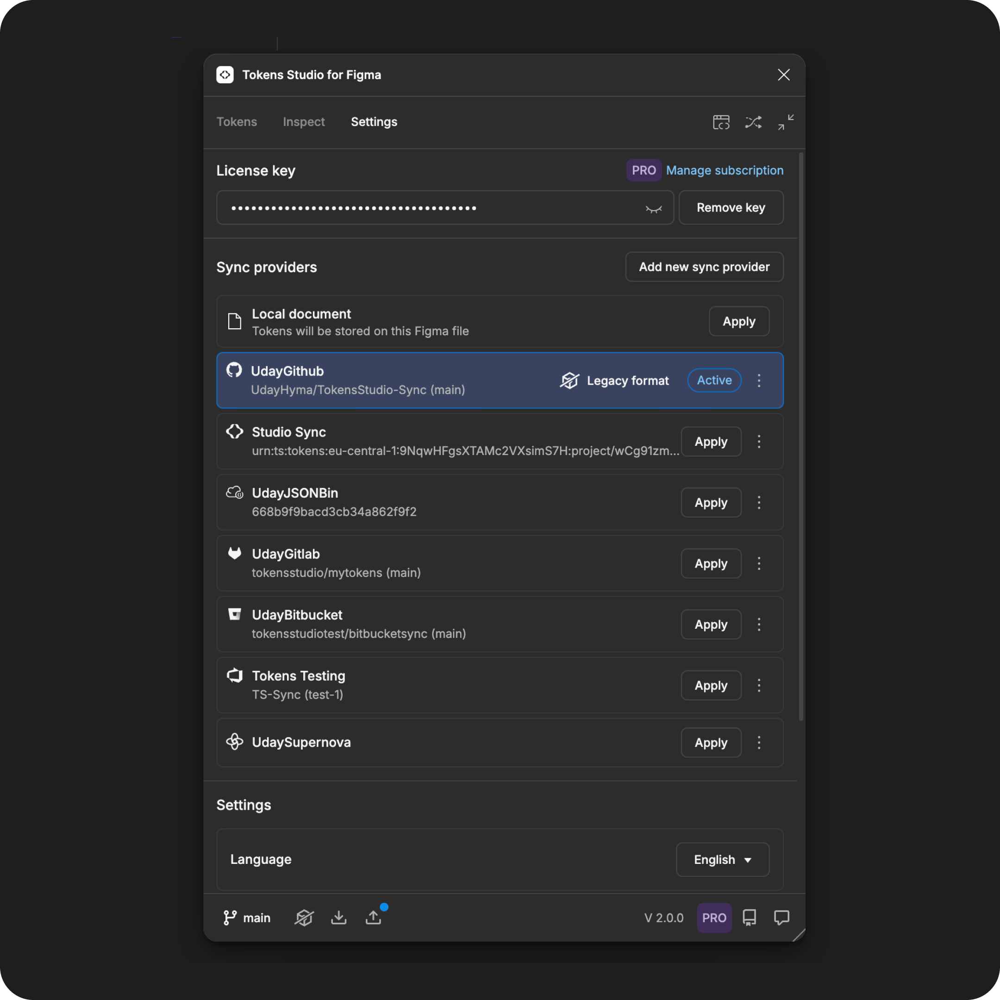

# Edit Sync Provider

## Edit a sync provider

Once a Sync provider is added to Tokens Studio, you may need to change the credentials.

### Steps in the plugin for Figma

Open the Tokens Studio plugin and navigate to the **settings** page.

1. Navigate to the **sync provider** of your choice in the list.
2. Select the **three-dot menu icon** on the right side of the **sync provider** details.
3. Select **edit** from the menu options.

<figure><figcaption></figcaption></figure>

#### Sync provider modal

A **modal** will open with a form to **edit the necessary credentials**.

Each provider's form will look slightly different. If you need help on how to fill out the form, make sure to check out their specific documentation for detailed instructions:



Select **Save** to continue. Sometimes you have to scroll the form to see the **save** button.

<figure><figcaption></figcaption></figure>

#### Remote storage providers

Once you **Save** your credentials, the plugin will compare your Tokens with whats in your repository.

You may see a modal asking you to **push** or **pull** to 'sync' the plugin data with your storage provider, depending on the type of provider, permissions, and the Tokens you have in the plugin.

These images show the **push** and **pull** modals for a new GitHub sync, but it will look similar for most providers.

<figure><figcaption></figcaption></figure>

#### **Pull from provider**

If your sync provider already has Design Tokens, you'll see a dialogue asking if you want to **pull** your Tokens in.

* If you select **yes**
  * Tokens in your remote storage will be **pulled** into the plugin.
  * Any Tokens currently in the plugin will be replaced with the Tokens in your remote storage, and they can not be recovered.
  * Once the pull is complete, the modal will close and you'll be returned to the **Settings** page of the plugin.
* If you select **cancel**
  * Tokens currently in the plugin will remain, and you can choose to push them to your sync provider later.
  * The modal will close and you'll be returned to the **Settings** page of the plugin.
* If you close the modal without making a selection
  * Tokens currently in the plugin will remain, and you can choose to push them to your sync provider later.
  * Closing the modal returns you to the **Settings** page of the plugin.



#### **Push from local**

If your sync provider does not have code files with Design Tokens, you'll see a modal asking if you want to **push**.

This would **push** or "send" the current Tokens in the plugin to your sync provider.

* If you select **Push changes**
  * The **commit message** is required.
    * You can think of it as a short note to your engineers about what you are **pushing**, such as "initial token load."
  * Tokens in the plugin will be **pushed** to your remote storage.
  * Once the pull is complete, the modal will close and you'll be returned to the **Settings** page of the plugin.
* If you select **cancel**
  * Tokens currently in the plugin will remain, and you can choose to push them to your sync provider later.
  * The modal will close and you'll be returned to the **Settings** page of the plugin.
* If you close the modal without making a selection
  * Tokens currently in the plugin will remain, and you can choose to push them to your sync provider later.
  * Closing the modal returns you to the **Settings** page of the plugin.

### Sync provider has been updated

The sync provider will be connected and appear in the **settings page** as **Active**.

<figure><figcaption></figcaption></figure>

If you don't want this sync provider to be active in your current file, you can choose a different one from the list.


[change.md](change.md)


***

### Resources

Community resources:

* None yet!



#### Known issues and bugs

Tokens Studio Plugin GitHub - Open issues for [Sync Providers Manage](https://github.com/tokens-studio/figma-plugin/labels/sync%20providers%20manage)



#### Requests, roadmap and changelog

* None yet


