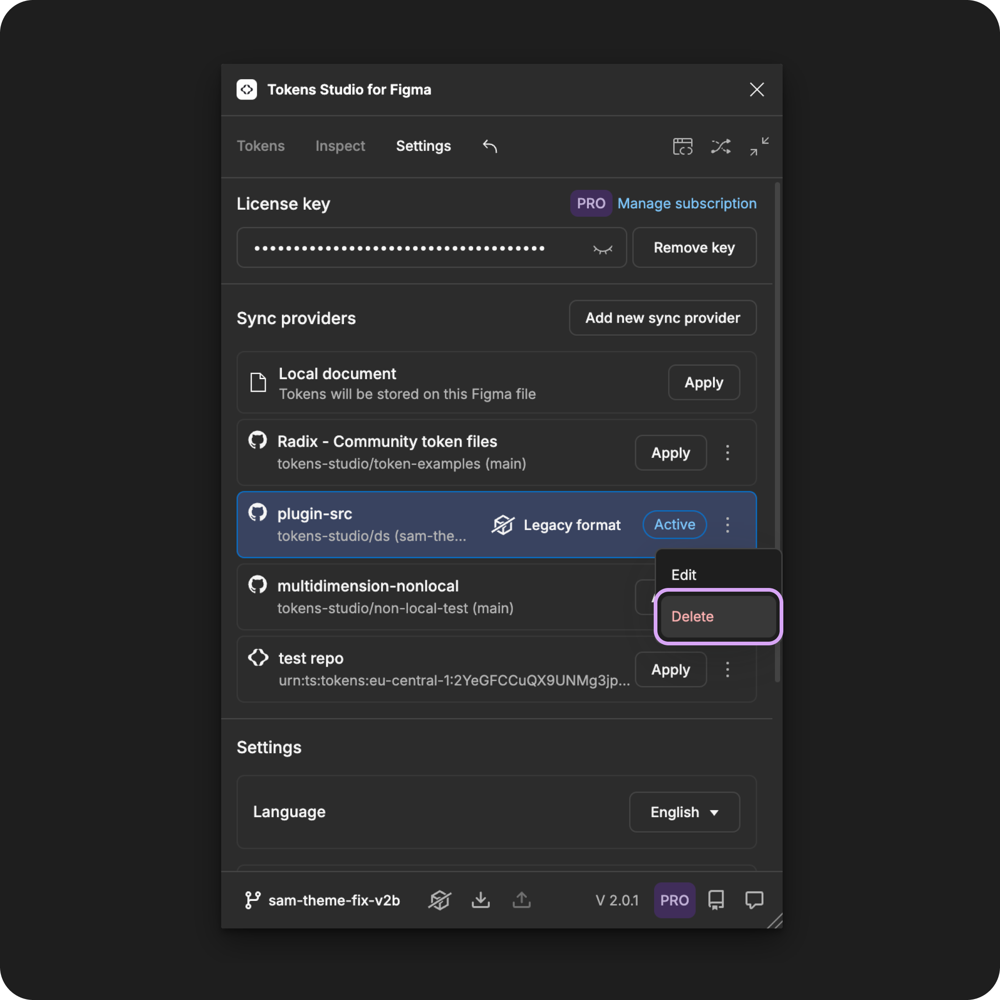
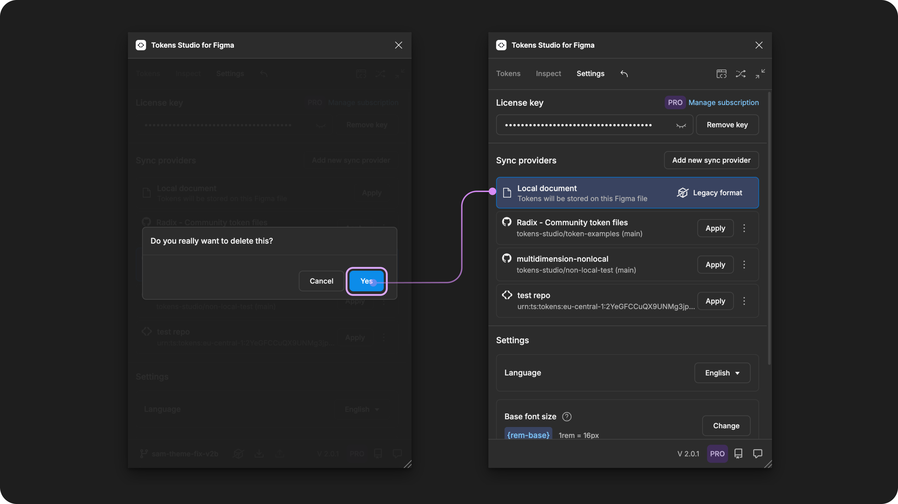

# Remove Sync Provider

## Delete a sync provider

Once a project is completed, you may wish to remove a sync provider from the plugin. You can always add it again later.

### Steps in the plugin for Figma

Open the Tokens Studio plugin and navigate to the **settings** page.

1. Navigate to the **sync provider** of your choice in the list.
2. Select the **three-dot menu icon** on the right side of the **sync provider** details.
3. Select **delete** from the menu options.

<figure><figcaption></figcaption></figure>

#### Delete sync provider modal

A **modal** will open to **confirm** that you want to delete this sync provider.

* If you select **yes**
  * The sync provider will be removed from the settings page of the plugin
  * The Tokens currently in the plugin will be stored locally by default.
  * The modal will close and the local document option will be selected in the list of sync providers on the plugin's settings page.
* If you select **cancel**
  * The modal will close and you'll be returned to the plugin's Settings page.
  * The sync provider will remain on the plugin's settings page.
* If you close the modal without making a selection
  * The sync provider will remain on the plugin's settings page.

<figure><figcaption></figcaption></figure>

If you don't want to work with your Tokens stored locally, you can add a new sync provider or choose an existing one from the settings page.


[.](./)



[change.md](change.md)


***

### Resources

Community resources:

* None yet!



#### Known issues and bugs

Tokens Studio Plugin GitHub - Open issues for [Sync Providers Manage](https://github.com/tokens-studio/figma-plugin/labels/sync%20providers%20manage)



#### Requests, roadmap and changelog

* None yet


