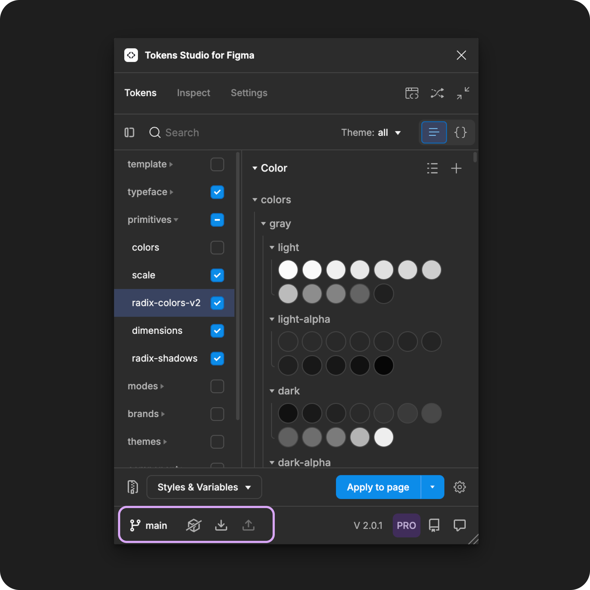
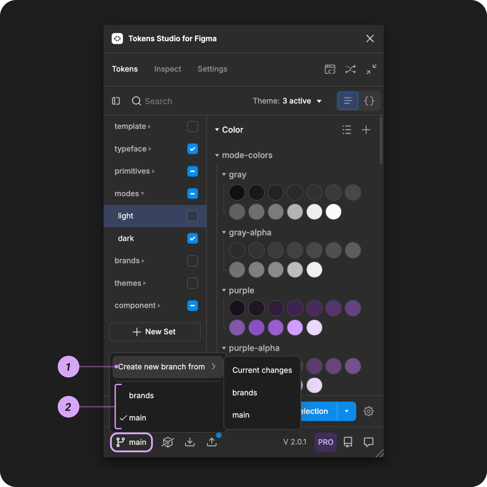

# Branch Switching (pro) - Version Control

## Branch switching (pro)



If you are working with one of these Git sync providers and have a Pro Licence for Tokens Studio, you can use the plugin native integration to take advantage of **branch** workflows to version control changes to your Tokens:




In this guide we will show a GitHub sync provider, but the steps are similar for all other Git sync providers.&#x20;


### Default branch settings

By default, Tokens Studio will connect to the **branch** you identified in your **sync provider settings.** You can adjust your Default Branch at anytime from the Settings page of the Plugin.&#x20;

→ [Read the guide on editing sync providers here](manage-sync-provider/edit.md)

The image below shows an example of a Github sync provider with the setting for `branch` set to `main` (number 4).&#x20;

<figure><figcaption></figcaption></figure>

To support proper version control of your Token Changes, you can **create a new branch** or **switch branches** using the plugin.

### Branch indicator

When you are connected to **Sync Provider** that supports branching, the **Sync Actions** at the bottom of the plugin will be visible.&#x20;

The **Branch Button** is on the left, displaying the current branch you are working on.

For example, in the image below, the `main` branch is active.

<figure><figcaption></figcaption></figure>

### View available branches

**Selecting the branch name** from the **Sync Actions** at the bottom of the plugin will open the **Branch menu** which displays:

1. An option to **Create a new branch**.
2. Available branches from your sync provider.

<figure><figcaption></figcaption></figure>


The branches visible in the plugin come from your sync provider.

The plugin can't remove any branches from the list; you have to log into your sync provider to delete branches.


#### 1. Create a new branch

**Select the branch name** from the **Sync Actions** at the bottom of the plugin to open the **Branch menu**.

* Select the **Create a new branch from** option.
* You'll see a list of current branches from your Sync provider.
* **Select the branch** you want to make your new branch from.
  * Choosing an existing branch (like `main`) will:
    * Ignore any local changes you have made to your Tokens in the plugin.
    * Pull in the Tokens from the branch you selected as the starting place for your new branch.
  * Choosing **Current changes** will:
    * Take the Tokens exactly as you have them in the plugin as the starting place for your new branch.
* Follow the prompts in the plugin to finish creating your new branch.
  * If you have unsaved changes in the plugin (blue push notification is visible), you will be prompted to **push** your changes to the **Sync Provider** before creating the new branch so they aren't lost.
* Once the new branch is created, the plugin will open the **Push Modal** to sync your Tokens to your new branch.

→ [Read the Keep Your Tokens in Sync guide for more details on the Push modal. ](remote-push-pull-changes.md#push-modal)

#### 2. Switch branches

**Select the branch name** from the **Sync Actions** at the bottom of the plugin to see the available branches you can switch between.

* **Select a new branch name** to switch to that branch.
* The plugin will open the **Pull modal** to see if you want to replace your existing tokens with the Tokens in the new branch you've selected.

→ [Read the Keep Your Tokens in Sync guide for more details on the Pull modal. ](remote-push-pull-changes.md#pull-modal)

### Limitations of branch switching

Sometimes, when you open the plugin, it reverts to the default branch in your **Sync Provider** configuration, for example, `main`.

Other times, new branches created in a local file are automatically applied in all files sharing the same sync provider, which is not always desired.


it's important to double-check which branch you are working on each time you open the plugin.

* The **name of the branch you are working on** appears at the bottom of the plugin for easy reference.
* You can switch branches by following the steps above at any time.


***

### Resources

Community resources:

* None yet!



#### Known issues and bugs

Tokens Studio Plugin GitHub - [Open issues for Sync Brancing](https://github.com/tokens-studio/figma-plugin/labels/sync%20branch)

* Add error when TS plugin is not able to push changes [#2487](https://github.com/tokens-studio/figma-plugin/issues/2487)
  * Currently no error is shown when you try to push changes to a branch where you don't have permissions for.
* Branch switching conflicts over multiple files https://github.com/tokens-studio/figma-plugin/issues/2476
  * Branch settings in the plugin follow you across Figma files.



#### Requests, roadmap and changelog

* None yet


