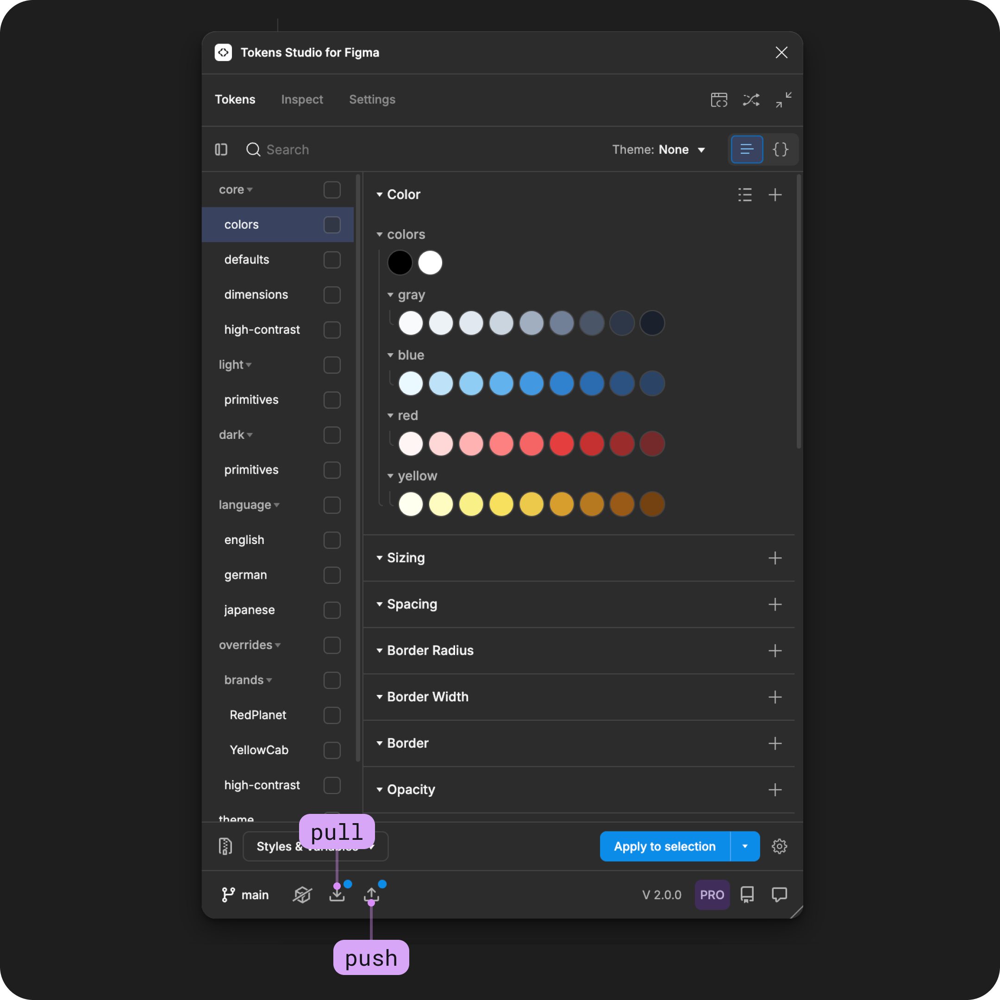
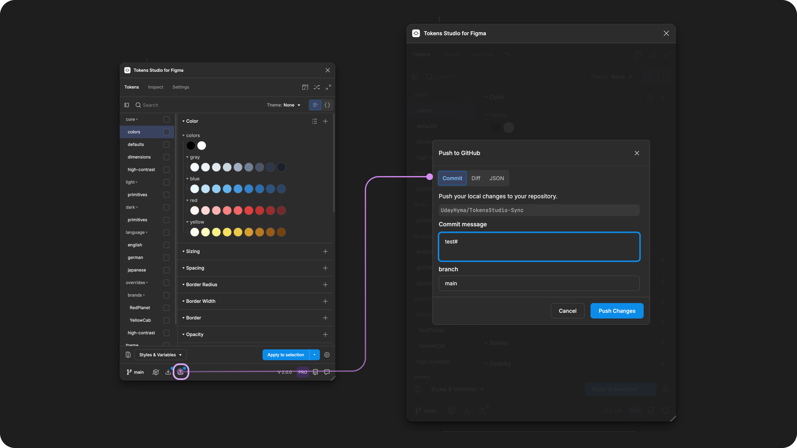
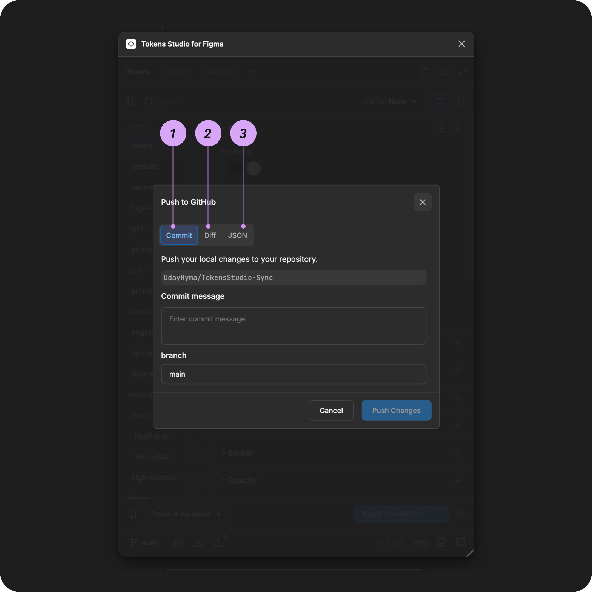
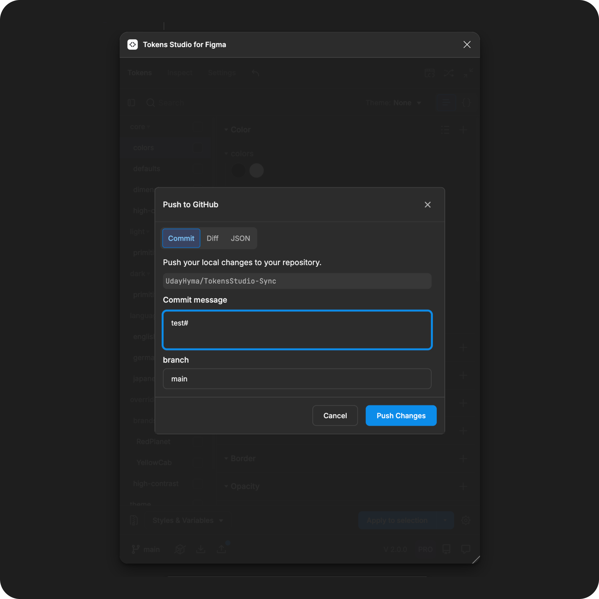
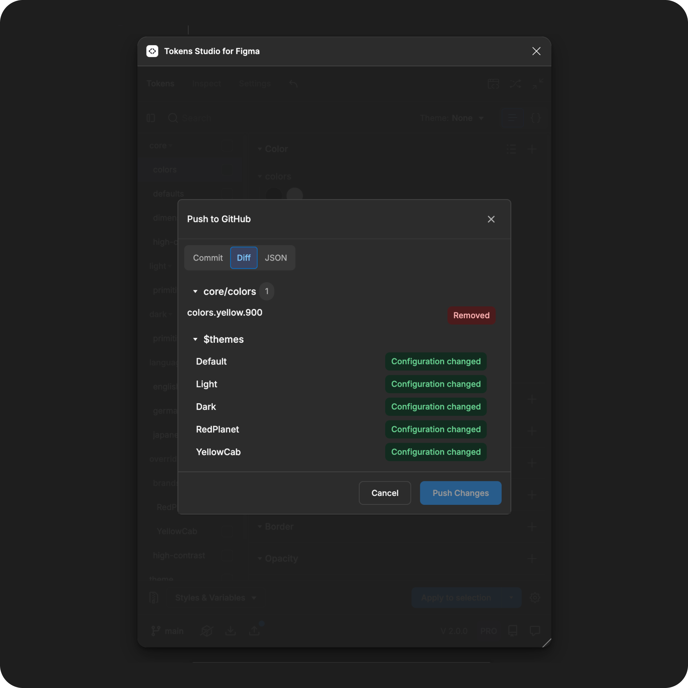
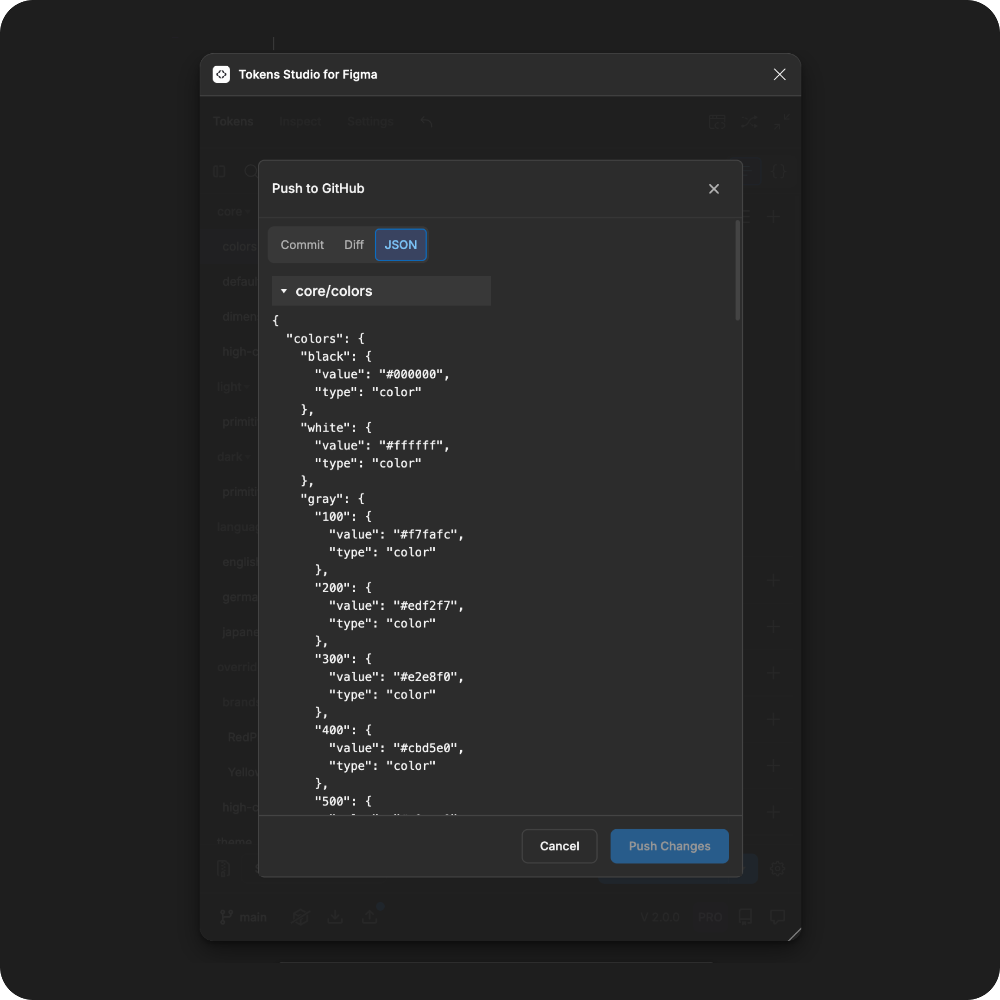
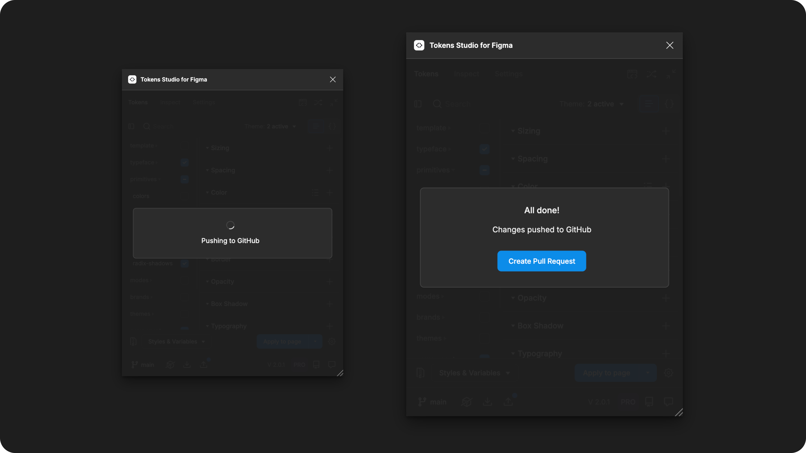
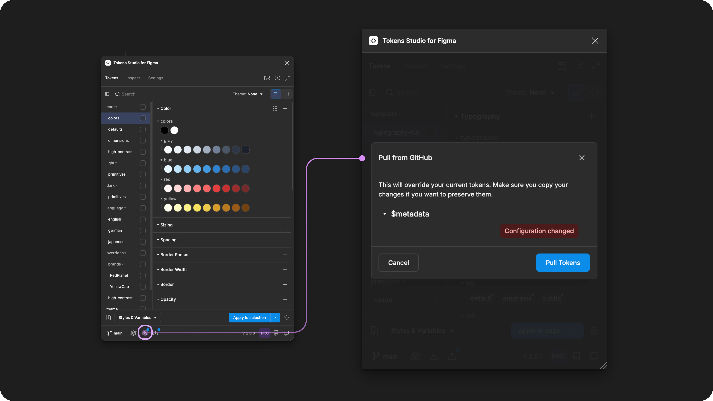
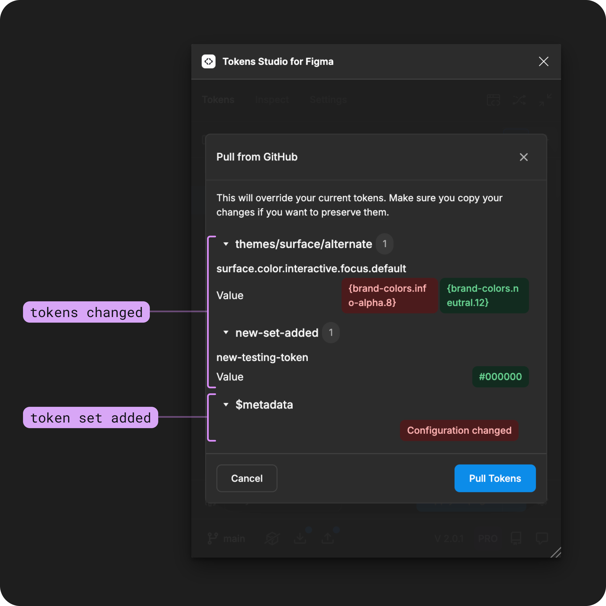

# Sync Changes to Remote Storage - Push and Pull

## Sync changes to remote Token storage

Once you have a sync provider connected, you can use the plugin to keep your tokens in sync.


[remote](remote/)


For sync providers that have **read** and/or **write** permissions, the plugin will identify when changes have been made and notify you to:

* **Push** to your sync provider.
  * **Write** access allows us to "send" changes made in the plugin to your code files.
* **Pull** from your sync provider.
  * **Read** access allows the plugin to "receive" changes to your code files.

<figure><figcaption></figcaption></figure>

### Push to sync provider

When you make changes in the plugin, it detects that your Token data is out of sync with the code files stored by your provider.

In the plugin, you will see the **push icon button** has a **notification indicator** visible to remind you to **push** (or send) your changes to your sync provider.

When you are ready to send those changes to your sync provider:

* **Select the push icon button** to open the **push modal**.

<figure><figcaption></figcaption></figure>

#### Push modal

The **Push modal** has three sections, accessible by selecting the tab in the plugin:

1. Commit
2. Diff
3. JSON

<figure><figcaption></figcaption></figure>

**1. Commit**

By default, when the **Push modal** opens, you see the **commit form**.

This is where you add a **commit message** containing a short note about what you are **pushing** to the sync provider.

The **commit message** is:

* visible to engineers looking at your code files.
* required each time you **push** Token data to a sync provider.
  * The **Push Changes Button** will be inactive until the **commit form** is completed.

<figure><figcaption></figcaption></figure>

**2. Diff view**

The **Diff** view shows the **difference** of what you are **pushing** to a sync provider and what is already at the source.

* Token data being added will appear highlighted in green.
* Token data being removed will appear highlighted in red.

<figure><figcaption></figcaption></figure>

**3. JSON view**

The **JSON** view shows the code in JSON, which will be sent to the sync provider.

<figure><figcaption></figcaption></figure>

#### Push Changes

Once you add a **Commit message**, you can select **Push changes**.

* The plugin will take some time to connect to your sync provider and update the Token data.

Once the **Push** has been completed and your **commit** has been added to the sync provider, the plugin may ask if you want to **Create a Pull Request**.

#### Pull Request

If your sync provider supports **Pull Requests**, sometimes called a **PR**, the plugin can initiate that process.

* A **Pull Request** signals to engineers and other folks consuming your code files that you've **pushed changes** to them and are requesting that they **pull** those changes to review them.
* The code review and merge processes are handled by the sync prover.

<figure><figcaption></figcaption></figure>

After you've **Pushed Changes** to your sync provider, you can **Create a Pull Request**.

* Selecting the **Create a Pull Request button** in the plugin will open a web browser to your sync provider, where you can complete the **PR** process.
  * The plugin will close the **Push Modal** and you can continue working in the plugin as desired.

**Delay the Pull Request**

Tapping outside the **Push modal** will close it without starting the **PR** process.

* This allows you to **push** more than one set of changes before you ask your team to review your changes.
* They will see each **commit message** you push from the plugin in the **PR** whenever you are ready.

## Pull from a sync provider

When the plugin detects that the Token data in your connected code files has changed, you will see the **pull button** with a notification indicator to remind you to **pull** (or update) the new data from your sync provider.

<figure><figcaption></figcaption></figure>

The **pull** action is also helpful if you've been working in the plugin and aren't happy with your changes.

* You can press the **pull button** at any time to 'reset' your Tokens to their original state in your code files.

When you are ready to receive changes from your sync provider:

* **Select the pull icon button** to open the **pull modal**.
* Review and accept the changes.
* The modal will close and the **pull indicator** will no longer be visible.

### Pull modal

The **Pull modal** separates the changes the plugin identifies so you can review them:

* **Token Sets** where changes are detected are in collapsable headings
  * **Tokens** deleted are identified with a **removed** label
  * **Token Values** that are changed are identified with the
    * Previous value on the left
    * New value on the right
* Metadata changes
  * When Token sets are removed/added
* Themes changes
  * All changes to the theme configuration.

Select the **Pull changes button** once you are ready to accept the changes.

You will lose all Tokens in the plugin, and they can not be recovered!

If you want to keep the Tokens as they are currently in the plugin, you can select **cancel.**

<figure><figcaption></figcaption></figure>

***

### Resources

Community resources:

* None yet!



#### Known issues and bugs

Tokens Studio Plugin GitHub - Open issues for [Sync Indicators](https://github.com/tokens-studio/figma-plugin/labels/sync%20indicators)



#### Requests, roadmap and changelog

* None


