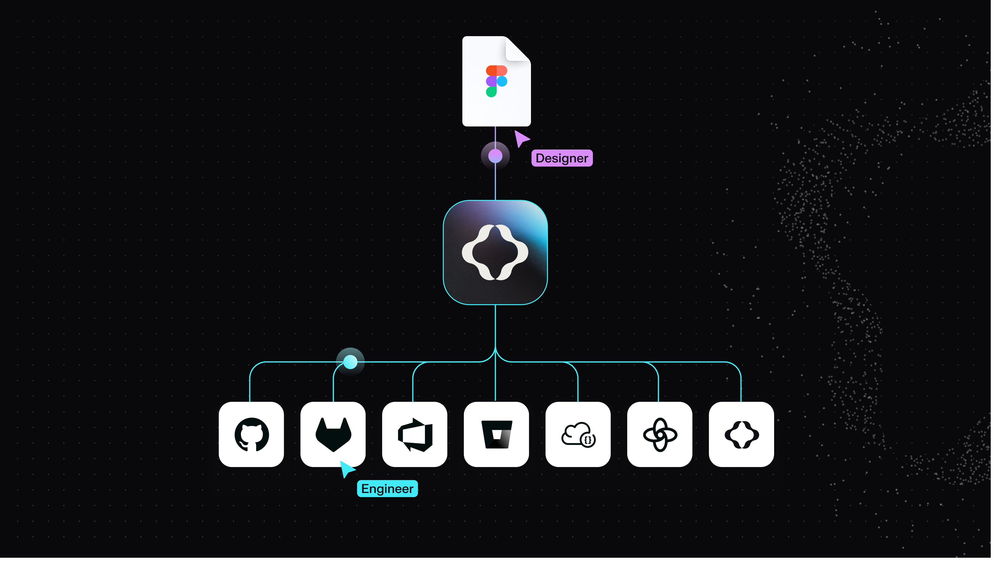
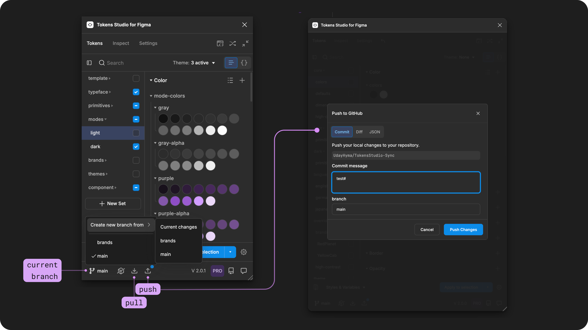

# Remote Token Storage Integrations

## Remote Token Storage

By default, Tokens Studio will store your [Design Tokens locally](../local.md) in the Figma file you are working in, but their true power is unleashed when they can be stored outside of a design tool and synced with code.

This synchronization creates a shared source of truth, fostering collaboration and alignment between design and development teams.

You can manage version control in Tokens Studio without ever having the Figma to keep your changes in sync with engineers in code, and other designers working in multiple Figma files.&#x20;

<figure><figcaption></figcaption></figure>

### Sync providers

Tokens Studio offers out-of-the-box integrations with several third-party providers to sync your Design Tokens with code and store them externally for safekeeping outside of your local design files.

We support:

* [Git providers](./#git-providers)
  * Connected to a code repository for remote Token storage that is version-controlled.
* [Cloud-based code storage providers](./#cloud-storage-providers)
  * Syncing your Token files with design data platforms.
* [Locally hosted server Token storage.](./#server-storage-providers)

Once your sync provider is active, the Plugin will detect changes in real time, and indicate when you need to sync changes with the Tokens in remote storage.&#x20;

Pro licence holders working with a Git sync provider can also create and switch between branches from within the plugin.&#x20;


[remote-branch-switch.md](../remote-branch-switch.md)


<figure><figcaption></figcaption></figure>

***

### Git providers

Git is an open-source system that tracks changes in code files.

Syncing your Tokens with a Git provider allows you to store your Design Tokens as code files in a repository. Tokens Studio has native features to push and pull Token changes easily and version-control your design decisions using the branching feature.

This allows you to explore design decisions before deploying them to a production environment.

_Select any of the Git providers below to read its Sync Setup Guide_

<table data-view="cards"><thead><tr><th></th><th data-hidden data-card-cover data-type="files"></th><th data-hidden data-card-target data-type="content-ref"></th></tr></thead><tbody><tr><td>GitHub is the most popular Git provider for hosting your code and design decisions in the same location, and it's free to get started!</td><td><a href="../../.gitbook/assets/github-card-header-sync-provider.png">github-card-header-sync-provider.png</a></td><td><a href="sync-git-github.md">sync-git-github.md</a></td></tr><tr><td>Gitlab is a popular Git provider for projects that benefit from its enhanced security features.</td><td><a href="../../.gitbook/assets/gitlab-card-header-sync-provider.png">gitlab-card-header-sync-provider.png</a></td><td><a href="sync-git-gitlab.md">sync-git-gitlab.md</a></td></tr><tr><td>Azure DevOps is a Microsoft-owned suite of development tools and services you can use to create a Git-based source code repository.</td><td><a href="../../.gitbook/assets/ado-card-header-sync-provider.png">ado-card-header-sync-provider.png</a></td><td></td></tr><tr><td>Bitbucket is a Git-based source code repository hosting service popular among teams using Atlassian tools.</td><td><a href="../../.gitbook/assets/bitbucket-card-header-sync-provider.png">bitbucket-card-header-sync-provider.png</a></td><td></td></tr></tbody></table>

***

### Cloud storage providers

Cloud storage providers offer a platform to store, manage, and retrieve your Design Token data via an API.

_Select any of the cloud storage providers below to read its Sync Setup Guide_

<table data-view="cards"><thead><tr><th></th><th data-hidden data-card-cover data-type="files"></th><th data-hidden data-card-target data-type="content-ref"></th></tr></thead><tbody><tr><td>JSONBin provides a simple REST interface to store &#x26; retrieve your JSON data from the cloud.</td><td><a href="../../.gitbook/assets/JSONBIN-card-header-sync-provider.png">JSONBIN-card-header-sync-provider.png</a></td><td><a href="sync-cloud-jsonbin.md">sync-cloud-jsonbin.md</a></td></tr><tr><td>Supernova is a design data platform popular for documenting design systems.</td><td><a href="../../.gitbook/assets/SUPERNOVA-card-header-sync-provider.png">SUPERNOVA-card-header-sync-provider.png</a></td><td><a href="sync-cloud-supernova.md">sync-cloud-supernova.md</a></td></tr><tr><td>Tokens Studio has a standalone web-based platform for dynamic creation and management of design decisions.</td><td><a href="../../.gitbook/assets/STUDIO-card-header-sync-provider.png">STUDIO-card-header-sync-provider.png</a></td><td><a href="sync-cloud-studio-platform.md">sync-cloud-studio-platform.md</a></td></tr></tbody></table>

***

### Locally hosted Token storage providers

Locally hosted Token storage providers offer an alternative to Git providers for projects that benefit from storing their Tokens on the same servers as the rest of their code.

_Select any of the local hosted below below to read its Sync Setup Guide_

<table data-view="cards"><thead><tr><th></th><th data-hidden data-card-cover data-type="files"></th></tr></thead><tbody><tr><td>Generic Versioned Storage is a way to host your Design Tokens on a local or remote server, which supports read-only, read/write, and read/write/create workflows.</td><td><a href="../../.gitbook/assets/GENERICVERSION-card-header-sync-provider.png">GENERICVERSION-card-header-sync-provider.png</a></td></tr><tr><td>When you host your Design Token JSON files on a web server or static hosting service, the plugin can access the Tokens (read-only) by syncing to the URL where your Token files are stored.</td><td><a href="../../.gitbook/assets/URL-card-header-sync-provider.png">URL-card-header-sync-provider.png</a></td></tr></tbody></table>

***

### Sync Provider Guides

When you are ready to sync your Tokens to a remote storage provider, check out these guides:


[manage-sync-provider](../manage-sync-provider/)



[remote-multi-file-sync.md](../remote-multi-file-sync.md)



[remote-push-pull-changes.md](../remote-push-pull-changes.md)



[remote-branch-switch.md](../remote-branch-switch.md)



[edit.md](../manage-sync-provider/edit.md)



[change.md](../manage-sync-provider/change.md)



[local.md](../local.md)



[remove.md](../manage-sync-provider/remove.md)


***

