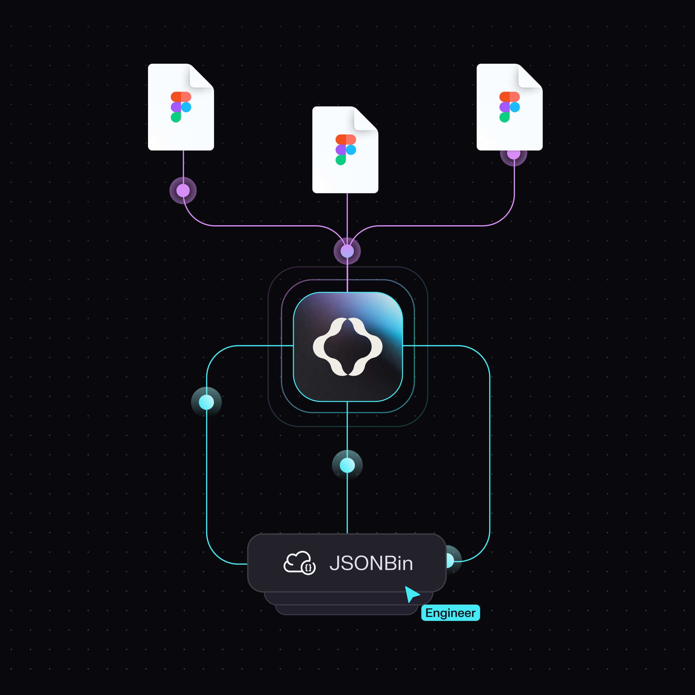
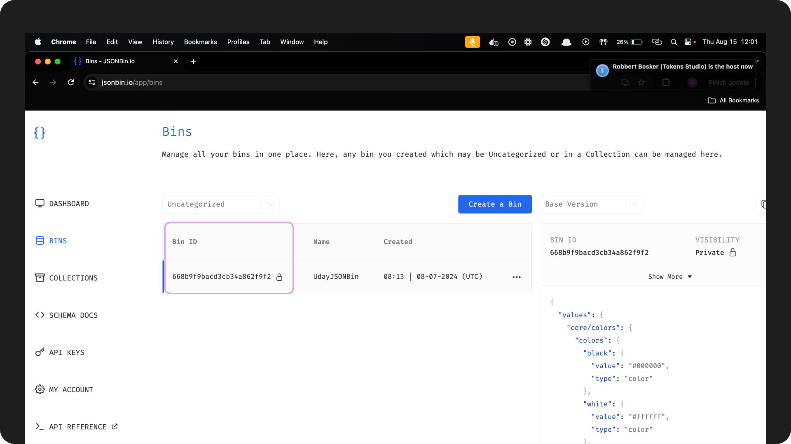
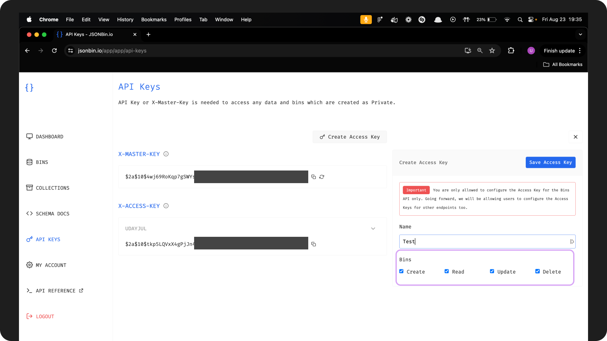
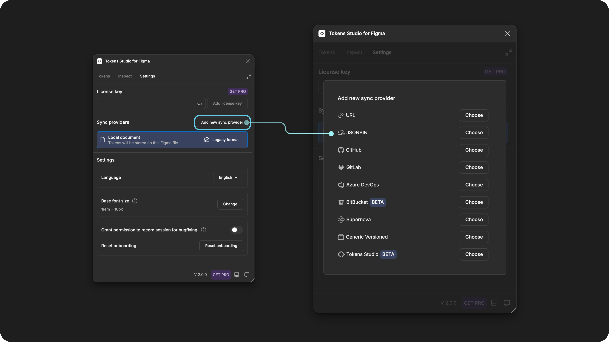
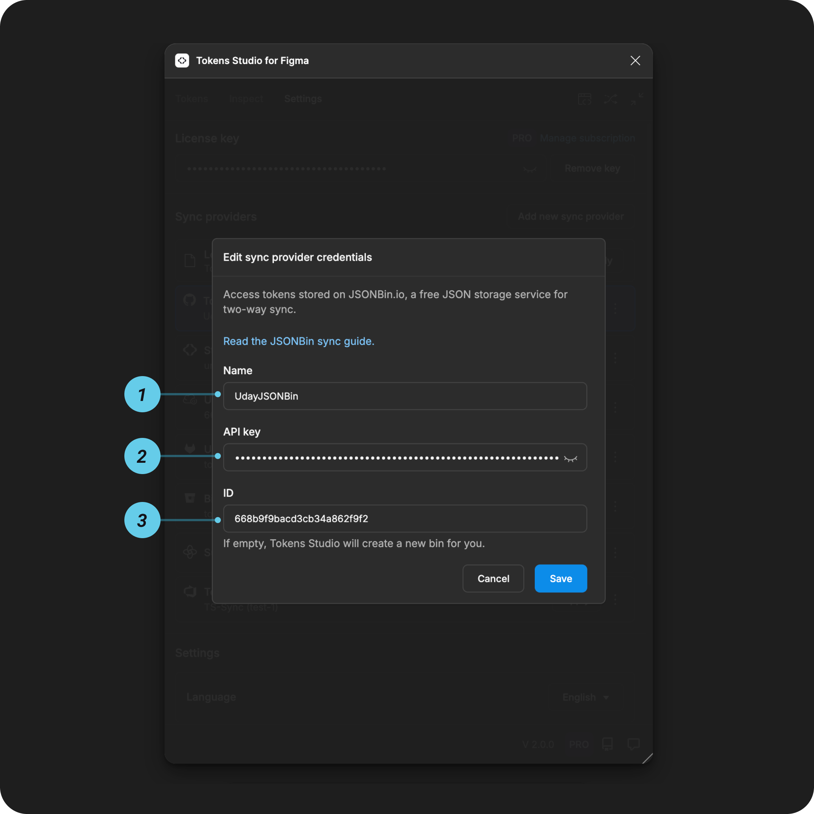

# JSONBin - Cloud Sync Provider

## JSONBin sync setup guide

[JSONBin](https://jsonbin.io/) provides a simple REST interface to store & retrieve your JSON data from the cloud.

You can use the Tokens Studio plugin native integration with JSONBin to sync your Design Tokens JSON files with code.

Tokens Studio supports two-way sync, meaning you can use the plugin to:

* **push** JSON files of Design Tokens to JSONBin
* **pull** the Tokens stored in JSONBin into any Figma file

This means the Design Tokens living in code are the source of truth for our design decisions, which can be shared between design and development teams.

This doc outlines how to set up JSONBin as a **Sync provider** in the Tokens Studio plugin.

### How it works

* Set up a **bin** and **API key** in JSONBin
* **Configure JSONBin as a sync provider** within the Tokens Studio plugin.
* Use the plugin to **sync your Design Tokens** between the JSONBin and Figma design files.

<figure><figcaption></figcaption></figure>

***

### JSONBin setup instructions

If you haven't already, sign up for a JSONBin account at [JSONBin](https://jsonbin.io/).

#### 1. Create a new bin

Once you've logged in to your JSONBin account:

* **Create a new bin** dedicated to storing and managing your Design Tokens.
  * Choose a **descriptive name** for your project that is specific to its purpose and is memorable.
* Follow JSONBin's prompts to create your new bin.

You are now looking at your new bin! Well done!


**Record the ID of the bin** somewhere safe, as it's needed for the plugin configuration.


<figure><figcaption></figcaption></figure>

#### 2. Generate an API key

The **API key** is generated from JSONBin, and acts as a passcode that allows the Tokens Studio plugin to connect to your JSONBin account.

Log into your JSONBin account:

* Navigate to your **JSONBin account settings**
* Locate the **API Key** section
* Select **Create Access Key**
  * Add a **Name** of what the Token is for.
    * Example: `test-Token repo sync to Tokens studio`
  * Select the **permissions** for the Bin using the checkboxes
    * Full permissions for the plugin would be `create`, `read`, `update`, and `delete`
* Select **Save Access Key**
* **Save the generated key** somewhere safe as it's needed for the plugin configuration.

You're ready to configure the Tokens Studio plugin in Figma!

<figure><figcaption></figcaption></figure>

***

### Configuring Tokens Studio Plugin

In Figma, open the Tokens Studio plugin and navigate to the **Settings** page using the navigation tab.

* Under the **Sync providers** section, select the **Add new** button to see a list of all Token storage providers
* Select **JSONBin**

<figure><figcaption></figcaption></figure>

#### 3. Add credentials for JSONBin

You'll need the information saved from the steps above to complete the JSONBin sync configuration form.

<figure><figcaption></figcaption></figure>

**1. Name**

This is a **nickname** that shows up in the **plugin settings page** later on to identify this specific sync provider configuration.

* Choose something memorable to you and your project.
* Example: `radix ui components`

**2. API Key**

The **API Key** you saved from  [step 2 above](sync-cloud-jsonbin.md#id-2.-generate-an-api-key).

**3. ID (optional)**

Enter the **ID of the bin** you created and saved from [step 1 above](sync-cloud-jsonbin.md#id-1.-create-a-new-bin).

* If this is empty, Tokens Studio will create a new bin for you.

#### Save and do the initial sync

Save to confirm your credentials, and then follow the plugin's prompts to finish setting up the JSONBin sync.



***

### Shared source of truth

As you work in the plugin, push and pull indicators remind you to stay in sync with your JSONbin.



Once your Token JSON files are synced to JSONbin, you have a shared source of truth between Designers and Engineers!



***

### Resources

Mentioned in this doc:

* JSONbin -[ https://jsonbin.io/](https://jsonbin.io/)
* SD-Transforms - [Read Me](https://github.com/Tokens-studio/sd-transforms#readme)
* Style Dictionary - [https://styledictionary.com/](https://styledictionary.com/)

Community resources:

* None yet!



#### Known issues and bugs

Tokens Studio Plugin GitHub - [Open issues for Sync JSONbin](https://github.com/Tokens-studio/figma-plugin/labels/sync%20JSONbin)

* JSONBin not updating if JSON is manually added [#2283](https://github.com/Tokens-studio/figma-plugin/issues/2283)
  * If you paste a JSON file in the plugin and save, you then need to click 'apply to' for the JSONBin to update.



#### Requests, roadmap and changelog

* 🧑‍💻 [Sync to external Token storage enhancements - Feature Request](https://tokensstudio.featurebase.app/p/sync-external-storage-enhancements)
  * How might we improve the experience of working with sync providers in general?
* ↕️ [Git sync enhancements - push, pull, merge, branching - Feature Request](https://feedback.tokens.studio/p/git-sync-enhancements)
* 🔐 [Data security info request - Feature Request](https://feedback.tokens.studio/p/data-security-info)


