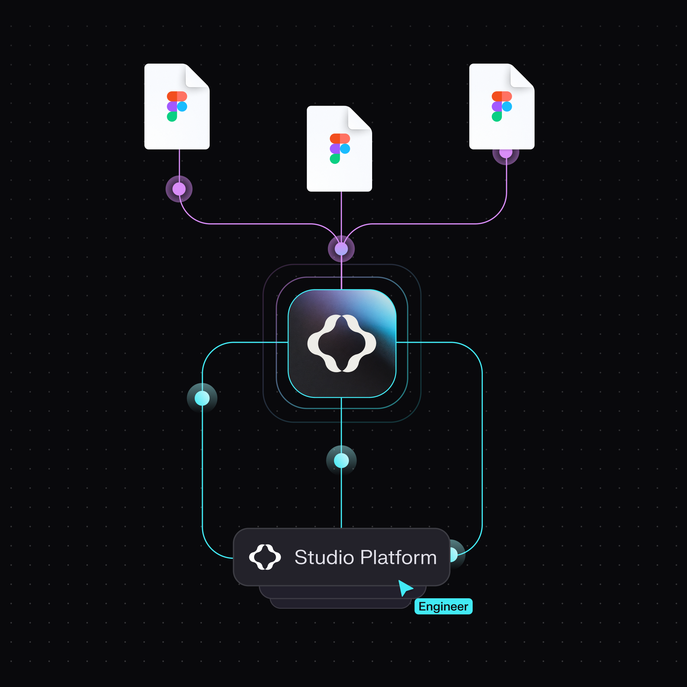
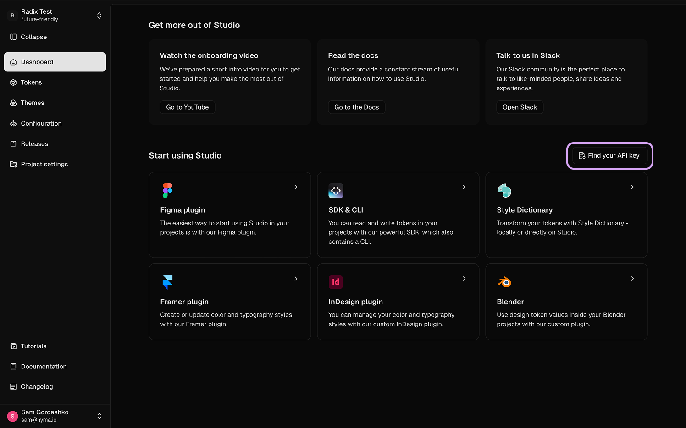
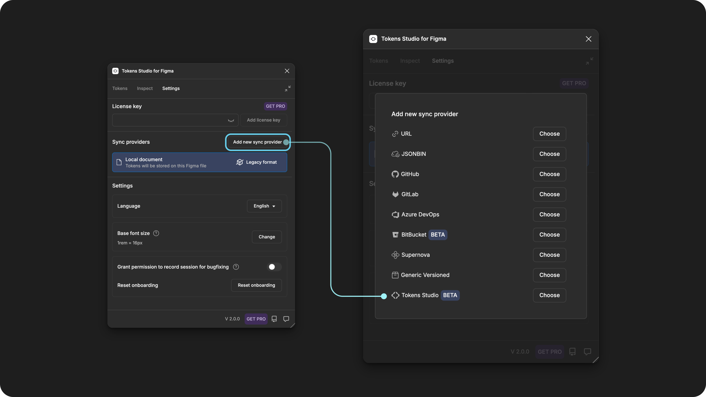
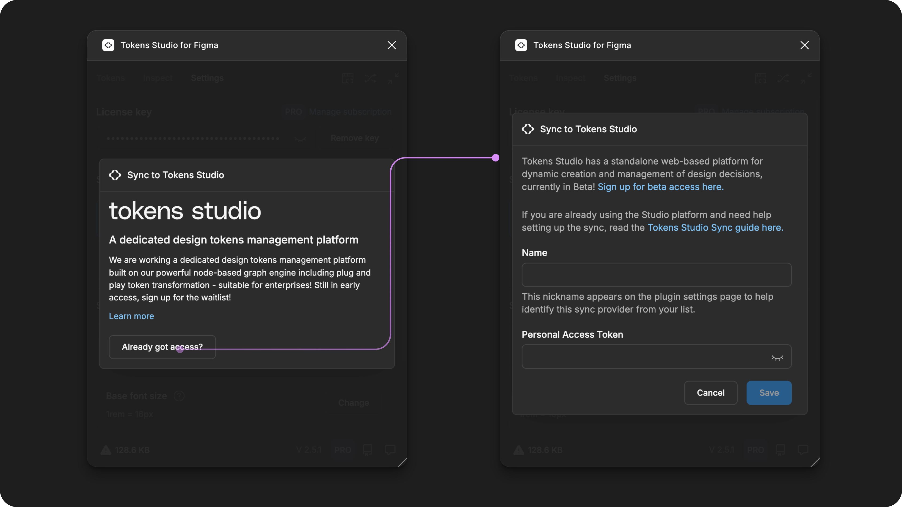
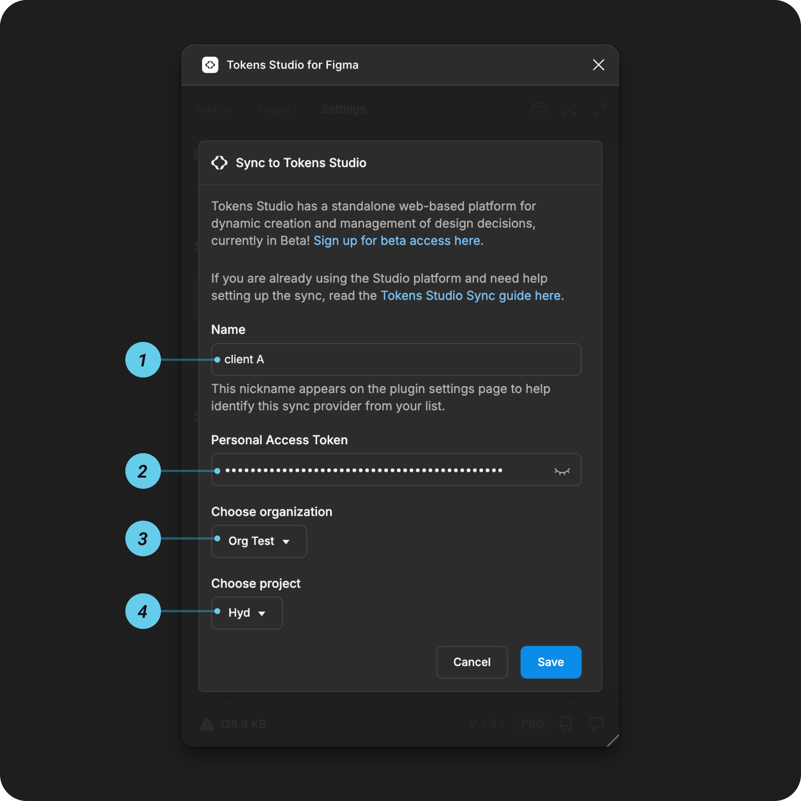

# Tokens Studio Platform - Cloud Sync Provider

## Tokens Studio Platform sync setup guide

Tokens Studio has a **standalone web-based platform** for dynamic creation and management of Design Tokens, currently in Beta!

[→ More information on the Studio Platform and sign up for Beta access here.](https://tokens.studio/studio)

### How it works

* Set up a **project** and **API key** in the Tokens Studio platform
* **Configure Tokens Studio as a sync provider** within the plugin.
* Use the plugin to **sync your Design Tokens** between the Tokens Studio platform and your Figma design files.

<figure><figcaption></figcaption></figure>

***

### Tokens Studio sync setup instructions

If you haven't already, sign up for an account at [Tokens Studio](https://app.tokens.studio/)

#### 1. Create a new project

Once you've logged into your Tokens Studio account:

* Create a **New Organization**.
* Create a **New Project**
  * Give your project a title.
  * Choose a template to start the project. You can always remove this later.&#x20;
* Now you are looking at the dashboard of your new project.

<figure><figcaption></figcaption></figure>

#### 2. Create an API key

The **API key** is generated from the Tokens Studio Platform, and acts as a passcode that allows the Figma Plugin to connect to your account and access all Organizations and Projects that you are a part of.

Log into your Tokens Studio Platform account:

* Navigate to the **home page** of your account
* Click on **Find your API key.**&#x20;
  * You can also jump to the API keys page by using the keyboard shortcut cmd+k.
* Select **Create a new Keys**
* Add a **Name** of what the API Key is for.
  * Example: `fimga-sync`
  * Option to add a **Description** for the API Key
    * Example: `test-token sync to plugin`
* Select **create key**
* **Save the generated API key** somewhere safe as it's needed for the plugin configuration and you will not see it again.&#x20;

You're ready to configure the Tokens Studio plugin in Figma!

<figure><figcaption></figcaption></figure>

***

### Configuring Tokens Studio Plugin

In Figma, open the Tokens Studio plugin and navigate to the **Settings** page

* Under the **Sync providers** section, select the **Add new** button to see a list of all Token storage providers
* Select **Tokens Studio**

<figure><figcaption></figcaption></figure>

You'll be asked to confirm that you already have access to the Studio Platform and then brought to the Studio Platform sync configuration form.&#x20;

<figure><figcaption></figcaption></figure>

#### Add credentials for Tokens Studio sync

You'll need the information saved from the steps above to complete the Tokens Studio sync configuration form.

As you fill in the details, additional inputs in the form will appear.&#x20;

<figure><figcaption></figcaption></figure>

**1. Name**

This is a **nickname** that shows up in the **plugin settings page** later on to identify this specific sync provider configuration.

* Choose something memorable to you and your project.
* Example: `Client A`

**2. API Key**

The **API Key** you saved from [step 2 above](sync-cloud-studio-platform.md#id-2.-create-an-api-key).

* Once you enter the API Key into the form, the system will validate your Studio Platform account.&#x20;
* Once the validation is successfull, the Organization input will appear.&#x20;

**3. Organization**

Select the Studio Platform Organization from the dropdown that contains the Token Project you'd like to work with.&#x20;

* Once you select an Organization, the system will check your Studio Platform account.&#x20;
* Once the check is complete, the Project input will appear.&#x20;

#### 4. Project

Select the Token Project you'd like to work with in the Figma Plugin from the dropdown.&#x20;

* You'll only see Projects within the current Organization you've selected above.&#x20;

#### Save and do the initial sync

Save to confirm your credentials, and follow the prompts in the plugin to finish setting up the Tokens Studio Platform sync.

***

### Shared source of truth

As you work in the Plugin, it will continuously update the Studio Platform to stay in sync without manual push actions needed.

You will need to pull changes made in the Studio Platform into the Figma Plugin using the refresh action  that appears in the bottom left of the Plugin.

***

### Resources

Mentioned in this doc:

* Tokens Studio Platform - [https://tokens.studio/studio](https://tokens.studio/studio)
* Studio Platform Documentation - [https://documentation.tokens.studio/](https://documentation.tokens.studio/)

Community resources:

* None yet!



#### Known issues and bugs

Tokens Studio Plugin GitHub - [Open issues for Sync Studio platform](https://github.com/tokens-studio/figma-plugin/labels/sync%20tokens%20studio%20\(beta\))



#### Requests, roadmap and changelog

* 🧑‍💻 [Sync to external token storage enhancements - Feature Request](https://tokensstudio.featurebase.app/p/sync-external-storage-enhancements)
  * How might we improve the experience of working with sync providers in general?
* ↕️ [Git sync enhancements - push, pull, merge, branching - Feature Request](https://feedback.tokens.studio/p/git-sync-enhancements)


