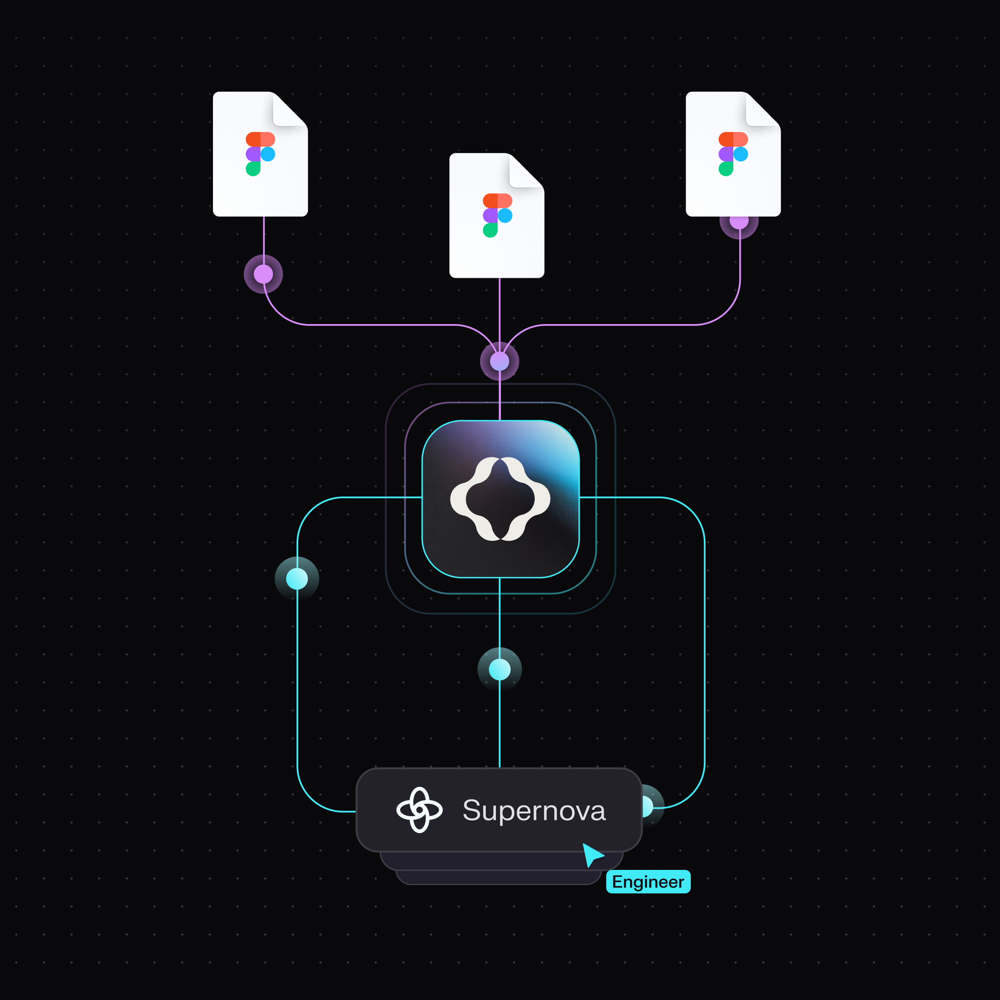
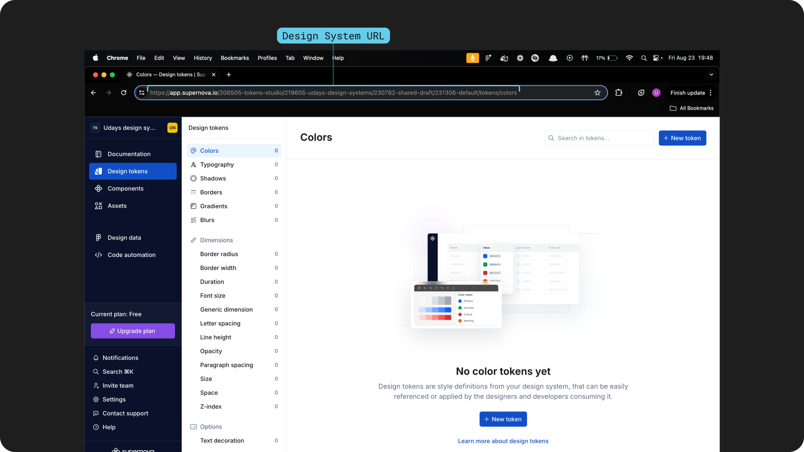
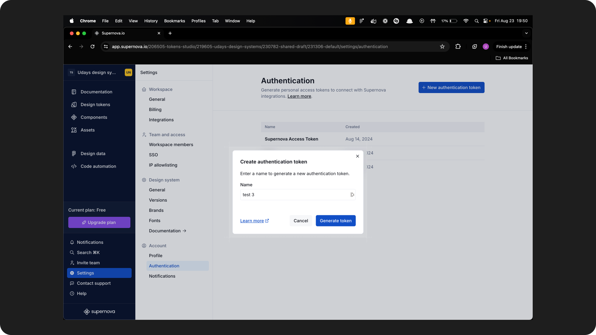
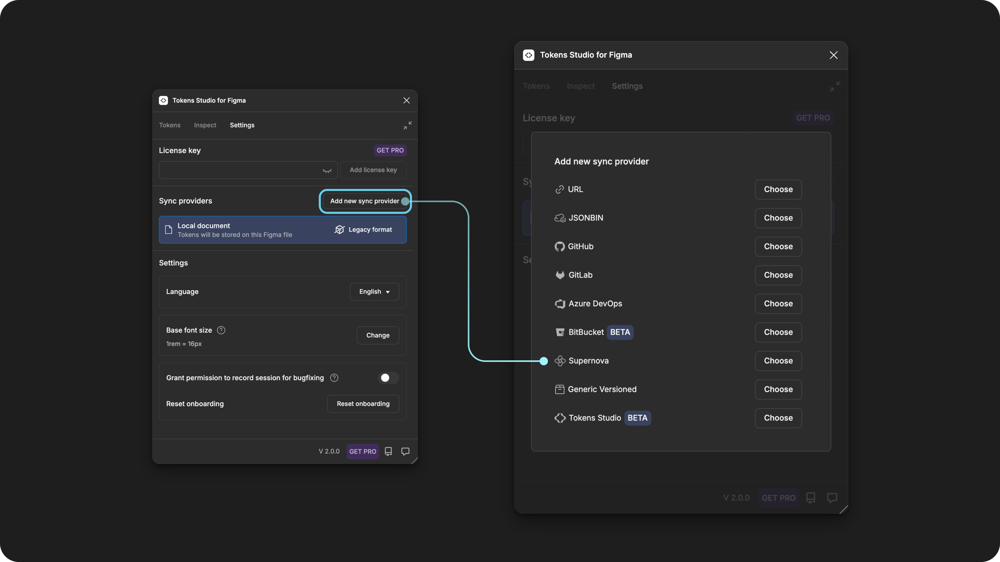
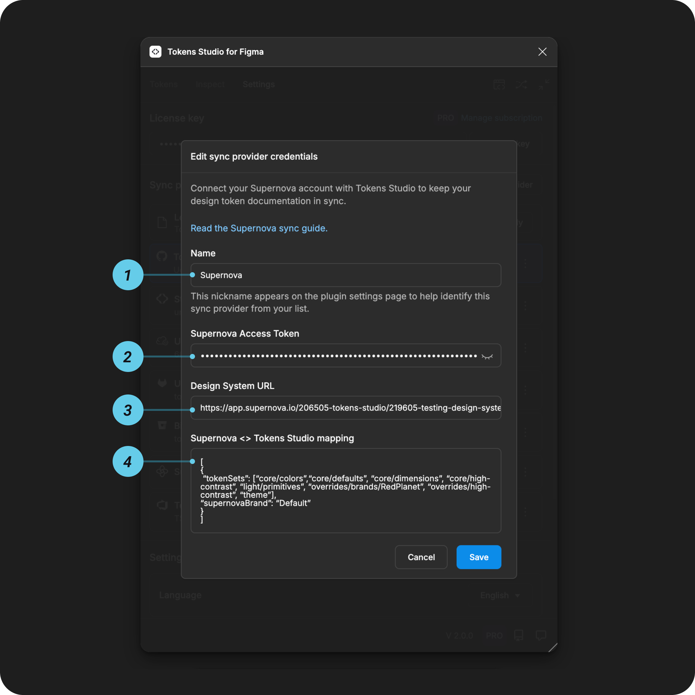

# Supernova - Cloud Sync Provider

## Supernova sync setup guide

[Supernova](https://supernova.io/) is a design data platform popular for documenting design systems.

With the Tokens Studio plugin's integration with Supernova, you can create and manage Design Tokens and themes in Figma and sync to Supernova to create documentation.


The Supernova integration has some limitations and does not provide the same bi-directional sync or version control our Git provider integrations offer.

You may want to consider including [a Git provider](broken-reference) in your process in addition to Supernova.


### How it works

* Gather **Design System Data** and **Authentication token** in Supernova.
* **Configure Supernova as a sync provider** within the Tokens Studio plugin.
* Use the plugin to **sync your Design Tokens** between Figma and Supernova to keep your Design Token documentation up to date.

<figure><figcaption></figcaption></figure>

***

### Supernova setup steps

If you haven't already, sign up for a Supernova account at [https://supernova.io/](https://supernova.io/)

#### 1. Gather design system project information

Log into your Supernova account and navigate to the **Design System Project** that you'd like to sync with Tokens Studio.

* You'll land on the **Design Tokens** page in Supernova for your project.
* **Save the URL of the Design Tokens page** somewhere safe as it's needed for the plugin configuration.


Be sure to include the `https://` in your URL copy


<figure><figcaption></figcaption></figure>

Each Design System project will require different code snippets for **mapping** Tokens Studio to Supernova. It's best to consult the Supernova docs to gather the right **mapping** code snippets or reach out to them for support:

→ [Basic mapping documentation on the Supernova site](https://learn.supernova.io/latest/design-systems/import-design-system-data/importing-via-tokens-studio/setting-up-tokens-studio-inyFJuPh#section-5-setting-up-mapping-f1)

→ [Advanced mapping for working with themes and multiple brands on the Supernova site](https://learn.supernova.io/latest/design-systems/import-design-system-data/importing-via-tokens-studio/working-with-themes-uDt16AKH)


#### 2. Generate an access token

Not to be confused with anything to do with Design _Tokens_, an **access token** acts as a passcode from Supernova you enter into the plugin that allows the connection to happen.

Log into your Supernova account:

* Navigate to the **Authentication** section of your project
* **Generate a new authentication token** with the necessary permissions.
* **Save the generated access token** somewhere safe as it's needed for the plugin configuration.

You're ready to configure the Tokens Studio plugin in Figma!

<figure><figcaption></figcaption></figure>

***

### Configuring Tokens Studio Plugin

In Figma, open up the Tokens Studio plugin and navigate to the **Settings** page using the navigation tab.

* Under the **Sync providers** section, select the **Add new** button to see a list of all Token storage providers
* Select **Supernova**

<figure><figcaption></figcaption></figure>

#### Add credentials for Supernova

You'll need the information saved from the steps above to complete the JSONBin sync configuration form.

<figure><figcaption></figcaption></figure>

**1. Name**

* This is a **nickname** that shows up in the **plugin settings page** later on to identify this specific sync provider configuration.
* Choose something memorable to you and your project.
* Example: `radix ui components`


**2. Supernova access token**

The **Access token** you saved from [ step 2 above.](sync-cloud-supernova.md#id-2.-generate-an-access-token)


**3. Design System URL**

The **URL** of your design system project [from step 1 above](sync-cloud-supernova.md#id-1.-gather-design-system-project-information)

* Example:`https://supernova.io/ws/test/ds/amazingdesigner/radixtokens`


**4. Supernova < > Tokens Studio Mapping**

The exact code snippets provided by Supernova (see the steps above) limit the data that Tokens Studio can sync to Supernova.


The mapping structure is important!&#x20;

Its essential to have the correct mapping structure, so copy/paste the configuration as outlined in the[ Supernova docs precisely](https://learn.supernova.io/latest/design-systems/import-design-system-data/importing-via-tokens-studio/working-with-themes-uDt16AKH), including the square brackets `[ ]`.


Example mapping configuration:

```json
[
    {
        "tokenSets": ["global", "light"],
        "supernovaBrand": "Default"
    }
]
```

If you want to map multiple themes at once, then you can check out the Supernova docs on connecting to the plugin [here](https://learn.supernova.io/latest/design-systems/import-design-system-data/importing-via-tokens-studio/working-with-themes-uDt16AKH).


#### Save and do the initial sync

Save to confirm your credentials, and then follow the plugin's prompts to finish setting up the Supernova sync.



***

### Shared source of truth

As you work in the plugin, push and pull indicators remind you to stay in sync with Supernova.





***

### Limitations from Supernova

According to the Supernova docs, Design Tokens synced to Tokens Studio cannot be edited directly in Supernova; all edits must be made in the Tokens Studio plugin interface.

→ [Read the Supernova docs here.](https://learn.supernova.io/latest/design-systems/import-design-system-data/importing-via-tokens-studio/import-and-update-tokens-d0sT3iiE)

This means **pulling tokens** from Supernova will only show changes to tokens made in the Tokens Studio plugin that were pushed to Supernova.


#### Customer support

The Supernova team provides customer support for issues with Supernova sync, so you'll need to contact them directly through their support channels to triage issues and ask questions.

* In the [Tokens Studio community slack](https://tokens.studio/slack), we have a [#supernove-sync](https://tokens-studio.slack.com/archives/C059H5BTMU3) channel moderated by the Supernova team.
* This is a great place to post questions and concerns to help other community members who might be having the same experience. It also allows the Tokens Studio team to help out where we can!

***

### Resources

Mentioned in this doc:

* Supernova - [https://www.supernova.io/](https://www.supernova.io/)
* Supernova - [Tokens Studio sync documentation](https://learn.supernova.io/latest/design-systems/import-design-system-data/importing-via-tokens-studio/working-with-themes-uDt16AKH)
* SD-Transforms - [Read Me](https://github.com/tokens-studio/sd-transforms#readme)
* Style Dictionary - [https://styledictionary.com/](https://styledictionary.com/)


Community resources:

* None yet!




#### Known issues and bugs

Tokens Studio Plugin GitHub - [Open issues for Sync Supernova](https://github.com/tokens-studio/figma-plugin/labels/sync%20supernaova)




#### Requests, roadmap and changelog

* 🧑‍💻 [Sync to external token storage enhancements - Feature Request](https://tokensstudio.featurebase.app/p/sync-external-storage-enhancements)
  * How might we improve the experience of working with sync providers in general?
* ↕️ [Git sync enhancements - push, pull, merge, branching - Feature Request](https://feedback.tokens.studio/p/git-sync-enhancements)
* 🔐 [Data security info request - Feature Request](https://feedback.tokens.studio/p/data-security-info)


