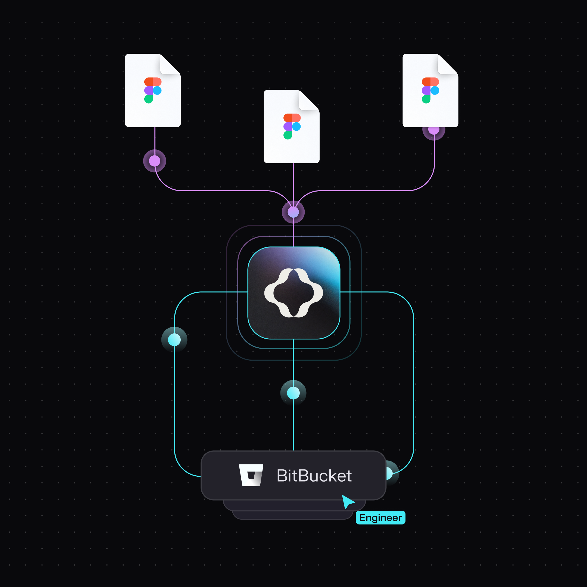

# Bitbucket - Git Sync Provider

## Bitbucket sync setup guide

[Bitbucket](https://bitbucket.org/product) is a Git-based source code repository hosting service popular among teams using Atlassian tools.

You can use the Tokens Studio plugin native integration with Bitbucket to sync your Design Tokens to a repository of your choice.

We support two-way sync, meaning you can use the plugin to:

* **Push** JSON files of Design Tokens to Bitbucket
* **Pull** the Tokens stored in Bitbucket into any Figma file

This means the Design Tokens living in code are the source of truth for our design decisions, which can be shared between design and development teams.

This doc outlines how to set up a Bitbucket repository and add it as a **Sync provider** in the plugin.

→ Once set up, you can use the plugin's **Push** and **Pull** features to keep your Tokens in sync. #add-doc-link

### How it works

* Set up a **repository** and **personal access Token** in Bitbucket.
* Configure **Bitbucket as a sync provider** within the Tokens Studio plugin.
* Use the plugin to **sync your Design Tokens** between Bitbucket and Figma design files.

<figure><figcaption></figcaption></figure>

***

### Bitbucket setup instructions

If you haven't already, sign up for a Bitbucket account at [https://bitbucket.org/](https://bitbucket.org/)

#### 1. Record your Bitbucket user name&#x20;

Once you sign in, record your Bitbucket user name and store it somewhere safe as its needed to authenticate when you configure the Tokens Studio plugin to connect with your account.&#x20;


#### 2. Create a new repository

Sign into your account and select the **Create** button, and select **Repository**.

* Select the project the repository should belong to.
* Choose a specific and memorable **repository name** which will be used in the plugin as the destination for your Design Tokens.
* Review the options, [learn more about those in the Bitbucket docs.](https://support.atlassian.com/bitbucket-cloud/docs/create-a-git-repository/)
  * `Add a README file` needs to be checked
    * This is mandatory because the plugin can not sync to an empty repository.
* Enter your **default branch name**
  * We suggest using `main` or ask your engineers what they prefer
  * Keep a copy of the default branch name handy as you'll need it for the plugin configuration later.
* Include .gitignore can be **None**

You are now looking at your new repository! Well done!

<figure><figcaption></figcaption></figure>

#### **3. Record the Repository URL**

From your browser, **Copy the URL of the repository and it somewhere safe** as it's needed for the plugin configuration.

<figure><figcaption></figcaption></figure>

#### 4. Generate an app password

The **App password** is generated from Bitbucket and acts as a passcode that allows the Tokens Studio plugin to connect to your Bitbucket account.

Navigate to your Bitbucket account settings.

* Locate the **Personal settings** section, select **Personal Bitbucket settings**
* Select **App passwords**.
* Select **Create app passwords**
* Add a **Name** of what the app password is for
  * Example: `test-token repo sync to Tokens studio`
* Select the **permissions** for app passwords
  * **Account** = `Read`
  * **Repositories** = `Write`
* Select the **Create** button
  * The page will display the **New app password dialog**
* **Save the generated password, and your Bitbucket username** somewhere safe as it's needed for the plugin configuration.

You're ready to configure the Tokens Studio plugin in Figma!

<figure><figcaption></figcaption></figure>


***

### Plugin settings for Bitbucket

In Figma, open the Tokens Studio plugin and navigate to the **Settings** page using the navigation tab.

* Under the **Sync providers** section, select the **Add new** button to see a list of all Token storage providers.
* Select **Bitbucket**

<figure><figcaption></figcaption></figure>


#### Add new credentials for Bitbucket

You'll need the information saved from the steps above to complete the Bitbucket sync configuration form.

<figure><figcaption></figcaption></figure>

**1. Name**

This is a **nickname** that shows up in the **Plugin settings page** later on to identify this specific sync provider configuration.

* Choose something memorable to you and your project.
* Example: `radix ui components`


**2. Bitbucket username**

The **username** of the Bitbucket account you saved in [step 1 above](sync-git-bitbucket.md#id-1.-record-your-bitbucket-user-name) is used as a part of the authentication process between the plugin and Bitbucket.


**3. App password**

The **App password** you saved from [step 4 above](sync-git-bitbucket.md#id-3.-generate-an-app-password).


**4. Repository (owner/repo)**

The URL from the **repository** from the [step 3 above](sync-git-bitbucket.md#id-3.-record-the-repository-url) has the **owner/repository** in it (all characters after the **bitbucket.org/)**

Occasionally your URL may contain a project related slug after the **owner/repository**. The screenshot above shows such a url. If the URL of your repo contains a slug, you'll only need the 2 sections after the **bitbucket.org**

For example, if your URL says `https://butbucket.org/tokensstudiotest/bitnucketsync/src/main` you will enter `tokensstudiotest/bitbucketsync` into the form in the plugin.


**5. Branch**

Your engineers might tell you what to add as the **default repository branch** where you will be pushing your Tokens, so if you aren't sure, ask them.

* If you created a new repo following [the steps above](sync-git-bitbucket.md#id-2.-create-a-new-repository), you will enter `main`.
* You can create additional branches using the plugin later.


**6. Token storage location (file/folder path)**

This tells the plugin:

* How to organize your Token JSON files in Bitbucket.
  * In a folder of multiple files, or a single file.
* The location of where your Token data is stored.
  * The file or folder's pathway (or name) to sync with.

This setting impacts:

* How engineers can work with our Token files during the Token transformation stage of the design-to-development process.
* May limit edit access of Tokens for other team members using the Tokens Studio plugin.

<figure><figcaption></figcaption></figure>

**Folder**

The folder option syncs Token data from the plugin into a folder that contains multiple JSON files or subfolders of JSON files.






In the plugin, enter the pathway of the folder where you want the Token data to be stored, which is the **folder name** without any extensions.

For example:

```
tokens
```

Our Bitbucket repository will have a folder called `tokens` synced to the Tokens Studio plugin in Figma.

* Each **Token Set** created in the plugin is added to the folder as an individual JSON file.
* Additional data files generated by the plugin are also added to the folder.
  * For example, `themes` configuration.

Recall that storing your Token data in a folder (multi-file sync) is a pro feature.

* If other team members are working with your Tokens and do not have a Pro Licence for Tokens Studio, your Tokens will be **read-only** for them.


**File Path**

Setting our Token storage as the **file** option syncs our Token data from the plugin into a single JSON file in code.

Combining Token data into a single file limits engineers' ability to work with **Theme** information when transforming Design Tokens.

→ Learn about the Themes (pro) feature in Tokens Studio here. #add-doc-link/themes-pro

**File** storage might work for you if:

* You are using the free version of Tokens Studio.
* Engineers are not using your Design Tokens in code.

In the plugin, we enter the pathway of the JSON file where we want our Token sets to be stored, which is the **file name** with the `.json` extension.

For example:

```
tokens.json
```

Our Bitbucket repository will have a single code file called `tokens.json` synced to the Tokens Studio plugin in Figma.

* Each **Token Set** created in the plugin is combined into this single file in our repository.


#### Save and do the initial sync

Once you **Save** your credentials, the plugin will compare your Tokens with whats in your repository.

You'll see a modal asking you to **push** or **pull** to Bitbucket to 'sync' the plugin data with your repository.




***

### Shared source of truth

As you work in the plugin, push and pull indicators remind you to stay in sync with your Bitbucket repository.



Once your Token JSON files are synced to your Bitbucket repo, you have a shared source of truth between Designers and Engineers!



***

### Resources

Mentioned in this doc:

* Bitbucket - [https://bitbucket.org/product/](https://bitbucket.org/product/)
* SD-Transforms - [Read Me](https://github.com/tokens-studio/sd-transforms#readme)
* Style Dictionary - [https://styledictionary.com/](https://styledictionary.com/)


#### Community resources:

* None yet!




#### Known issues and bugs

Tokens Studio Plugin GitHub - [Open issues for Sync Bitbucket](https://github.com/tokens-studio/figma-plugin/labels/sync%20bitbucket)




#### Requests, roadmap and changelog

* 🧑‍💻 [Sync to external token storage enhancements - Feature Request](https://tokensstudio.featurebase.app/p/sync-external-storage-enhancements)
  * How might we improve the experience of working with sync providers in general?
* ↕️ [Git sync enhancements - push, pull, merge, branching - Feature Request](https://feedback.tokens.studio/p/git-sync-enhancements)
* 🔐 [Data security info request - Feature Request](https://feedback.tokens.studio/p/data-security-info)


