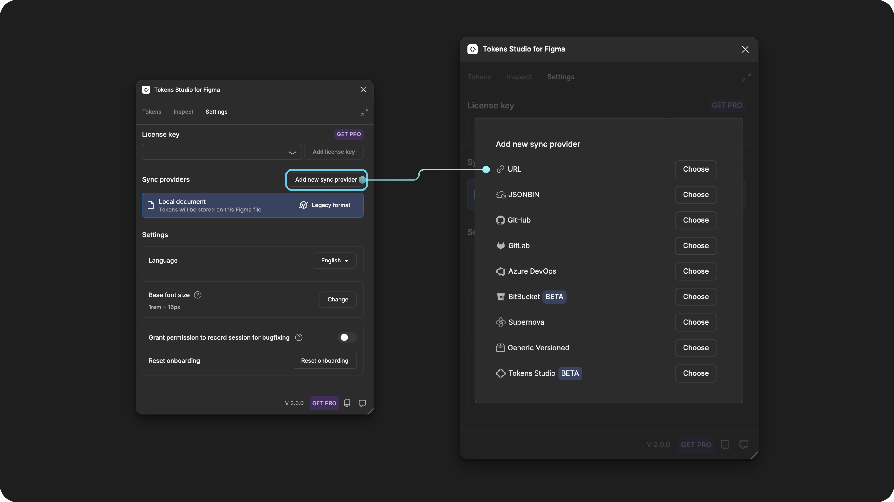
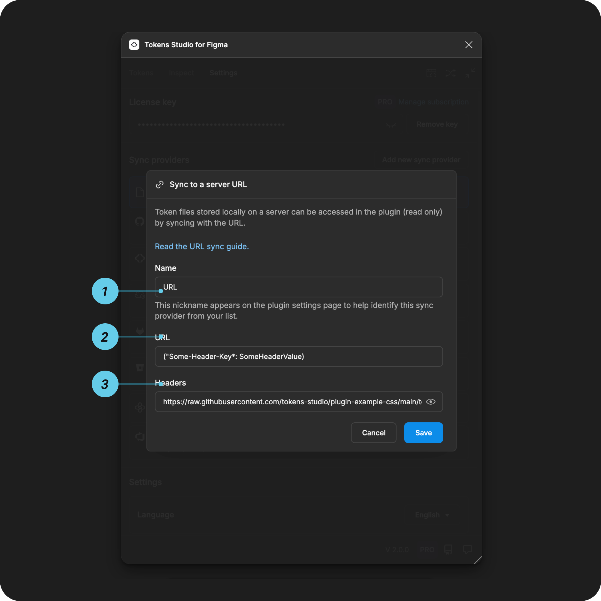

# URL - Server Sync Provider

## URL sync setup guide

If your Design Token storage is set up on a local server, you can access your Token files (via their URL) in the plugin using the URL Sync option.

URL Sync operates in **read-only** mode.

* This means you can't use the Tokens Studio plugin to create or modify your design Tokens, but you can apply your Tokens to design elements in Figma.
* You'll need to modify the Token JSON files stored on your server and pull the updates into the plugin.

This means the Design Tokens living in code are the source of truth for our design decisions, which can be shared between design and development teams.

This guide outlines how to access your Token files stored on your local server using the **URL Sync provider** option in the plugin.

### How it works

* Once your Token JSON files are **stored on your server**, capture the URL.
* **Configure a new URL sync provider** within the plugin.
* Use the plugin to **sync Design Token changes** between your server and Figma design files.

***

### URL sync setup instructions

If you haven't already, store your Design Token JSON files on your server.

→ [Here's an example Token JSON file stored on a server URL.](https://raw.githubusercontent.com/Tokens-studio/plugin-example-css/main/Tokens.json)

#### 1. Server URL

**Copy the URL** on your server where your Token JSON files are stored. **Store the URL somewhere safe**, as it's needed for the plugin configuration.

#### 2. Check server headers

Headers are the server authentication instructions for the plugin.

* Refer to your server technical documentation for more details on headers.

If your server requires authentication:

* **Store the headers as a JSON object** in the headers field.
* **Access-Control-Allow-Origin** header must be `*`
* **Copy the required headers** and
  * **Store them somewhere safe**, as they are needed for the plugin configuration.

***

### Configure the Tokens Studio Plugin

In Figma, open the Tokens Studio plugin and navigate to the **Settings** page.

* Under the **Sync providers** section, select the **Add new** button to see a list of all Token storage providers.
* Select **URL**

<figure><figcaption></figcaption></figure>

#### Add credentials for URL sync

You'll need the information saved from the steps above to complete the Tokens Studio sync configuration form.

<figure><figcaption></figcaption></figure>

**1. Name**

This is a **nickname** that shows up in the **plugin settings page** later on to identify this specific sync provider configuration.

* Choose something memorable to you and your project.
* Example: `Hyma brand exploration`

**2. URL**

Enter the complete **URL** you saved from [step 1 above.](sync-server-url.md#id-1.-server-url)

#### **3. Headers**

The authentication **headers** you saved from [step 2 above](sync-server-url.md#id-2.-check-server-headers).

Example: \`("Some-Header-Key":SomeHeaderValue)

#### Save and do the initial sync

Save to confirm your credentials, and follow the prompts in the plugin to finish setting up the sync to your server.



***

### Shared source of truth

As you work in the plugin, pull indicators remind you to stay in sync with your URL storage.



Once your Token JSON files are synced to your URL storage, you have a shared source of truth between Designers and Engineers!



***

### Resources

Mentioned in this doc:

* SD-Transforms - [Read Me](https://github.com/tokens-studio/sd-transforms#readme)
* Style Dictionary - [https://styledictionary.com/](https://styledictionary.com/)

Community resources:

* None yet!



#### Known issues and bugs

Tokens Studio Plugin GitHub - [Open issues for URL sync](https://github.com/tokens-studio/figma-plugin/labels/sync%20url)



#### Requests, roadmap and changelog

* 🧑‍💻 [Sync to external token storage enhancements - Feature Request](https://tokensstudio.featurebase.app/p/sync-external-storage-enhancements)
  * How might we improve the experience of working with sync providers in general?
* ↕️ [Git sync enhancements - push, pull, merge, branching - Feature Request](https://feedback.tokens.studio/p/git-sync-enhancements)
* 🔐 [Data security info request - Feature Request](https://feedback.tokens.studio/p/data-security-info)


