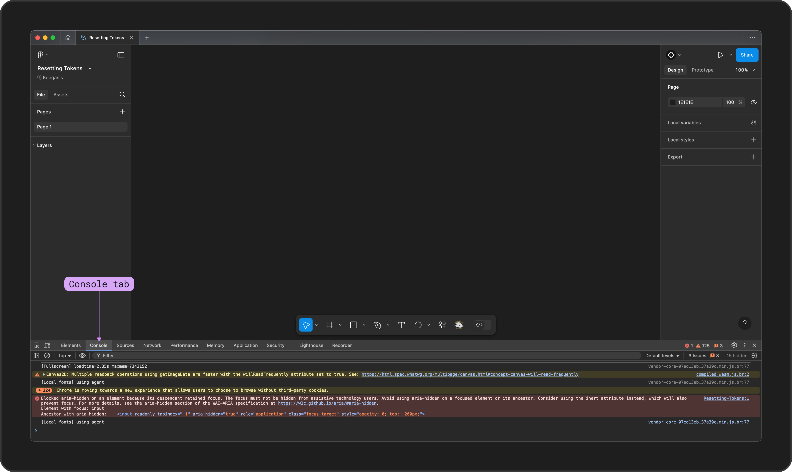
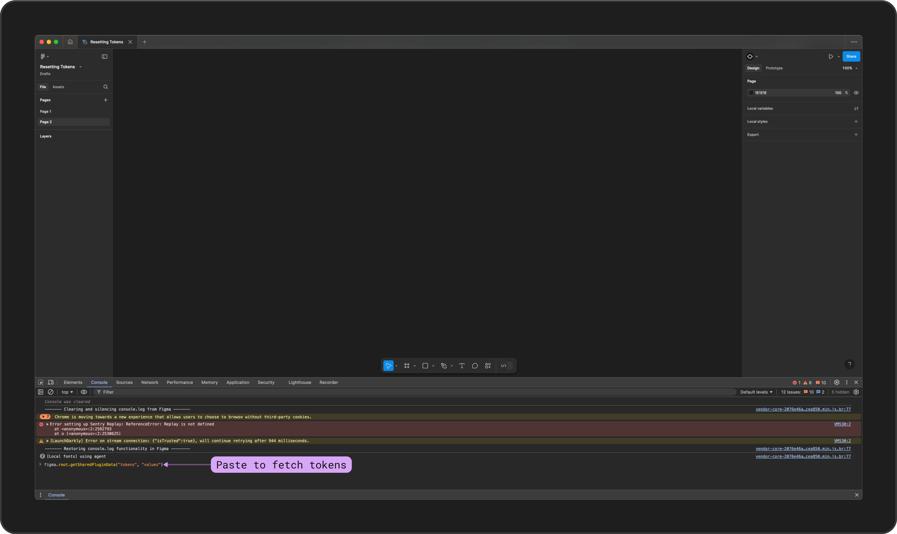
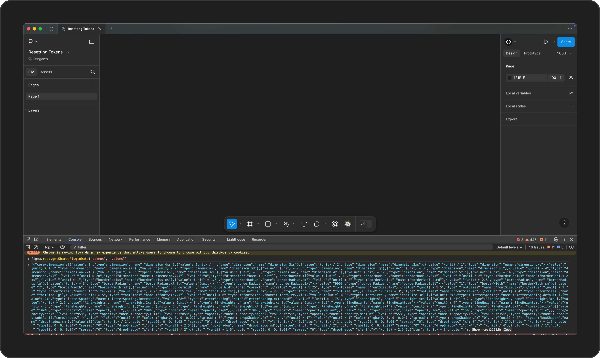
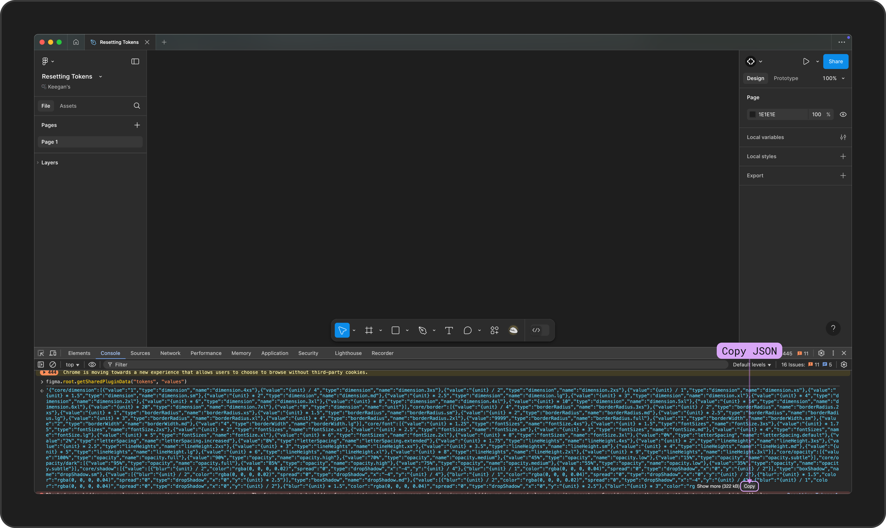
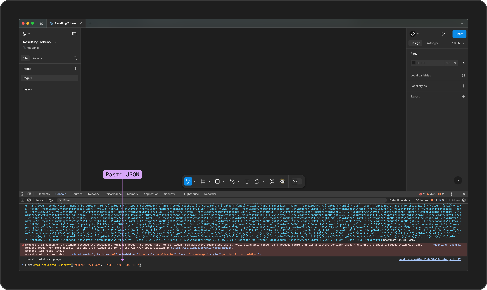
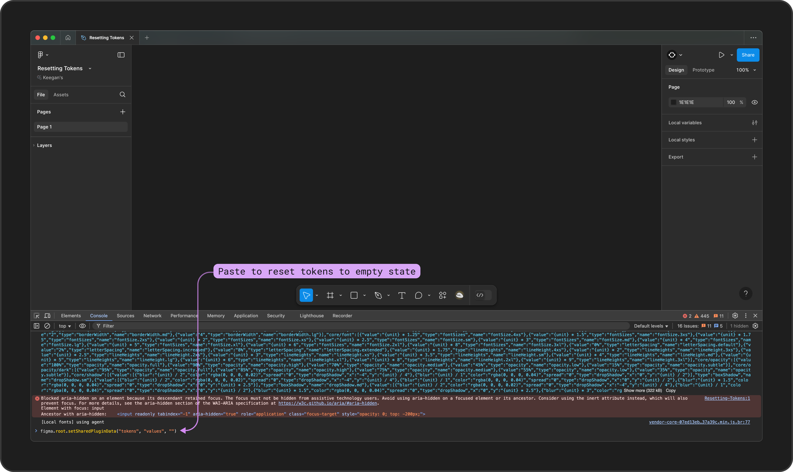

# Reset Tokens from Dev Console

## **Reset Tokens from Developer Console in Figma**

If you encounter issues with your Tokens or have trouble opening the plugin, you can reset your Tokens using the Developer Console in Figma&#x20;


**Note:**\
If Tokens exist **only in the local document**, resetting will permanently remove them. If Tokens are synced with an external provider, you can pull them again from the repository after resetting.



### How it works

You can think about this like a "factory reset" for the Tokens Studio Plugin.&#x20;

1. Open the console in the Figma file where you are experiencing the issues.
2. Use the console to either
   1. Replace the Token JSON to fix errors causing the issues
   2. Run a command to perform a hard reset
3. Restart the Tokens Studio Plugin

***


### **1 - Open the Console**

1. Open your browser’s developer tools:
   1. • **Mac:** Press Cmd + Option + I
   2. • **Windows:** Press Ctrl + Shift + I
2. Navigate to the **Console** tab.

<figure><figcaption><p>Opening the Console tab in the Developer Tools</p></figcaption></figure>


***

### **2A - Replace the Token JSON**

To replace the Token JSON, first you need to export it from the console. Then you can paste it into a code editor of your choice to make changes as needed, and paste the new JSON back into the console.&#x20;


#### Export the JSON from the console

In the console, enter the following code then press enter:

```
figma.root.getSharedPluginData("tokens", "values")
```

This data identifier retreives the JSON from the Tokens Studio Plugin data stored in the Figma file.

<figure><figcaption></figcaption></figure>

Once you press enter, the JSON from the Tokens Studio Plugin are displayed in the console, as shown below in the blue text located below the command.&#x20;

<figure><figcaption></figcaption></figure>

At the end of the JSON displayed in the console there is a Copy JSON button you can use to export the code to your clip board.

<figure><figcaption></figcaption></figure>

Once you've copied the JSON from the console, you can paste it into a code editor (like VS Code) to make changes as needed.&#x20;


#### Paste your edited JSON back into the console

After editing the JSON in a code editor, you can paste it back into the console at the end of this command between quotes:&#x20;

```
figma.root.setSharedPluginData("tokens", "values", "EDITEDJSONHERE")
```

<figure><figcaption><p>Pasting Plugin Data and the fixed JSON in the Console</p></figcaption></figure>


***


### 2B - Hard Reset Tokens JSON

If you want to **hard reset** the Tokens Studio Plugin, removing all Token Data from Figma file, open the console using the [steps described above ↑](reset-tokens-console.md#open-the-console).&#x20;

In the console, enter the following code then press enter:

```
figma.root.setSharedPluginData("tokens", "values", "")
```

<figure><figcaption></figcaption></figure>


***


### **3 - Restart the Plugin**

Close the console and open the Tokens Studio plugin.&#x20;

You’ll see the **Get Started** screen, indicating a successful reset.


**Key Tips:**\
• Always back up your JSON before resetting.\
• For synced tokens, re-pull from your repository after resetting to restore data.



